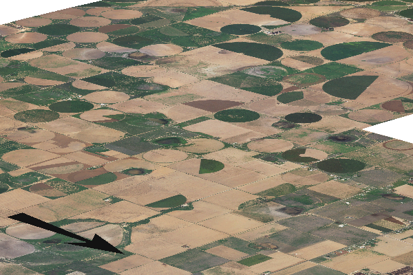

# NRCS_SIMWE

## Purpose

The purpose of this agreement, between the U.S. Department of Agriculture, Natural Resources Conservation Service (NRCS) and North Carolina State University (Recipient), is to adapt the SIMulation of Water and Erosion (SIMWE) model for the integration of Dynamic Soil Survey data. Proposed work will expand model capabilities, add supporting modules, and incorporate data input flexibility for integrating soil survey data. The updated model will serve as an important component of the future Dynamic Soil Survey at field to watershed scales and minute to monthly time-steps.

## Objectives

- [ ] Develop pre-processing modules to translate basic soil properties and site conditions into model input parameters.
- [ ] Perform a sensitivity analysis to identify optimal ranges of and interactions between model input parameters.
- [ ] Explore the capability of the model to accept and utilize time-varying inputs.
- [ ] Expand model capabilities to include multiple and consecutive rainfall events and account for antecedent conditions.
- [ ] Develop multilayer SIMWE model simulations that account for multiple subsurface soil layers.

## Sites

### Clay Center


- [x] Create site projects in GRASS GIS

Report: [output/clay-center/clay-center.md](output/clay-center/clay-center.md)


### Coweeta


- [X] Create site projects in GRASS GIS

Report: [output/coweeta/report.md](output/coweeta/coweeta.md)

### SFREC


- [X] Create site projects in GRASS GIS

Report: [output/SFREC/report.md](output/SFREC/report.md)

### SJER


- [X] Create site projects in GRASS GIS

Report: [output/SJER/report.md](output/SJER/report.md)

### tx069-playas



- [X] Create site projects in GRASS GIS

Report: [output/tx069-playas/report.md](output/tx069-playas/report.md)

## Data

### Shared Goolge Drive

[NRCS_SIMWE/site_data_workflows](https://drive.google.com/drive/folders/1VsauKpPnaPhKcRUykEgmGN7045xuhFu_?usp=drive_link)

## Getting Started

### Set up your Python environment

```bash
# create a virtual environment
$ python3 -m venv venv
# activate the virtual environment
$ source venv/bin/activate
```

### Install Dependencies

```bash
pip install -r requirements.txt
```

### Install Pre-commit

```bash
# Install pre-commit
(venv) $ pip install pre-commit
# Run pre-commit install to setup the git hook scripts
(venv) $ pre-commit install
```

## Create Site Projects (Locations) in GRASS

Run the python script `scripts/create_site_projects.py` to create site projects (locations) in GRASS GIS.

```bash
(venv) $ python scripts/create_site_projects.py
```

## Run SIMWE Model

Run the python script `scripts/simulation.py` to downlaod data and run the SIMWE model.

```bash
(venv) $ python scripts/simulation.py
```

## License

## Acknowledgements

This project is supported by the U.S. Department of Agriculture, Natural Resources Conservation Service (NRCS) and North Carolina State University.

## Contributors

- Helena Mitasova (North Carolina State University)
- Corey T. White (North Carolina State University)
- Add your name here
