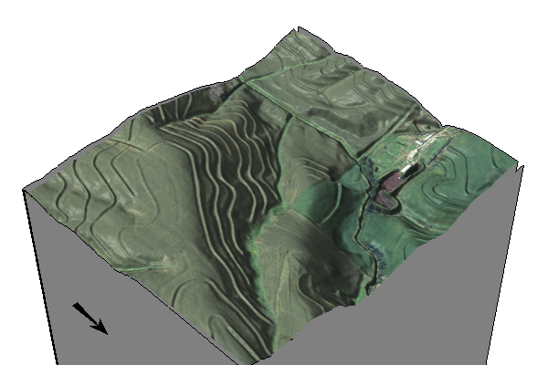
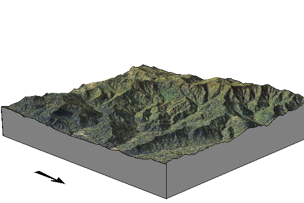
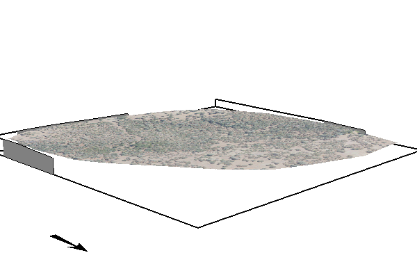
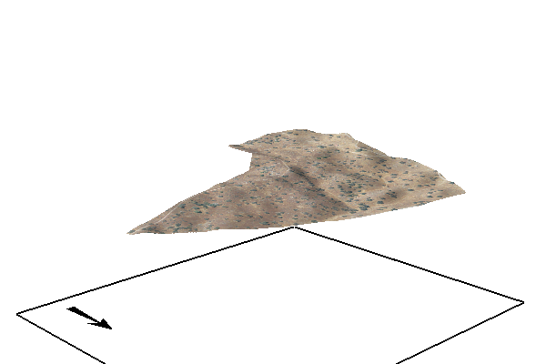
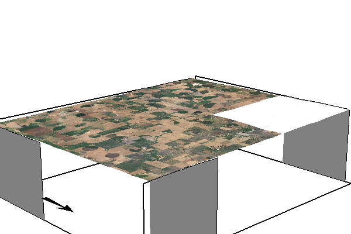

## Purpose

The purpose of this agreement, between the [U.S. Department of Agriculture, Natural Resources Conservation Service (NRCS)]() and [North Carolina State University](https://ncsu.edu) (Recipient), is to adapt the SIMulation of Water and Erosion (SIMWE) model for the integration of Dynamic Soil Survey data. Proposed work will expand model capabilities, add supporting modules, and incorporate data input flexibility for integrating soil survey data. The updated model will serve as an important component of the future Dynamic Soil Survey at field to watershed scales and minute to monthly time-steps.

## Sites

::: {.columns}

::: {.column width="32%"}

### Clay Center

[View Report](output/clay-center/report.qmd)

:::

::: {.column width="32%"}

### Coweeta

[View Report](output/coweeta/report.qmd)

:::

:::

::: {.columns}

::: {.column width="32%"}

### SFREC

[View Report](output/SFREC/report.qmd)

:::

::: {.column width="32%"}

### SJER

[View Report](output/SJER/report.qmd)

:::

:::

::: {.columns}

::: {.column width="32%"}

### tx069-playas

[View Report](output/tx069-playas/report.qmd)

:::

:::

## Acknowledgements

This project is supported by the U.S. Department of Agriculture, Natural Resources Conservation Service (NRCS) and North Carolina State University.

## Contributors

- Helena Mitasova (North Carolina State University)
- Corey T. White (North Carolina State University)
- Add your name here
