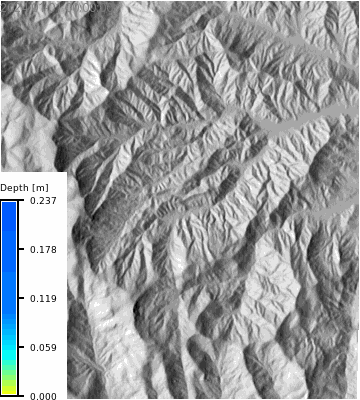
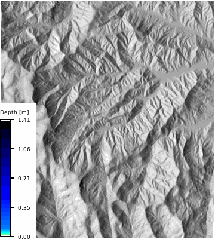
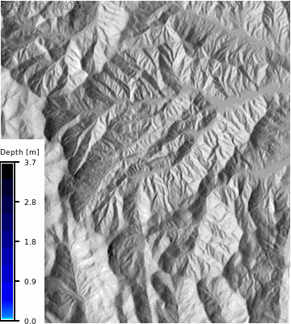

# [WIP] SSURGO Soil Data in GRASS

This notebook demonstrates how to import SSURGO soil data into GRASS using the [r.in.ssurgo](https://grass.osgeo.org/grass-devel/manuals/addons/r.in.ssurgo.html) extension. The `r.in.ssurgo` tool can import both local SSURGO data and data from the Soil Data Access (SDA) web service. The imported data includes *soil areas*, *hydrologic groups*, *ksat maps*, and *mukey maps*, which can be used for hydrological modeling and analysis in GRASS.

The flowchart below (@fig_ssurgo_flowchart) illustrates the workflow for using SSURGO data in GRASS, including the tools and outputs that can be generated from the imported soil data. We will cover the following steps in this notebook:

```{mermaid}
%% label: fig_ssurgo_flowchart
%% echo: false
%% eval: true
%% fig-cap: "(Draft) Flowchart of SSURGO SIMWE workflows"
flowchart TD
    A[r.in.ssurgo] --> B("Soils map vector")
    A[r.in.ssurgo] --> HG("Hydrologic group map")
    A[r.in.ssurgo] --> KSAT("Ksat maps rasters")
    A[r.in.ssurgo] --> E("MUKEY map raster")
    B --> F("Soil attributes in vector attribute table")
    G[r.curvenumber] --> H("Curve number map")
    HG --> G
    LC(NLCD land cover map) --> G
    ELEV[Elevation raster] --> W[r.watershed]
    W --> I("Flow direction")
    W --> J("Streams")
    W --> K("Basins")
    TC[r.timeofconcentration] --> TCR("Time of concentration")
    ELEV --> TC
    I --> TC
    J --> TC
    H --> R[r.runoff]
    I --> R
    TCR --> R
    R --> RD("Runoff depth")
    R --> RV("Runoff volume")
    R --> TP("Time to peak")
    R --> PD("Peak discharge raster")
    R --> URD("Upstream runoff depth")
    R --> URV("Upstream runoff volume")
    R --> UA("Upstream area")
    LC --> MC["r.manning"]
    MC --> MN("Manning's n map")
    ELEV --> RSA["r.slope.aspect"]
    RSA --> DX("dx")
    RSA --> DY("dy")
    ELEV --> SIMWE["r.sim.water"]
    DX --> SIMWE
    DY --> SIMWE
    MN --> SIMWE
    HG --> SIMWE
    KSAT --> SIMWE
    SIMWE --> DEPTH("Water depth raster")
    SIMWE --> DISCHARGE("Discharge raster")
```

## Objectives

1. **Import SSURGO soil data** into GRASS using `r.in.ssurgo`.
2. **Visualize the imported soil maps**, including soil areas, hydrologic groups, ksat maps, and mukey maps.
3. **Calculate curve number** using the imported hydrologic group map and a land cover map.
4. **Calculate runoff depth and peak discharge** using the curve number map, flow direction, and time of concentration.
5. **Run a basic SIMWE simulation** using the imported soil data and visualize the results.

```{python}
# | label: imports
# | echo: false

import os
import subprocess
import sys

# import numpy as np
import matplotlib.pyplot as plt
import pandas as pd
import numpy as np
import seaborn as sns
from pprint import pprint
from PIL import Image
import sqlite3
from IPython.display import IFrame

# Ask GRASS GIS where its Python packages are.
sys.path.append(
    subprocess.check_output(["grass", "--config", "python_path"], text=True).strip()
)

# Import the GRASS GIS packages we need.
import grass.script as gs

# Import GRASS Jupyter
import grass.jupyter as gj
from grass.tools import Tools
```

We will examine the Coweeta site for this demonstration, which has a mapset called `ssurgo_demo` that we will use to import the SSURGO data and run the SIMWE model.

```{python}
# | label: init_session
# | echo: false
# | output: false
gisdb = os.path.join(os.getenv("HOME"), "grassdata")
site = "coweeta"
mapset = "ssurgo_demo"
session = gj.init(gisdb, site, "PERMANENT")
tools = Tools(session=session)
try:
    tools.g_mapset(mapset=mapset, flags="c")
except Exception as e:
    print(f"{e}")
```

---

## Import SSURGO Data

Install the `r.in.ssurgo` extension if it is not already installed. This extension is available in the GRASS Addons repository and can be installed using `g.extension`. The source code for this extension is also available in the `tools/r.soildb/r.in.ssurgo` directory of this repository.

```{python}
# | label: install_extension
# | eval: false
# | echo: false

tools.g_extension(
    extension="r.in.ssurgo",
    url="../../../cwhite911/grass-addons/src/raster/r.in.ssurgo"
)

```

::: {.panel-tabset}
## Command Line

```sh
g.extension r.in.ssurgo
```

## Python (grass.tools)
```python
tools.g_extension(
    extension="r.in.ssurgo"
)
```

:::

Set the computational region to the elevation raster and create a relief raster for hillshading.

```{python}
# | label: set_region
region_text = tools.g_region(raster="elevation", flags="p").text
print(region_text)
```

Let's also create a relief raster for hillshading or soil maps.

```{python}
tools.r_relief(input="elevation", output="relief")
```

Import SSURGO data using `r.in.ssurgo`. Note that this will import the soil areas map, hydrologic group map, and ksat maps for low, regular, and high values. The `mukey` column is also imported as a raster with a categorical color scheme applied. The hydrologic group map also has a categorical color scheme applied.

::: {.panel-tabset}

## Local Import

```{python}
# | label: import_ssurgo_local
# | eval: false

tools.r_in_ssurgo(
    ssurgo_path="../data/gSSURGO_NC.zip",
    soils="soil_areas",
    hydgrp="hydgrp",
    ksat_l="ksat_l",
    ksat_r="ksat_r",
    ksat_h="ksat_h",
    mukey="mukey",
    hzdept_r=0,
    hzdepb_r=100,
    desgnmaster="A",
    nprocs=30
)
```


## SDA Import

```{python}
# | label: import_ssurgo_sda
# | eval: false
tools.r_in_ssurgo(
    soils="soil_areas_sda",
    hydgrp="hydgrp_sda",
    ksat_l="ksat_l_sda",
    ksat_r="ksat_r_sda",
    ksat_h="ksat_h_sda",
    mukey="mukey_sda",
    hzdept_r=0,
    hzdepb_r=100,
    desgnmaster="A",
    nprocs=30
)
```

:::

## Visualize Imported Data

The tool imports the soil polygons as a vector map (`soil_areas_sda`), which contains the soil polygons with attributes from the SSURGO database.

```{python}
# | label: SDA soil attributes
# | echo: false

json_data = tools.v_db_select(map="soils_polygons", format="json").json
df = pd.DataFrame(json_data["records"])
display(df.head())
```


### MUKEY Map

```{python}
# | label: mukey
# | echo: false

# m = gj.Map(use_region=True)
# m.d_shade(shade="relief", color="mukey")
# m.d_vect(map="soil_areas", color="black", fillcolor="none", width=0.5)
# # m.d_legend(raster="mukey", title="MUKEY", flags="b")
# m.show()

m = gj.Map(use_region=True)
m.d_shade(shade="relief", color="mukey_sda")
m.d_vect(map="soil_areas_sda", color="black", fillcolor="none", width=0.5)
# m.d_legend(raster="mukey", title="MUKEY", flags="b")
m.show()
```


```{python}
# | echo: false
# | eval: false
m = gj.Map(use_region=True)
m.d_shade(shade="relief", color="mukey")
m.d_vect(map="soils_polygons", color="black", fillcolor="white", width=0.5)
m.show()
```

### Ksat Maps

```{python}
# | label: ksat
# | layout-ncol: 3
# | echo: false
# | fig-cap: "Ksat maps for low, regular, and high values"
# | fig-subcap:
# |     - Low
# |     - Regular
# |     - High
# |     - Low - SDA
# |     - Regular - SDA
# |     - High - SDA


# m = gj.Map(use_region=True)
# m.d_shade(shade="relief", color="ksat_l")
# m.d_legend(raster="ksat_l", title="Ksat (mm/hr)", flags="db")
# m.show()

# m = gj.Map(use_region=True)
# m.d_shade(shade="relief", color="ksat_r")
# m.d_legend(raster="ksat_r", title="Ksat (mm/hr)", flags="db")
# m.show()

# m = gj.Map(use_region=True)
# m.d_shade(shade="relief", color="ksat_h")
# m.d_legend(raster="ksat_h", title="Ksat (mm/hr)", flags="db")
# m.show()

m = gj.Map(use_region=True)
m.d_shade(shade="relief", color="ksat_l_sda")
m.d_legend(raster="ksat_l_sda", title="Ksat (mm/hr)", flags="db")
m.show()

m = gj.Map(use_region=True)
m.d_shade(shade="relief", color="ksat_r_sda")
m.d_legend(raster="ksat_r_sda", title="Ksat (mm/hr)", flags="db")
m.show()

m = gj.Map(use_region=True)
m.d_shade(shade="relief", color="ksat_h_sda")
m.d_legend(raster="ksat_h_sda", title="Ksat (mm/hr)", flags="db")
m.show()
```

### Hydrologic Group

We can visualize the hydrologic group maps to compare the local and SDA imports. The hydrologic group map is a categorical raster with values of A, B, C, D, and A/D. The color scheme is applied using `r.colors` with the `hydgrp` color table.

```{python}
# | label: hydrologic_group_map
# | layout-ncol: 1
# | echo: false
# | fig-cap: "Hydrologic groups"

with gs.RegionManager(raster="hydgrp_sda", s="s-50000", flags="a"):
    m = gj.Map(use_region=False)
    m.d_shade(shade="relief", color="hydgrp_sda")
    m.d_legend(raster="hydgrp_sda", flags="bn", at="0, 30, 1, 30")
    m.show()
```


```{python}
# | label: hydrologic_group_map_comparison
# | echo: false
# | eval: false
tools.r_mapcalc(
    expression="hydgrp_diff = hydgrp - hydgrp_sda",
)

m = gj.Map(use_region=True)
m.d_shade(shade="relief", color="hydgrp_diff")
m.d_legend(raster="hydgrp_diff", title="Difference", flags="b")
m.show()
```

## Calculate Curve Number

Install the `r.curvenumber` extension if it is not already installed. This extension is available in the GRASS Addons repository and can be installed using `g.extension`.

```python
# | label: install_curvenumber_text
# | eval: false
tools.g_extension(
    extension="r.curvenumber",
)
```

```{python}
# | label: install_test_extensions
# | eval: false
# | echo: false
tmp_addon_test = [
    # "r.stream.basins",
    # "r.stream.distance",
    # "r.stream.order",
    # "r.stream.segment",
    # "r.stream.slope",
    # "r.stream.snap",
    # "r.stream.stats",
    # "r.stream.variables",
    # "r.stream.watersheds"
]
for addon in tmp_addon_test:
    try:
        tools.g_extension(
            extension=addon,
            url=f"../../../cwhite911/grass-addons/src/raster/{addon}"
        )
    except Exception as e:
        print(f"{e}")

```


To calculate the curve number, we need both a land cover map and a hydrologic soil group map. The land cover map is from the National Land Cover Database (NLCD) 2024 dataset, which was imported as a COG raster. The `landcover_source` parameter specifies that the land cover map is from the NLCD dataset, which allows the tool to use the appropriate lookup table for curve number values.

```{python}
#| label: import_landcover
#| eval: false
tools.r_import(
    output="nlcd_2024",
    input="<path_to_nlcd_cog>",
    extent="region",
    resolution="region",
)

```

NLCD 2024 land cover map:

```{python}
# | label: landcover_map
with gs.RegionManager(raster="nlcd_2024", w="w-1600", flags="a"):
    m = gj.Map(use_region=True)
    m.d_shade(shade="relief", color="nlcd_2024")
    m.d_legend(
        raster="nlcd_2024",
        title="NLCD 2024",
        flags="",
        at="5,80,2,45",
        fontsize=12,
    )
    m.show()
```

Calculate the hydrolic curve number using the [r.curvenumber](https://grass.osgeo.org/grass-devel/manuals/addons/r.curvenumber.html) extension, which requires both a land cover map and a hydrologic soil group map. The land cover map is from the National Land Cover Database (NLCD) 2024 dataset, which was imported as a COG raster. The `landcover_source` parameter specifies that the land cover map is from the NLCD dataset, which allows the tool to use the appropriate lookup table for curve number values.

```{python}
# | label: curvenumber_calc
tools.r_curvenumber(
    landcover="nlcd_2024",
    soil="hydgrp_sda",
    landcover_source="nlcd",
    output="curvenumber",
)
```

```{python}
#| label: curvenumber_map

with gs.RegionManager(raster="curvenumber", w="w-1600", flags="a"):
    m = gj.Map(use_region=True)
    m.d_shade(shade="relief", color="curvenumber")
    m.d_legend(raster="curvenumber", title="Curve Number", flags="s", at="5, 30, 2, 10", fontsize=12)
    m.show()
```

## Calculate Runoff and time of concentration

Let's also run [r.runoff](https://grass.osgeo.org/grass-devel/manuals/addons/r.runoff.html) to calculate runoff depth using the curve number method. This tool requires a precipitation raster, which we can create using `r.mapcalc` with a constant value for precipitation.

```{python}
# | label: install_toc_extension
# | eval: false
# | echo: false
tools.g_extension(
    extension="r.timeofconcentration",
    url="../../../cwhite911/grass-addons/src/raster/r.timeofconcentration",
)
tools.g_extension(
    extension="r.stream.distance",
    url="../../../cwhite911/grass-addons/src/raster/r.stream.distance",
)
```

```{python}
# | label: install_runoff_extension
# | eval: false
# | echo: false
# tools.g_extension(
#     extension="r.accumulate",
#     url="../../../cwhite911/grass-addons/src/raster/r.accumulate",
# )
# tools.g_extension(
#     extension="r.runoff", url="../../../cwhite911/grass-addons/src/raster/r.runoff"
# )
tools.g_extension(
    extension="r.noaa.atlas14",
    url="../../../cwhite911/grass-addons/src/raster/r.noaa.atlas14",
)
```

```{python}
# | label: noaa_atlas14

# tools.r_noaa_atlas14(
#     mode="grid",
#     statistic="intensity",
#     unit="metric",
#     series="pds",
#     bound="expected",
#     resample="bilinear",
#     flags="i",
#     # region="se",
#     base_gis_url="https://hdsc.nws.noaa.gov/pub/hdsc/data",
# )
# | Latitude | 35.0667° |
# | Longitude | -83.4333° |
outjson = tools.r_noaa_atlas14(
    mode="point",
    statistic="intensity",
    vector_output="noaa_atlas14_station",
    coordinates=[-83.4333, 35.0667],
    unit="metric",
    series="pds",
    bound="expected",
    resample="bilinear",
    # flags="i",
    # region="se",
    # base_gis_url="https://hdsc.nws.noaa.gov/pub/hdsc/data",
).json

pprint(outjson)
```

We need the flow direction and stream maps to run `r.runoff` with time of concentration, which can be calculated using the `r.watershed` tool.

```{python}
#| label: watershed
tools.r_watershed(
    elevation="elevation",
    drainage="flow_direction",
    accumulation="accumulation",
    stream="stream",
    basin="basins",
    threshold=10,
)
```

```{python}
# | label: watershed_map

with gs.RegionManager(raster="accumulation", w="w-1600", flags="a"):
    m = gj.Map(use_region=True)
    m.d_shade(shade="relief", color="accumulation")
    m.d_legend(
        raster="accumulation",
        title="Accumulation",
        flags="s",
        at="5, 30, 2, 10",
        fontsize=12,
    )
    m.show()

    m2 = gj.Map(use_region=True)
    m2.d_shade(shade="relief", color="basins")
    m2.d_legend(
        raster="basins",
        title="Basins 50K threshold",
        flags="s",
        at="5, 30, 2, 10",
        fontsize=12,
    )
    m2.show()
```

Let calculate the time of concentration using the `r.timeofconcentration` tool, which requires an elevation raster, flow direction raster, and stream raster as inputs. The output is a raster of time of concentration values in hours.

```{python}
# | label: time_of_concentration
tools.r_timeofconcentration(
    elevation="elevation",
    direction="flow_direction",
    stream="stream",
    length_min=100,  # minimum length of flow path
    tc="time_concentration",
)
```

```{python}
# | label: time_of_concentration_map

with gs.RegionManager(raster="elevation", s="s-2100", flags="a"):
    tools.r_colors(map="time_concentration", color="magma", flags="e")
    m = gj.Map(use_region=True)
    m.d_shade(shade="relief", color="time_concentration")

    m.d_legend(
        raster="time_concentration",
        at="8, 12, 20, 80",
        title="Time of Concentration (hours)",
        font="Fira Sans Condensed Light",
        fontsize=14,
        flags="s",
    )
    m.d_barscale(
        at=(20, 28),
        font="Fira Sans Condensed Light",
        fontsize=10,
        length=3,
        width_scale=1,
        units="kilometers",
        bgcolor="none",
        style="both_ticks",
        color="#f7f7f7",
        flags="n",
    )
    m.show()
```

Let's check the univarite statistics for the time of concentration raster to see the range of values.

```{python}
# | label: time_of_concentration_stats
# | echo: false

tc_json = tools.r_univar(map="time_concentration", flags="e", format="json").json
df_tc = pd.DataFrame(tc_json)
tc_table = (
    pd.DataFrame(tc_json, index=[0])
    .T.reset_index()
    .rename(columns={"index": "Statistic", 0: "Value"})
)

percentiles_row = tc_table.loc[tc_table["Statistic"] == "percentiles", "Value"]
tc_table = tc_table.loc[tc_table["Statistic"] != "percentiles"].copy()

if not percentiles_row.empty:
    p = percentiles_row.iloc[0]
    if isinstance(p, dict):
        pct_df = pd.DataFrame(
            [{"Statistic": f"percentile_{k}", "Value": v} for k, v in p.items()]
        )
        tc_table = pd.concat([tc_table, pct_df], ignore_index=True)

display(
    tc_table.style.hide(axis="index")
    .set_caption("Time of Concentration — Summary Statistics")
    .format(
        {
            "Value": lambda v: f"{v:,.3f}"
            if isinstance(v, (int, float, np.number))
            else v
        }
    )
)
```

We can use the the `time_concentration` raster as an input to the `r.runoff` tool, which calculates runoff depth and peak discharge using the curve number method. The `r.runoff` tool also requires a precipitation raster, which we can create using `r.mapcalc` with a constant value for precipitation ($50$ mm) over a 24 hour period.

```{python}
# | label: tc_and_rfi

df_tc_min = df_tc[["min", "mean", "max"]].apply(
    lambda x: round(x * 60, 2)
)  # convert to minutes
max_tc = df_tc_min["max"].max()
print(max_tc)

df_rf_intensity = pd.read_csv("data/r_intensity_pds.csv")
display(
    df_rf_intensity.style.hide(axis="index")
    .set_caption("Rainfall Intensity — NOAA Atlas 14, Coweeta, NC")
    .format(
        {
            "Value": lambda v: f"{v:,.3f}"
            if isinstance(v, (int, float, np.number))
            else v
        }
    )
)

# | label: rainfall_intensity_figure
# | echo: false
# | fig-cap: "NOAA Atlas 14 rainfall intensity by storm duration for Coweeta, NC, with the maximum time of concentration marked."

rf = df_rf_intensity.copy()

duration_col = next(
    (c for c in rf.columns if "duration" in c.lower()),
    rf.columns[0],
)

def _duration_to_minutes(value):
    text = str(value).strip().lower()
    match = re.search(r"(\d+(?:\.\d+)?)", text)
    if not match:
        return np.nan
    number = float(match.group(1))
    if "day" in text:
        return number * 24 * 60
    if "hr" in text or "hour" in text:
        return number * 60
    return number

import re

rf["duration_min"] = rf[duration_col].apply(_duration_to_minutes)

value_cols = [c for c in rf.columns if c not in {duration_col, "duration_min"}]
rf_long = rf.melt(
    id_vars=["duration_min"],
    value_vars=value_cols,
    var_name="return_period",
    value_name="intensity_mm_hr",
)
rf_long["intensity_mm_hr"] = pd.to_numeric(rf_long["intensity_mm_hr"], errors="coerce")
rf_long = rf_long.dropna(subset=["duration_min", "intensity_mm_hr"]).sort_values(
    ["return_period", "duration_min"]
)

sns.set_theme(style="whitegrid", context="talk")
fig, ax = plt.subplots(figsize=(10, 6))

sns.lineplot(
    data=rf_long,
    x="duration_min",
    y="intensity_mm_hr",
    hue="return_period",
    marker="o",
    linewidth=2.5,
    ax=ax,
)

ax.axvline(
    max_tc,
    color="black",
    linestyle="--",
    linewidth=1.5,
    label=f"Max Tc = {max_tc:.1f} min",
)

ax.annotate(
    f"Max Tc\n{max_tc:.1f} min",
    xy=(max_tc, rf_long["intensity_mm_hr"].max()),
    xytext=(8, -10),
    textcoords="offset points",
    ha="left",
    va="top",
    fontsize=11,
    bbox=dict(boxstyle="round,pad=0.25", fc="white", ec="0.6", alpha=0.9),
)

ax.set_xscale("log")
ax.set_xlabel("Storm duration (minutes)")
ax.set_ylabel("Rainfall intensity (mm/hr)")
ax.set_title("Rainfall intensity–duration curves")
ax.legend(title="Return period", frameon=True, ncol=2)
sns.despine()
plt.tight_layout()
plt.show()


return_periods = rf_long["return_period"].dropna().unique()
rp_100 = next(
    (
        rp
        for rp in return_periods
        if re.search(r"100", str(rp)) and re.search(r"(yr|year)", str(rp).lower())
    ),
    next((rp for rp in return_periods if re.search(r"100", str(rp))), None),
)

if rp_100 is None:
    raise ValueError("Could not identify the 100-year storm column in rainfall intensity data.")

rf_100 = (
    rf_long.loc[rf_long["return_period"] == rp_100, ["duration_min", "intensity_mm_hr"]]
    .dropna()
    .sort_values("duration_min")
)

storm_intensity_100yr = float(
    np.interp(
        np.log10(max_tc),
        np.log10(rf_100["duration_min"].to_numpy()),
        rf_100["intensity_mm_hr"].to_numpy(),
    )
)

rain_mm_per_hour = storm_intensity_100yr

display(
    pd.DataFrame(
        {
            "return_period": [rp_100],
            "max_tc_min": [round(max_tc, 2)],
            "intensity_mm_hr": [round(storm_intensity_100yr, 2)],
        }
    ).style.hide(axis="index").set_caption(
        "Interpolated rainfall intensity at maximum time of concentration"
    )
)

print(f"100-year storm intensity at max Tc ({max_tc:.2f} min): {storm_intensity_100yr:.2f} in/hr")
```

```{python}
# | label: precipitation_mm

# storm_intensity_100yr 46.97 min = 0.7828 hr
duration_min = 46.97
intensity_in_hr = 4.34
intensity_mm_hr = intensity_in_hr * 25.4

duration_hr = duration_min / 60.0
rain_mm = intensity_mm_hr * duration_hr

print(f"Storm duration: {duration_hr:.4f} hr")
print(f"Rainfall intensity: {intensity_mm_hr:.3f} mm/hr")
print(f"Rain depth: {rain_mm:.3f} mm")
tools.r_mapcalc(
    expression=f"rain = {rain_mm}",  # mm of precipitation
)
```

```{python}
# | label: extension_import_accumulate_runoff
# | echo: false
# | eval: false
tools.g_extension(
    extension="r.accumulate",
    url="../../../cwhite911/grass-addons/src/raster/r.accumulate",
)
tools.g_extension(
    extension="r.runoff", url="../../../cwhite911/grass-addons/src/raster/r.runoff"
)
```

```{python}
# | label: runoff_calculation

tools.r_runoff(
    rainfall="rain",
    direction="flow_direction",
    duration=duration_hr,  # 0.7828 hrs
    curvenumber="curvenumber",
    time_concentration="time_concentration",
    runoff_depth="runoff_depth",
    runoff_volume="runoff_volume",
    upstream_area="upstream_area",
    upstream_runoff_depth="upstream_runoff_depth",
    upstream_runoff_volume="upstream_runoff_volume",
    time_to_peak="time_to_peak",
    peak_discharge="peak_discharge",
)
```

Let's visualize the runoff depth

```{python}
# | label: runoff_map
with gs.RegionManager(raster="runoff_depth", w="w-1600", flags="a"):
    tools.r_colors(map="runoff_depth", color="water")
    m = gj.Map(use_region=True)
    m.d_shade(shade="relief", color="runoff_depth")
    m.d_legend(
        raster="runoff_depth", at="5, 30, 2, 10", title="Runoff Depth (mm)", flags="b"
    )
    m.show()

```

Peak discharge and time to peak discharge maps

```{python}
# | label: peak_discharge_map

with gs.RegionManager(raster="peak_discharge", w="w-1600", flags="a"):
    tools.r_colors(map="peak_discharge", color="magma", flags="")
    m = gj.Map(use_region=True)
    m.d_shade(shade="relief", color="peak_discharge")

    m.d_legend(
        raster="peak_discharge",
        at="5, 30, 2, 10",
        title="Peak Discharge (m³/s)",
        flags="d",
    )
    m.show()

    tools.r_colors(map="time_to_peak", color="magma", flags="e")
    m1 = gj.Map(use_region=True)
    m1.d_shade(shade="relief", color="time_to_peak")

    m1.d_legend(
        raster="time_to_peak",
        at="5, 30, 2, 10",
        title="Time to Peak (hours)",
        flags="d",
    )
    m1.show()
```

## Manning's n Map

We will calculate the Manning's n map using the `r.manning` extension, which uses the National Land Cover Dataset (2024) map to assign Manning's n values based on the lookup table from Kalyanapu et al. (2009). The output is a raster of Manning's n values that can be used as an input to the SIMWE model.

We first must install the `r.manning` extension if it is not already installed. This extension is available in the GRASS Addons repository and can be installed using `g.extension`.

```{python}
# | label: install_manning_extension
# | eval: false
tools.g_extension(
    extension="r.manning"
)
```

Now we can calculate the roughness map using the `r.manning` tool.

```{python}
# | label: r_manning_map
tools.r_manning(
    input="nlcd_2024",
    output="mannings_n",
    landcover="nlcd",
    source="kalyanapu",
    seed=42,
)


with gs.RegionManager(raster="mannings_n", s="s-2100", flags="a"):
    tools.r_colors(map="mannings_n", color="plasma", flags="")
    m = gj.Map(use_region=True)
    m.d_shade(shade="relief", color="mannings_n")

    m.d_legend(
        raster="mannings_n",
        at="8, 12, 20, 80",
        title="Manning's n",
        font="Fira Sans Condensed Light",
        fontsize=14,
        flags="",
    )
    m.d_barscale(
        at=(20, 28),
        font="Fira Sans Condensed Light",
        fontsize=10,
        length=3,
        width_scale=1,
        units="kilometers",
        bgcolor="none",
        style="both_ticks",
        color="#f7f7f7",
        flags="n",
    )
    m.show()
```

## Run SIMWE model

Calcuate the slope and aspect from the elevation raster, which are required inputs for the `r.sim.water` tool.

### Precipitation and Rainfall Excess

We will use a constant rainfall value for the simulation, which is based on the 60 min 100 year storm from NOAA Atlas 14 for Coweeta, NC. The rainfall excess is calculated as the runoff depth divided by the duration of the storm (24 hours) to get a rainfall excess in mm/hr.

| **Location Information** | **Value** |
|---|---|
| Name | Otto, North Carolina, USA* |
| Station name | COWEETA EXP STN |
| Site ID | 31-2102 |
| Latitude | 35.0667° |
| Longitude | -83.4333° |
| Elevation | 2700 ft** |


Rainfall excess map

```{python}
# | label: rainfall_excess_map

# Time of Concentration: 46.8 min
tools.r_mapcalc(
    expression=f"rainfall_excess = runoff_depth / 24.0",
)


with gs.RegionManager(raster="rainfall_excess", s="s-2100", flags="a"):
    tools.r_colors(map="rainfall_excess", color="magma", flags="e")
    m = gj.Map(use_region=True)
    m.d_shade(shade="relief", color="rainfall_excess")

    m.d_legend(
        raster="rainfall_excess",
        title="Rainfall Excess (mm/hr)",
        at="8, 12, 20, 80",
        font="Fira Sans Condensed Light",
        fontsize=14,
        flags="",
    )
    m.d_barscale(
        at=(20, 28),
        font="Fira Sans Condensed Light",
        fontsize=10,
        length=3,
        width_scale=1,
        units="kilometers",
        bgcolor="none",
        style="both_ticks",
        color="#f7f7f7",
        flags="n",
    )
    m.show()
```

Calcuate the overland flow for a 47 min 100 year storm using the `r.sim.water` tool, which simulates overland flow using a particle-based approach. The tool requires the elevation raster, rainfall excess raster, and Manning's n raster as inputs, along with the number of walkers to simulate and the number of iterations to run. The output is a series of depth and discharge rasters that can be visualized as maps or animations.

```{python}
# | label: r_sim_water
# | eval: false

# duration_min = 46.97 round to 47 min for simulation
tools.r_slope_aspect(elevation="elevation", dx="dx", dy="dy")
tools.r_sim_water(
    elevation="elevation",
    depth="tc_100yr_depth",
    discharge="tc_100yr_discharge",
    walkers_output="tc_100yr_walkers",
    rain="rainfall_excess",  # Infiltration / Veg Intercept
    man="mannings_n",  # Mixed forest Kalyanapu et al. (2009)
    nwalkers=100000,
    # infil="ksat_r_sda", # Infiltration of flowing water
    # niterations=1440 / 2,
    observation="sample_outlets",
    logfile="coweeta_100yr_simulation.log",
    duration=48, # Minutes
    # mintimestep=0,
    output_step=2,
    nprocs=30,
    flags="t",
)

# Register the output maps into a space time dataset
gs.run_command(
    "t.create",
    output="tc_100yr_depth_sum",
    type="strds",
    temporaltype="absolute",
    title="Runoff Depth",
    description="Runoff Depth in [m]",
    overwrite=True,
)

# Get the list of depth maps
depth_list = gs.read_command(
    "g.list", type="raster", pattern="tc_100yr_depth.*", separator="comma"
).strip()

# Register the maps
gs.run_command(
    "t.register",
    input="tc_100yr_depth_sum",
    type="raster",
    start="2024-01-01",
    increment="2 minutes",
    maps=depth_list,
    flags="i",
    overwrite=True,
)

```

```{python}
# | label: tc_100yr_depth_map
# | eval: true

with gs.RegionManager(raster="accumulation", s="s-2100", flags="a"):
    depth_list = gs.read_command(
        "g.list", type="raster", pattern="tc_100yr_depth.*", separator="comma"
    ).strip()

    max_depth = depth_list.split(",")[-1]
    stats = tools.r_info(map=max_depth, format="json").json
    m = gj.Map(use_region=True, width=600)
    m.d_shade(shade="relief", color="naip_2022_rgb@naip")
    m.d_rast(map=max_depth, values=f"0.005-{stats['max']}")
    m.d_vect(
        map="sample_outlets",
        type="point",
        color="black",
        fill_color="orange",
        icon="basic/circle",
        size=10,
    )
    m.d_legend(
        raster=max_depth,
        title="Deqpth [m]",
        at="8, 12, 15, 85",
        font="Fira Sans Condensed Light",
        range=[0.005, stats["max"]],
        fontsize=14,
        flags="",
    )
    m.d_barscale(
        at=(20, 28),
        font="Fira Sans Condensed Light",
        fontsize=10,
        length=3,
        width_scale=1,
        units="kilometers",
        bgcolor="none",
        style="both_ticks",
        color="#f7f7f7",
        flags="n",
    )
    m.show()
```

Animation of depth maps

```{python}
# | label: tc_100_depth_map
# | eval: false
depth_list = gs.read_command(
    "g.list", type="raster", pattern="tc_100yr_depth.*", separator="comma"
).strip()

max_depth = depth_list.split(",")[-1]
stats = tools.r_info(map=max_depth, format="json").json
m = gj.TimeSeriesMap(use_region=True)
m.d_rast(map="relief")
m.add_raster_series("tc_100yr_depth_sum", values=f"0.025-{stats['max']}")
m.d_legend(
    raster=max_depth,
    title="Depth [m]",
    flags="bt",
    border_color="none",
    range=[0.005, stats["max"]],
    at=(1, 50, 0, 5),
)

m.save("output/tc_100yr_simwe_depth_animation.gif")
m.show()
```



Overland Flow Simulation (100yr - 12hr storm) with Soil Data

```{python}
# | label: depth_map
# | eval: false
m = gj.TimeSeriesMap(use_region=True)
m.d_rast(map="relief")
m.add_raster_series("depth_sum", values="0.025-1.25")
m.d_legend(
    raster="depth.720",
    title="Depth [m]",
    flags="bt",
    border_color="none",
    at=(1, 50, 0, 5),
)
# m.d_shade(shade="relief", color="depth")
m.save("output/simwe_depth_animation.gif")
m.show()
```



No soils

```{python}
# | label: r_sim_water_no_soil
# | eval: false

# 12 hr 100 year storm is 16.2052 mm/hr
tools.r_sim_water(
    elevation="elevation",
    depth="no_soil_depth",
    discharge="no_soil_discharge",
    walkers_output="no_soil_walkers",
    rain_value=rain_mm_per_hour,
    # rain="rainfall_excess",  # Infiltration / Veg Intercept
    man="mannings_n",  # Mixed forest Kalyanapu et al. (2009)
    nwalkers=100000,
    # infil="ksat_r_sda", # Infiltration of flowing water
    niterations=1440 / 2,
    # mintimestep=0,
    output_step=2,
    nprocs=30,
    flags="t",
)

gs.run_command(
    "t.create",
    output="no_soil_depth_sum",
    type="strds",
    temporaltype="absolute",
    title="Runoff Depth",
    description="Runoff Depth in [m]",
    overwrite=True,
)

# Get the list of depth maps
depth_list = gs.read_command(
    "g.list", type="raster", pattern="no_soil_depth.*", separator="comma"
).strip()

# Register the maps
gs.run_command(
    "t.register",
    input="no_soil_depth_sum",
    type="raster",
    start="2024-01-01",
    increment="2 minutes",
    maps=depth_list,
    flags="i",
    overwrite=True,
)

with gs.RegionManager(raster="accumulation", w="w-1600", flags="a"):
    m = gj.Map(use_region=True)
    m.d_shade(shade="relief", color="naip_2022_rgb@naip")
    m.d_rast(map="no_soil_depth.720", values="0.025-1.25")
    m.d_legend(
        raster="no_soil_depth.720",
        title="Depth [m]",
        flags="btl",
        border_color="none",
        at=(5, 50, 2, 5),
    )
    m.show()
```

no soil animation

```{python}
# | label: no_soil_depth_map_animation
# | eval: false

m = gj.TimeSeriesMap(use_region=True)
m.d_rast(map="relief")
m.add_raster_series("no_soil_depth_sum", values="0.025-1.25")
m.d_legend(
    raster="no_soil_depth.720",
    title="Depth [m]",
    flags="bt",
    border_color="none",
    at=(1, 50, 0, 5),
)
m.save("output/no_soil_simwe_depth_animation.gif")
m.show()
```


