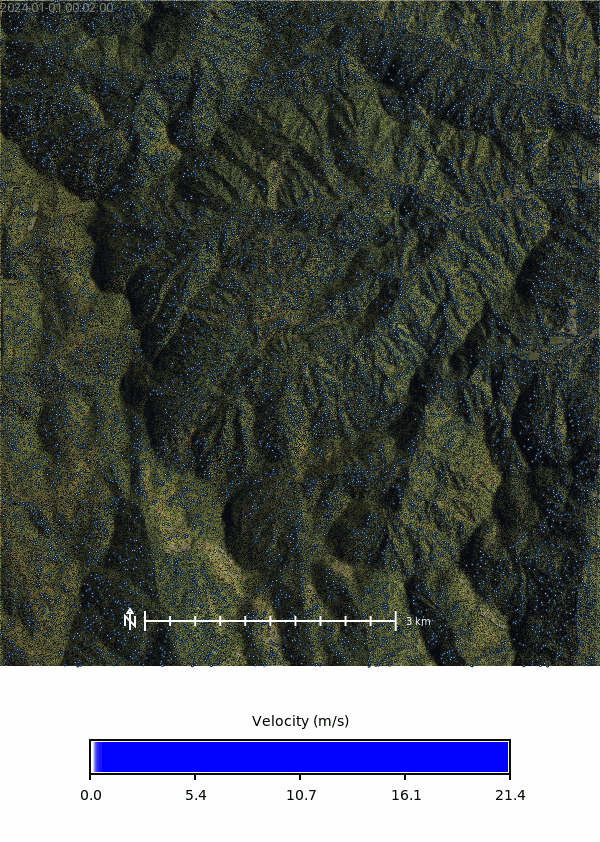

# Coweeta, NC -- Soil-Informed Overland Flow Simulation

The Coweeta Hydrologic Laboratory sits in the southern Blue Ridge Mountains of western North Carolina, where steep slopes, dense mixed-hardwood canopy, and deep well-drained loams route most rainfall through subsurface pathways long before it reaches a channel. That makes Coweeta a demanding test for overland-flow models: soil and cover heterogeneity fundamentally reshape where runoff forms and how fast it travels. Typical shallow-water runs apply a single uniform rainfall rate to every cell, but real rainfall excess -- the fraction of precipitation that actually runs off -- varies pixel by pixel. This notebook imports USDA SSURGO soil data, derives a spatially varying rainfall-excess surface via SCS curve-number analysis, and feeds it into the SIMWE particle-based shallow-water model. We then compare the soil-informed simulation against a naive one that ignores soil variability, and animate the walker cloud colored by flow speed.

The workflow below (@fig_ssurgo_flowchart) traces data from SSURGO and NLCD inputs through curve number, time of concentration, and Manning's $n$ to SIMWE's depth, discharge, and walker outputs.

```{mermaid}
%% label: fig_ssurgo_flowchart
%% echo: false
%% eval: true
%% fig-cap: "(Draft) Flowchart of SSURGO SIMWE workflows"
flowchart TD
    A[r.in.ssurgo] --> B("Soils map vector")
    A[r.in.ssurgo] --> HG("Hydrologic group map")
    A[r.in.ssurgo] --> KSAT("Ksat maps rasters")
    A[r.in.ssurgo] --> E("MUKEY map raster")
    B --> F("Soil attributes in vector attribute table")
    G[r.curvenumber] --> H("Curve number map")
    HG --> G
    LC(NLCD land cover map) --> G
    ELEV[Elevation raster] --> W[r.watershed]
    W --> I("Flow direction")
    W --> J("Streams")
    W --> K("Basins")
    TC[r.timeofconcentration] --> TCR("Time of concentration")
    ELEV --> TC
    I --> TC
    J --> TC
    H --> R[r.runoff]
    I --> R
    TCR --> R
    R --> RD("Runoff depth")
    R --> RV("Runoff volume")
    R --> TP("Time to peak")
    R --> PD("Peak discharge raster")
    R --> URD("Upstream runoff depth")
    R --> URV("Upstream runoff volume")
    R --> UA("Upstream area")
    LC --> MC["r.manning"]
    MC --> MN("Manning's n map")
    ELEV --> RSA["r.slope.aspect"]
    RSA --> DX("dx")
    RSA --> DY("dy")
    ELEV --> SIMWE["r.sim.water"]
    DX --> SIMWE
    DY --> SIMWE
    MN --> SIMWE
    HG --> SIMWE
    KSAT --> SIMWE
    SIMWE --> DEPTH("Water depth raster")
    SIMWE --> DISCHARGE("Discharge raster")
```

## Objectives

1. Import SSURGO soil properties (hydrologic groups, saturated hydraulic conductivity, MUKEYs) from either a local gSSURGO archive or the USDA Soil Data Access service.
2. Derive a curve-number surface by combining hydrologic soil groups with NLCD 2024 land cover.
3. Design a 100-year storm whose duration matches the watershed's time of concentration, ensuring peak-runoff conditions.
4. Convert SCS curve-number runoff depths into a spatially varying rainfall-excess rate (mm/hr) suitable for SIMWE.
5. Compute Manning's $n$ from NLCD to parameterize surface roughness for the shallow-water solver.
6. Run SIMWE with and without soil-informed rainfall excess, then visualize the walker cloud colored by flow speed ($v = q/h$) from the model's own depth and discharge outputs.

```{python}
# | label: imports
# | echo: false

import os
import subprocess
import sys

# import numpy as np
import matplotlib.pyplot as plt
import pandas as pd
import numpy as np
import seaborn as sns
from pprint import pprint
from PIL import Image
import sqlite3
from IPython.display import IFrame

# Ask GRASS GIS where its Python packages are.
sys.path.append(
    subprocess.check_output(["grass", "--config", "python_path"], text=True).strip()
)

# Import the GRASS GIS packages we need.
import grass.script as gs

# Import GRASS Jupyter
import grass.jupyter as gj
from grass.tools import Tools
```

## Study Area

Coweeta Hydrologic Laboratory (35.0667 N, 83.4333 W) is a long-term USDA Forest Service research site near Otto, NC, with ~2700 ft (~820 m) of relief across forested headwater catchments. Hydrologic soil groups here are dominated by **B** (moderate infiltration) with pockets of **C** and **D** on thinner ridge soils, in contrast to the B/C/D cropland mosaic at the Clay Center site. Work happens inside a GRASS mapset called `ssurgo_demo` in a project aligned to the site's 3 m elevation raster.

```{python}
# | label: init_session
# | echo: false
# | output: false
gisdb = os.path.join(os.getenv("HOME"), "grassdata")
site = "coweeta"
mapset = "ssurgo_demo"
session = gj.init(gisdb, site, "PERMANENT")
tools = Tools(session=session)
try:
    tools.g_mapset(mapset=mapset, flags="c")
except Exception as e:
    print(f"{e}")
finally:
    session.switch_mapset(mapset)
```

---

## Import SSURGO Data

`r.in.ssurgo` can pull soil survey data in two modes: from a local **gSSURGO** state archive, or on-demand from the **Soil Data Access** (SDA) web service, which avoids the multi-GB download at the cost of network latency. Both modes produce the same outputs -- a soil-polygon vector plus categorical rasters for hydrologic group (HSG) and MUKEY, and low/representative/high saturated hydraulic conductivity ($K_{sat}$) rasters -- which downstream tools use as inputs to curve-number and infiltration models.

Source for the `r.in.ssurgo` addon lives in `tools/r.soildb/r.in.ssurgo` in this repository; install it via `g.extension` pointing at that path (or from the GRASS Addons repository once it's merged).

```{python}
# | label: install_extension
# | eval: false
# | echo: false

tools.g_extension(
    extension="r.in.ssurgo",
    url="../../../cwhite911/grass-addons/src/raster/r.in.ssurgo"
)

```

### Computational Region

We align the computational region to the 3 m elevation raster so every derived layer -- soil rasters, curve number, Manning's $n$, SIMWE outputs -- shares the same grid. A companion shaded-relief raster provides the cartographic backdrop for every map that follows.

```{python}
# | label: set_region
region_text = tools.g_region(raster="elevation", flags="p").text
print(region_text)
```

```{python}
# | label: create_relief
tools.r_relief(input="elevation", output="relief")
```

### Loading the soil data

The local tab below imports from a downloaded gSSURGO North Carolina archive; the SDA tab queries the web service directly (no prior download). The horizon window (`hzdept_r=0`, `hzdepb_r=100` cm) and master designation filter (`desgnmaster="A"`) select the top 100 cm of A-horizon material, since rainfall-excess generation on forested slopes is dominated by near-surface soil properties. Outputs are suffixed `_sda` when imported via SDA so both versions can coexist.


## SDA Import

```{python}
# | label: import_ssurgo_sda
# | eval: false
tools.r_in_ssurgo(
    soils="soil_areas_sda",
    hydgrp="hydgrp_sda",
    ksat_l="ksat_l_sda",
    ksat_r="ksat_r_sda",
    ksat_h="ksat_h_sda",
    mukey="mukey_sda",
    hzdept_r=0,
    hzdepb_r=100,
    desgnmaster="A",
    nprocs=30
)
```

```{python}
# | label: import_ssurgo_sda
# | eval: false
tools.r_in_ssurgo(
    ssurgo_path="data/gSSURGO_NC.zip",
    soils="soil_areas",
    hydgrp="hydgrp",
    ksat_l="ksat_l",
    ksat_r="ksat_r",
    ksat_h="ksat_h",
    mukey="mukey",
    hzdept_r=0,
    hzdepb_r=100,
    desgnmaster="A",
    flags="s",
    nprocs=30
)

tools.r_in_ssurgo(
    ssurgo_path="data/gSSURGO_NC.zip",
    soils="soil_areas",
    hydgrp="hydgrp",
    ksat_r="ksat_r",
    depths="0,15,30,60,100",
    desgnmaster="A",
    flags="s",
    nprocs=30
)
```

```{python}
import grass.script.array as garray
import matplotlib.pyplot as plt

a = garray.array3d(mapname="ksat_r")  # shape (z, y, x)
fig, axes = plt.subplots(1, a.shape[0],
figsize=(4*a.shape[0], 4))
for i, ax in enumerate(axes):
    ax.imshow(a[i], cmap="viridis")
    ax.set_title(f"ksat_r slice {i}")
plt.show()
```


## Visualize Imported Data

Before feeding the soil surfaces into hydrologic models, it's worth confirming the imports look right. The soil polygons (`soil_areas_sda`) carry the full SSURGO attribute table -- MUKEY, component percentages, hydrologic group, texture, and permeability by horizon -- while the companion rasters are pre-rendered MUKEY, HSG, and three $K_{sat}$ percentiles (low / representative / high) for fast map algebra.

### MUKEY Map

MUKEY (map-unit key) is the atomic identifier that ties every raster cell back to a row in the SSURGO attribute database. Distinct MUKEY patches mark where component-level differences -- texture, depth, drainage class, percent rock -- vary even when the aggregated hydrologic group stays the same.

```{python}
# | label: mukey
# | echo: false
# | fig-cap: "MUKEY patches at Coweeta with soil polygon boundaries overlaid. The mosaic reflects distinct component assemblages even where the aggregated hydrologic group is the same."
with gs.RegionManager(raster="mukey_sda", flags="a"):
    m = gj.Map(use_region=True, width=700)
    m.d_shade(shade="relief", color="mukey_sda")
    m.d_vect(map="soil_areas_sda", color="black", fillcolor="none", width=0.5)
    m.d_barscale(
        at=(60, 5),
        font="Fira Sans Condensed Light",
        fontsize=14,
        length=2,
        units="kilometers",
        width_scale=1,
        bgcolor="none",
        color="#f9f9f9",
        flags="n",
    )
    m.show()
```

```{python}
data_json = tools.db_select(
    table="soil_areas",
    format="json",
).json
print(data_json)
df_soils = pd.DataFrame(data_json['records'])
df_soils.head()
```

### Ksat Maps

SSURGO reports saturated hydraulic conductivity as a low / representative / high percentile triplet that captures within-map-unit variability. Importing all three ($K_{sat,l}$, $K_{sat,r}$, $K_{sat,h}$) lets downstream infiltration models run at the representative value and be stress-tested against the bracketing bounds.

```{python}
# | label: ksat
# | layout-ncol: 3
# | echo: false
# | fig-cap: "SSURGO saturated hydraulic conductivity at Coweeta, shown for the low, representative, and high estimates within each map unit. The same absolute color ramp (browns = low $K_{sat}$, blues = high) is applied to all three panels so they are directly comparable -- the high-estimate panel is visibly more permeable because it uses the upper-bound $K_{sat}$ within each component."
# | fig-subcap:
# |     - Low
# |     - Representative
# |     - High
from io import StringIO


def ksat_color_scheme(vmin: float = 0.0, vmax: float = 150.0) -> str:
    """Return an r.colors rules string mapping absolute Ksat values (mm/hr)
    from browns (slow infiltration) to blues (fast) across [vmin, vmax]."""
    stops = [
        (0.00, "#3B1F0E"),  # very slow (clays, compacted)
        (0.10, "#5A2D1A"),
        (0.20, "#7A3F1D"),
        (0.30, "#9C5A2A"),  # low-moderate
        (0.40, "#B97C3F"),
        (0.50, "#D6A95C"),  # loams
        (0.60, "#BFD38A"),  # moderate-high
        (0.70, "#8FCB9B"),
        (0.80, "#5FB7B2"),  # high (sands)
        (0.90, "#3A8FB7"),
        (1.00, "#1E5E8C"),  # very high (gravel, macroporous)
    ]
    return "\n".join(
        f"{vmin + frac * (vmax - vmin):.3f} {color}" for frac, color in stops
    ) + "\n"


ksat_maps = ["ksat_l_sda", "ksat_r_sda", "ksat_h_sda"]
ksat_max = max(tools.r_info(map=m, format="json").json["max"] for m in ksat_maps)
tools.r_colors(map=ksat_maps, rules=StringIO(ksat_color_scheme(0.0, ksat_max)))

for ksat_map, out in zip(
    ksat_maps,
    [None, "output/coweeta_ksat_r_sda.png", None],
):
    kwargs = {"use_region": True, "width": 600}
    if out:
        kwargs["filename"] = out
    with gs.RegionManager(raster=ksat_map, s="s-1500", flags="a"):
        m = gj.Map(**kwargs)
        m.d_shade(shade="relief", color=ksat_map, brighten=30)
        m.d_legend(
            raster=ksat_map,
            title="Ksat (mm/hr)",
            at="5, 10, 20, 80",
            font="Fira Sans Condensed Light",
            fontsize=16,
            flags="n",
            range=[0.0, ksat_max],
        )
        m.show()
```

### Hydrologic Group

Hydrologic soil groups (HSG) are a four-class condensation of SSURGO's detailed soil properties into categories **A** (high infiltration, sand/gravel) through **D** (low infiltration, clay/shallow bedrock), with **A/D** marking soils whose behavior depends on drainage. HSG is the direct input to the SCS curve-number lookup table, so any coarseness in this raster propagates into every subsequent runoff calculation.

```{python}
# | label: hydrologic_group_map
# | layout-ncol: 1
# | echo: false
# | fig-cap: "Hydrologic soil groups at Coweeta. Group B dominates the ridgeline forest with pockets of C on thinner soils; no group A (high infiltration) appears in this catchment."

with gs.RegionManager(raster="hydgrp_sda", w="w-5000", flags="a"):
    m = gj.Map(use_region=True, width=700)
    m.d_shade(shade="relief", color="hydgrp_sda")
    m.d_legend(
        raster="hydgrp_sda",
        flags="nc",
        at="50, 95, 2, 5",
        font="Fira Sans Condensed Light",
        fontsize=16,
    )
    m.show()
```

## Calculate Curve Number

The SCS curve number (CN) is an empirical index, from 0 to 100, that captures how much of a given rainfall depth becomes runoff. High CNs mean runoff-prone surfaces (impervious, bare, hydrologic group D); low CNs mean infiltration-dominant surfaces (forested, group A). CN is computed from an HSG × land cover lookup table, so it's the natural bridge between SSURGO's soil classes and NLCD's cover classes.

Install `r.curvenumber` from the GRASS Addons repository:

```python
# | label: install_curvenumber_text
# | eval: false
tools.g_extension(
    extension="r.curvenumber",
)
```

```{python}
# | label: install_test_extensions
# | eval: false
# | echo: false
tmp_addon_test = [
    # "r.stream.basins",
    # "r.stream.distance",
    # "r.stream.order",
    # "r.stream.segment",
    # "r.stream.slope",
    # "r.stream.snap",
    # "r.stream.stats",
    # "r.stream.variables",
    # "r.stream.watersheds"
    "r.accumulate",
    "r.runoff",
    "r.curvenumber",
]
for addon in tmp_addon_test:
    try:
        tools.g_extension(
            extension=addon,
            url=f"../../../cwhite911/grass-addons/src/raster/{addon}"
        )
    except Exception as e:
        print(f"{e}")

```


### Land Cover

CN requires a land cover raster alongside the HSG raster. We use NLCD 2024, the most recent national land cover product, imported as a cloud-optimized GeoTIFF so the `r.import` call only reads the pixels that fall inside the current computational region.

```{python}
#| label: import_landcover
#| eval: false
tools.r_import(
    output="nlcd_2024",
    input="<path_to_nlcd_cog>",
    extent="region",
    resolution="region",
)

```

The imported raster carries numeric class codes (21, 41, 42…) but no human-readable labels -- the legend would render as a column of bare numbers. Since `nlcd_2024` lives in PERMANENT and `r.category` only writes to the current mapset, we copy it into `ssurgo_demo` first, then attach the standard NLCD 2024 class names inline.

```{python}
# | label: landcover_map
# | echo: false
# | layout-ncol: 1
# | fig-cap: "NLCD 2024 land cover at Coweeta. The canopy is dominated by deciduous and mixed forest with narrow ribbons of developed, open space along valley floors -- a land-cover distribution that pushes most cells toward low curve-number (infiltration-friendly) values in the next step."
import io

gs.run_command(
    "g.copy",
    raster=("nlcd_2024@PERMANENT", "nlcd_2024"),
    overwrite=True,
)

with gs.RegionManager(raster="nlcd_2024", w="w-5100", flags="a"):
    tools.r_category(
        map="nlcd_2024",
        separator="|",
        rules=io.StringIO(
            "11|Open Water\n"
            "12|Perennial Ice/Snow\n"
            "21|Developed, Open Space\n"
            "22|Developed, Low Intensity\n"
            "23|Developed, Medium Intensity\n"
            "24|Developed, High Intensity\n"
            "31|Barren Land\n"
            "41|Deciduous Forest\n"
            "42|Evergreen Forest\n"
            "43|Mixed Forest\n"
            "52|Shrub/Scrub\n"
            "71|Grassland/Herbaceous\n"
            "81|Pasture/Hay\n"
            "82|Cultivated Crops\n"
            "90|Woody Wetlands\n"
            "95|Emergent Herbaceous Wetlands\n"
        ),
    )
    m = gj.Map(use_region=True, width=600)
    m.d_shade(shade="relief", color="nlcd_2024")
    m.d_legend(
        raster="nlcd_2024",
        title="Land Cover",
        flags="cn",
        at="15,85,2,35",
        fontsize=14,
        font="Fira Sans Condensed Light",
    )
    m.d_barscale(
        at=(3, 10),
        font="Fira Sans Condensed Light",
        fontsize=10,
        length=3,
        width_scale=1,
        units="kilometers",
        bgcolor="none",
        style="both_ticks",
        color="#3e3e3e",
        flags="n",
    )
    m.show()
```

### Deriving the CN raster

With HSG and NLCD in hand, [`r.curvenumber`](https://grass.osgeo.org/grass-devel/manuals/addons/r.curvenumber.html) applies the standard SCS lookup. `landcover_source="nlcd"` tells the tool to use the NLCD-specific class-to-CN table (rather than the default NCDS or custom tables), which matters because class codes differ across land-cover datasets.

```{python}
# | label: curvenumber_calc
tools.r_curvenumber(
    landcover="nlcd_2024",
    soil="hydgrp_sda",
    landcover_source="nlcd",
    output="curvenumber",
)
```

```{python}
# | label: curvenumber_map
# | echo: false
# | layout-ncol: 1
# | fig-cap: "Curve number at Coweeta derived from NLCD 2024 and hydrologic soil group. Values span 32 (forested soils, heavy infiltration) to 89 (developed patches on group-C soils)."

with gs.RegionManager(raster="curvenumber", s="s-1500", flags="a"):
    m = gj.Map(use_region=True, width=600)
    m.d_shade(shade="relief", color="curvenumber")
    m.d_legend(
        raster="curvenumber",
        title="Curve Number",
        at="5, 10, 20, 80",
        font="Fira Sans Condensed Light",
        fontsize=16,
        flags="",
    )
    m.d_barscale(
        at=(60, 20),
        font="Fira Sans Condensed Light",
        fontsize=11,
        length=2,
        units="kilometers",
        width_scale=1,
        bgcolor="none",
        color="#ffffff",
        flags="n",
    )
    m.show()
```

## Runoff and Time of Concentration

A CN raster alone doesn't yet tell us how much runoff a particular storm produces -- we also need a design storm depth (how much rain fell) and the watershed's time of concentration $T_c$ (how long the longest flow path takes to drain). Pairing $T_c$ with an IDF curve identifies the storm duration that generates the peak runoff response, which is the storm we want to simulate with SIMWE.

### Extension installs

`r.timeofconcentration`, `r.stream.distance`, and `r.noaa.atlas14` are needed for this section and are pulled from a local checkout of the grass-addons fork.

```{python}
# | label: install_toc_extension
# | eval: false
# | echo: false
tools.g_extension(
    extension="r.timeofconcentration",
    url="../../../cwhite911/grass-addons/src/raster/r.timeofconcentration",
)
tools.g_extension(
    extension="r.stream.distance",
    url="../../../cwhite911/grass-addons/src/raster/r.stream.distance",
)
```

```{python}
# | label: install_runoff_extension
# | eval: false
# | echo: false
# tools.g_extension(
#     extension="r.accumulate",
#     url="../../../cwhite911/grass-addons/src/raster/r.accumulate",
# )
# tools.g_extension(
#     extension="r.runoff", url="../../../cwhite911/grass-addons/src/raster/r.runoff"
# )
tools.g_extension(
    extension="r.noaa.atlas14",
    url="../../../cwhite911/grass-addons/src/raster/r.noaa.atlas14",
)
```

### Design storm from NOAA Atlas 14

NOAA Atlas 14 provides point-based precipitation frequency estimates indexed by return period (1, 2, 5, ... 1000 yr) and duration (5 min to 60 day). A `mode="point"` query at the Coweeta Experimental Station coordinates fetches the local IDF table without triggering the multi-GB regional grid download that `mode="grid"` would.

```{python}
# | label: noaa_atlas14

outjson = tools.r_noaa_atlas14(
    mode="point",
    statistic="intensity",
    vector_output="noaa_atlas14_station",
    coordinates=[-83.4333, 35.0667],
    unit="metric",
    series="pds",
    bound="expected",
    resample="bilinear",
).json
```

### Watershed analysis

`r.runoff` and `r.timeofconcentration` both need a flow-direction raster, a stream network, and (optionally) basin boundaries. `r.watershed` derives all three from the DEM in a single call.

```{python}
#| label: watershed
tools.r_watershed(
    elevation="elevation",
    drainage="flow_direction",
    accumulation="accumulation",
    stream="stream",
    basin="basins",
    threshold=1000,
)
```

```{python}
# | label: watershed_map
# | echo: false
# | layout-ncol: 2
# | fig-cap: "Watershed products derived from the DEM by `r.watershed`. The NOAA Atlas 14 station coordinate is marked on the flow-accumulation panel."
# | fig-subcap:
# |     - Flow accumulation
# |     - Sub-basins

with gs.RegionManager(raster="accumulation", s="s-1500", flags="a"):
    # r.watershed flags cells with inflow from outside the region as negative
    # accumulation values. Clip the legend (and the displayed stretch) to the
    # positive-only side so the color ramp isn't dominated by that sentinel.
    acc_max = tools.r_info(map="accumulation", format="json").json["max"]
    m = gj.Map(use_region=True, width=600)
    m.d_shade(shade="relief", color="accumulation")
    m.d_vect(
        map="noaa_atlas14_station",
        color="black",
        fill_color="orange",
        icon="basic/circle",
        size=10,
    )
    m.d_legend(
        raster="accumulation",
        title="Accumulation (cells)",
        flags="slt",
        at="5, 10, 20, 80",
        font="Fira Sans Condensed Light",
        fontsize=16,
        range=[1, acc_max],
    )
    m.show()

m2 = gj.Map(use_region=True, width=600)
m2.d_shade(shade="relief", color="basins")
m2.show()
```

### Time of concentration

`r.timeofconcentration` traces every cell's flow path downstream using the `flow_direction` and `stream` rasters, accumulating travel time to produce a per-cell $T_c$ estimate. `length_min=100` discards flow paths shorter than 100 m as numerical noise. The maximum of this raster is the watershed-scale $T_c$ that drives the design-storm duration below.

```{python}
# | label: time_of_concentration
tools.r_timeofconcentration(
    elevation="elevation",
    direction="flow_direction",
    stream="stream",
    length_min=100,  # minimum length of flow path
    tc="time_concentration",
)
```

```{python}
# | label: time_of_concentration_map
# | echo: false
# | layout-ncol: 1
# | fig-cap: "Per-cell time of concentration at Coweeta. Values accumulate downstream along flow paths; the maximum sets the storm duration used to size rainfall intensity."

with gs.RegionManager(raster="elevation", s="s-1500", flags="a"):
    tools.r_colors(map="time_concentration", color="byg", flags="e")
    m = gj.Map(use_region=True, width=600)
    m.d_shade(shade="relief", color="time_concentration")
    m.d_legend(
        raster="time_concentration",
        title="Time of Concentration (hours)",
        at="5, 10, 20, 80",
        font="Fira Sans Condensed Light",
        fontsize=16,
        flags="sl",
    )
    # m.d_barscale(
    #     at=(67, 5),
    #     font="Fira Sans Condensed Light",
    #     fontsize=11,
    #     length=2,
    #     units="kilometers",
    #     width_scale=1,
    #     bgcolor="none",
    #     color="#4f4e4e",
    #     flags="n",
    # )
    m.show()
```

A quick univariate summary confirms the range of $T_c$ values -- the maximum drives the storm duration used to size rainfall intensity in the next step.

```{python}
# | label: time_of_concentration_stats
# | echo: false

tc_json = tools.r_univar(map="time_concentration", flags="e", format="json").json
df_tc = pd.DataFrame(tc_json)
tc_table = (
    pd.DataFrame(tc_json, index=[0])
    .T.reset_index()
    .rename(columns={"index": "Statistic", 0: "Value"})
)

percentiles_row = tc_table.loc[tc_table["Statistic"] == "percentiles", "Value"]
tc_table = tc_table.loc[tc_table["Statistic"] != "percentiles"].copy()

if not percentiles_row.empty:
    p = percentiles_row.iloc[0]
    if isinstance(p, dict):
        pct_df = pd.DataFrame(
            [{"Statistic": f"percentile_{k}", "Value": v} for k, v in p.items()]
        )
        tc_table = pd.concat([tc_table, pct_df], ignore_index=True)

display(
    tc_table.style.hide(axis="index")
    .set_caption("Time of Concentration — Summary Statistics")
    .format(
        {
            "Value": lambda v: f"{v:,.3f}"
            if isinstance(v, (int, float, np.number))
            else v
        }
    )
)
```

### Matching storm duration to Tc

The storm that produces the peak runoff response at a given return period has a duration equal to $T_c$. We convert the watershed's $T_c$ from hours to minutes, look up the NOAA Atlas 14 intensity-duration-frequency (IDF) table, and interpolate the 100-year intensity at that duration.

```{python}
# | label: tc_and_rfi

df_tc_min = df_tc[["min", "mean", "max"]].apply(
    lambda x: round(x * 60, 2)
)  # convert to minutes
max_tc = df_tc_min["max"].max()
print(max_tc)

_rf_table = outjson["table"]
_rf_rps = [str(rp) for rp in _rf_table["return_periods_years"]]
df_rf_intensity = pd.DataFrame(
    [
        {"duration": row["duration"], **{rp: row["values"].get(rp) for rp in _rf_rps}}
        for row in _rf_table["rows"]
    ],
    columns=["duration"] + _rf_rps,
)
display(
    df_rf_intensity.style.hide(axis="index")
    .set_caption("Rainfall Intensity — NOAA Atlas 14, Coweeta, NC")
    .format(
        {
            "Value": lambda v: f"{v:,.3f}"
            if isinstance(v, (int, float, np.number))
            else v
        }
    )
)
```

```{python}
# | label: rainfall_intensity_figure
# | echo: false
# | fig-cap: "NOAA Atlas 14 rainfall intensity by storm duration for Coweeta, NC, with the maximum time of concentration marked."

rf = df_rf_intensity.copy()

duration_col = next(
    (c for c in rf.columns if "duration" in c.lower()),
    rf.columns[0],
)

def _duration_to_minutes(value):
    text = str(value).strip().lower()
    match = re.search(r"(\d+(?:\.\d+)?)", text)
    if not match:
        return np.nan
    number = float(match.group(1))
    if "day" in text:
        return number * 24 * 60
    if "hr" in text or "hour" in text:
        return number * 60
    return number

import re

rf["duration_min"] = rf[duration_col].apply(_duration_to_minutes)

value_cols = [c for c in rf.columns if c not in {duration_col, "duration_min"}]
rf_long = rf.melt(
    id_vars=["duration_min"],
    value_vars=value_cols,
    var_name="return_period",
    value_name="intensity_mm_hr",
)
rf_long["intensity_mm_hr"] = pd.to_numeric(rf_long["intensity_mm_hr"], errors="coerce")
rf_long = rf_long.dropna(subset=["duration_min", "intensity_mm_hr"]).sort_values(
    ["return_period", "duration_min"]
)

sns.set_theme(style="whitegrid", context="talk")
fig, ax = plt.subplots(figsize=(10, 6))

sns.lineplot(
    data=rf_long,
    x="duration_min",
    y="intensity_mm_hr",
    hue="return_period",
    marker="o",
    linewidth=2.5,
    ax=ax,
)

ax.axvline(
    max_tc,
    color="black",
    linestyle="--",
    linewidth=1.5,
    label=f"Max Tc = {max_tc:.1f} min",
)

ax.annotate(
    f"Max Tc\n{max_tc:.1f} min",
    xy=(max_tc, rf_long["intensity_mm_hr"].max()),
    xytext=(8, -10),
    textcoords="offset points",
    ha="left",
    va="top",
    fontsize=11,
    bbox=dict(boxstyle="round,pad=0.25", fc="white", ec="0.6", alpha=0.9),
)

ax.set_xscale("log")
ax.set_xlabel("Storm duration (minutes)")
ax.set_ylabel("Rainfall intensity (mm/hr)")
ax.set_title("Rainfall intensity–duration curves")
ax.legend(title="Return period", frameon=True, ncol=2)
sns.despine()
plt.tight_layout()
plt.show()


return_periods = rf_long["return_period"].dropna().unique()
rp_100 = next(
    (
        rp
        for rp in return_periods
        if re.search(r"100", str(rp)) and re.search(r"(yr|year)", str(rp).lower())
    ),
    next((rp for rp in return_periods if re.search(r"100", str(rp))), None),
)

if rp_100 is None:
    raise ValueError("Could not identify the 100-year storm column in rainfall intensity data.")

rf_100 = (
    rf_long.loc[rf_long["return_period"] == rp_100, ["duration_min", "intensity_mm_hr"]]
    .dropna()
    .sort_values("duration_min")
)

storm_intensity_100yr = float(
    np.interp(
        np.log10(max_tc),
        np.log10(rf_100["duration_min"].to_numpy()),
        rf_100["intensity_mm_hr"].to_numpy(),
    )
)

rain_mm_per_hour = storm_intensity_100yr

display(
    pd.DataFrame(
        {
            "return_period": [rp_100],
            "max_tc_min": [round(max_tc, 2)],
            "intensity_mm_hr": [round(storm_intensity_100yr, 2)],
        }
    ).style.hide(axis="index").set_caption(
        "Interpolated rainfall intensity at maximum time of concentration"
    )
)

print(f"100-year storm intensity at max Tc ({max_tc:.2f} min): {storm_intensity_100yr:.2f} in/hr")
```

### Rainfall depth for r.runoff

`r.runoff` takes a total rainfall depth (mm) over the storm duration rather than an intensity rate, so we convert the interpolated intensity back to a depth using the $T_c$-matched storm duration.

```{python}
# | label: precipitation_mm

# storm_intensity_100yr 46.97 min = 0.7828 hr
duration_min = 46.97
intensity_in_hr = 4.34
intensity_mm_hr = intensity_in_hr * 25.4

duration_hr = duration_min / 60.0
rain_mm = intensity_mm_hr * duration_hr

print(f"Storm duration: {duration_hr:.4f} hr")
print(f"Rainfall intensity: {intensity_mm_hr:.3f} mm/hr")
print(f"Rain depth: {rain_mm:.3f} mm")
tools.r_mapcalc(
    expression=f"rain = {rain_mm}",  # mm of precipitation
)
```

```{python}
# | label: extension_import_accumulate_runoff
# | echo: false
# | eval: false
tools.g_extension(
    extension="r.accumulate",
    url="../../../cwhite911/grass-addons/src/raster/r.accumulate",
)
tools.g_extension(
    extension="r.runoff", url="../../../cwhite911/grass-addons/src/raster/r.runoff"
)
```

```{python}
# | label: runoff_calculation

tools.r_runoff(
    rainfall="rain",
    direction="flow_direction",
    duration=duration_hr,  # 0.7828 hrs
    curvenumber="curvenumber",
    time_concentration="time_concentration",
    runoff_depth="runoff_depth",
    runoff_volume="runoff_volume",
    upstream_area="upstream_area",
    upstream_runoff_depth="upstream_runoff_depth",
    upstream_runoff_volume="upstream_runoff_volume",
    time_to_peak="time_to_peak",
    peak_discharge="peak_discharge",
)
```

### Runoff depth

With the CN raster, rainfall depth, $T_c$, and flow-direction raster in hand, `r.runoff` produces the full suite of SCS-method outputs: per-cell runoff depth and volume, upstream-accumulated runoff, peak discharge, and time to peak. The `runoff_depth` raster is the critical input to the next step -- once normalized by duration, it becomes the rainfall-excess rate that SIMWE routes across the surface.

```{python}
# | label: runoff_map
# | echo: false
# | layout-ncol: 1
# | fig-cap: "Runoff depth (mm) from the SCS method for the $T_c$-matched 100-year storm. Low-CN forest patches shed little runoff; higher-CN valley patches shed several centimeters."
with gs.RegionManager(raster="runoff_depth", s="s-1500", flags="a"):
    tools.r_colors(map="runoff_depth", color="water")
    m = gj.Map(use_region=True, width=600)
    m.d_shade(shade="relief", color="runoff_depth")
    m.d_legend(
        raster="runoff_depth",
        title="Runoff Depth (mm)",
        at="5, 10, 20, 80",
        font="Fira Sans Condensed Light",
        fontsize=16,
        flags="n",
    )
    # m.d_barscale(
    #     at=(67, 5),
    #     font="Fira Sans Condensed Light",
    #     fontsize=11,
    #     length=2,
    #     units="kilometers",
    #     width_scale=1,
    #     bgcolor="none",
    #     color="#4f4e4e",
    #     flags="n",
    # )
    m.show()
```

Peak discharge and time-to-peak maps give complementary information: discharge highlights where flow concentrates, while time-to-peak reveals the temporal response of different sub-basins.

```{python}
# | label: peak_discharge_map
# | echo: false
# | layout-ncol: 2
# | fig-cap: "SCS runoff response for the design storm."
# | fig-subcap:
# |     - Peak discharge (m³/s)
# |     - Time to peak (hours)

with gs.RegionManager(raster="peak_discharge", s="s-1500", flags="a"):
    tools.r_colors(map="peak_discharge", color="magma",flags="n")
    m = gj.Map(use_region=True, width=600)
    m.d_shade(shade="relief", color="peak_discharge")
    m.d_legend(
        raster="peak_discharge",
        title="Peak Discharge (m³/s)",
        at="5, 10, 20, 80",
        font="Fira Sans Condensed Light",
        fontsize=16,
        flags="n",
    )
    m.show()

    tools.r_colors(map="time_to_peak", color="magma", flags="ne")
    m1 = gj.Map(use_region=True, width=600)
    m1.d_shade(shade="relief", color="time_to_peak")
    m1.d_legend(
        raster="time_to_peak",
        title="Time to Peak (hours)",
        at="5, 10, 20, 80",
        font="Fira Sans Condensed Light",
        fontsize=16,
        flags="ls",
    )
    m1.show()
```

## Manning's n Map

SIMWE routes surface flow using the shallow-water momentum equation, with surface friction parameterized by Manning's $n$. Coefficient values depend strongly on land cover: open water has $n \approx 0.03$, dense forest $n \approx 0.4$ or higher. `r.manning` assigns $n$ per NLCD class using a lookup table; here we use the values from Kalyanapu et al. (2009), which are calibrated for overland flow rather than channel flow.

Install `r.manning` if it isn't already available:

```{python}
# | label: install_manning_extension
# | eval: false
tools.g_extension(
    extension="r.manning"
)
```

A fixed `seed=42` keeps the per-class stochastic jitter reproducible across runs.

```{python}
# | label: r_manning_map
tools.r_manning(
    input="nlcd_2024",
    output="mannings_n",
    landcover="nlcd",
    source="kalyanapu",
    seed=42,
)


mannings_n_colors = io.StringIO(
    "0.008 #F0E68C\n"   # Barren Land (low end)
    "0.025 #6BAED6\n"   # Open Water
    "0.040 #A1D99B\n"   # Developed, Open Space / Open Water (med)
    "0.068 #BDBDBD\n"   # Developed, Low/Med Intensity
    "0.160 #F4A460\n"   # Cultivated Crops
    "0.183 #66C2A4\n"   # Emergent Herbaceous Wetlands
    "0.325 #D4B86A\n"   # Pasture/Hay
    "0.368 #A8C25C\n"   # Grassland/Herbaceous
    "0.400 #2D8C2D\n"   # Mixed Forest / Shrub
    "0.530 #1A5C1A\n"   # Dense Forest (high end)
)

with gs.RegionManager(raster="mannings_n", s="s-1500", flags="a"):
    tools.r_colors(map="mannings_n", rules=mannings_n_colors)
    m = gj.Map(use_region=True, width=600)
    m.d_shade(shade="relief", color="mannings_n")
    m.d_legend(
        raster="mannings_n",
        title="Manning's n",
        at="5, 10, 20, 80",
        font="Fira Sans Condensed Light",
        fontsize=16,
        flags="sn",
    )
    # m.d_barscale(
    #     at=(67, 5),
    #     font="Fira Sans Condensed Light",
    #     fontsize=11,
    #     length=2,
    #     units="kilometers",
    #     width_scale=1,
    #     bgcolor="none",
    #     color="#4f4e4e",
    #     flags="n",
    # )
    m.show()
```

## Run SIMWE

SIMWE (`r.sim.water`) solves the shallow-water momentum equation using a particle-based (walker) approach. Each walker carries a fraction of the total discharge along flow paths computed from the DEM gradient, depth, and Manning's $n$. The model needs four inputs: DEM, slope components ($dx$, $dy$), a rainfall-excess rate (mm/hr), and Manning's $n$. Outputs are per-timestep depth and unit-discharge rasters plus an optional walker vector cloud for visualization.

### Precipitation and Rainfall Excess

The key difference between soil-aware and naive simulations is the rainfall-excess input. A naive run applies a uniform rate to every cell. The soil-informed version divides the per-cell runoff depth produced by the curve-number analysis by the storm duration, yielding a spatially varying mm/hr rate that implicitly encodes soil infiltration capacity and land-cover abstractions.

| **Location Information** | **Value** |
|---|---|
| Name | Otto, North Carolina, USA* |
| Station name | COWEETA EXP STN |
| Site ID | 31-2102 |
| Latitude | 35.0667° |
| Longitude | -83.4333° |
| Elevation | 2700 ft** |


The resulting `rainfall_excess` map below is in mm/hr and drives SIMWE's interior source term.

::: {.callout-note}
The current divisor of 24 hr is a placeholder for the full daily storm bookkeeping -- the `TODO` in the cell flags that this should be $T_c$-normalized (≈ 0.78 hr) once the runoff model is reconciled with the $T_c$-matched storm duration.
:::

```{python}
# | label: rainfall_excess_map

# Time of Concentration: 46.8 min
tools.r_mapcalc(
    expression=f"rainfall_excess = runoff_depth /  0.7828",  # 0.7828 hr = 46.8 min
)


with gs.RegionManager(raster="rainfall_excess", s="s-1500", flags="a"):
    tools.r_colors(map="rainfall_excess", color="haxby", flags="en")
    m = gj.Map(use_region=True, width=600)
    m.d_shade(shade="relief", color="rainfall_excess")
    m.d_legend(
        raster="rainfall_excess",
        title="Rainfall Excess (mm/hr)",
        at="5, 10, 20, 80",
        font="Fira Sans Condensed Light",
        fontsize=16,
        flags="n",
    )
    # m.d_barscale(
    #     at=(67, 5),
    #     font="Fira Sans Condensed Light",
    #     fontsize=11,
    #     length=2,
    #     units="kilometers",
    #     width_scale=1,
    #     bgcolor="none",
    #     color="#4f4e4e",
    #     flags="n",
    # )
    m.show()
```

### Soil-informed simulation

The first SIMWE run uses the soil-derived `rainfall_excess` map and simulates 48 min (covering the $T_c$-matched 100-year storm) with 100,000 walkers, writing depth, discharge, and walker snapshots every 2 min. The `flags="t"` option emits a time-indexed series rather than summary totals. Outputs are registered into a space-time raster dataset (STRDS) so downstream visualization tools can treat the run as a single animated object.

```{python}
# | label: r_sim_water
# | eval: false

# duration_min = 46.97 round to 47 min for simulation
tools.r_slope_aspect(elevation="elevation", dx="dx", dy="dy")
tools.r_sim_water(
    elevation="elevation",
    depth="tc_100yr_depth",
    discharge="tc_100yr_discharge",
    walkers_output="tc_100yr_walkers",
    rain="rainfall_excess",  # Infiltration / Veg Intercept
    man="mannings_n",  # Mixed forest Kalyanapu et al. (2009)
    nwalkers=100000,
    # infil="ksat_r_sda", # Infiltration of flowing water
    # niterations=1440 / 2,
    observation="sample_outlets",
    logfile="coweeta_100yr_simulation.log",
    duration=48, # Bump it to 48 min to cover the full storm duration (rounded up from 46.97 min)
    output_step=2,
    nprocs=0,  # auto-detect
    flags="t",
)

# Register the output maps into a space time dataset
gs.run_command(
    "t.create",
    output="tc_100yr_depth_sum",
    type="strds",
    temporaltype="absolute",
    title="Runoff Depth",
    description="Runoff Depth in [m]",
    overwrite=True,
)

# Get the list of depth maps
depth_list = gs.read_command(
    "g.list", type="raster", pattern="tc_100yr_depth.*", separator="comma"
).strip()

# Register the maps
gs.run_command(
    "t.register",
    input="tc_100yr_depth_sum",
    type="raster",
    start="2024-01-01",
    increment="2 minutes",
    maps=depth_list,
    flags="i",
    overwrite=True,
)

```

```{python}
# | label: tc_100yr_depth_map
# | echo: false
# | layout-ncol: 1
# | fig-cap: "Final-timestep overland flow depth draped over NAIP 2022 imagery. Sample outlet points are marked in orange."

with gs.RegionManager(raster="accumulation", s="s-1500", flags="a"):
    depth_list = gs.read_command(
        "g.list", type="raster", pattern="tc_100yr_depth.*", separator="comma"
    ).strip()

    max_depth = depth_list.split(",")[-1]
    stats = tools.r_info(map=max_depth, format="json").json
    m = gj.Map(use_region=True, width=700)
    m.d_shade(shade="relief", color="naip_2022_rgb@naip")
    m.d_rast(map=max_depth, values=f"0.0075-{stats['max']}")
    m.d_vect(
        map="sample_outlets",
        type="point",
        color="black",
        fill_color="orange",
        icon="basic/circle",
        size=10,
    )
    m.d_legend(
        raster=max_depth,
        title="Depth (m)",
        at="5, 10, 20, 80",
        font="Fira Sans Condensed Light",
        fontsize=16,
        range=[0.0075, stats["max"]],
        flags="ls",
    )
    m.d_barscale(
        at=(62, 15),
        font="Fira Sans Condensed Light",
        fontsize=11,
        length=2,
        units="kilometers",
        width_scale=1,
        bgcolor="none",
        color="#383838",
        flags="n",
    )
    m.show()
```

The final-timestep depth map above captures the accumulated flood extent once rainfall has routed through the full watershed. To see the temporal evolution -- where water ponds first, which channels fill late, and how the drainage pattern develops -- we render the full STRDS as an animated GIF.

```{python}
# | label: tc_100_depth_map
# | eval: false

with gs.RegionManager(raster="accumulation", s="s-1500", flags="a"):
    depth_list = gs.read_command(
        "g.list", type="raster", pattern="tc_100yr_depth.*", separator="comma"
    ).strip()

    max_depth = depth_list.split(",")[-1]
    stats = tools.r_info(map=max_depth, format="json").json
    m = gj.TimeSeriesMap(use_region=True, width=700)
    m.d_rast(map="relief")
    m.add_raster_series("tc_100yr_depth_sum", values=f"0.025-{stats['max']}")
    m.d_legend(
        raster=max_depth,
        title="Depth [m]",
        flags="ls",
        border_color="none",
        range=[0.025, stats["max"]],
        at="5, 10, 20, 80",
    )

    m.save("output/tc_100yr_simwe_depth_animation.gif")
    m.show()
```


### Walker Velocity Animation

The `walkers_output` from `r.sim.water` stores walker positions but no velocity attribute. SIMWE already emits both depth ($h$) and unit discharge ($q$) per timestep, and by definition $q = h \cdot v$, so the per-cell flow speed is simply $v = q / h$. Using SIMWE's own outputs keeps the velocity field consistent with the model's internal physics (diffusion wave + Manning + infiltration) rather than re-deriving it from Manning's equation externally. We then sample this velocity raster at each walker position to color the Lagrangian particle cloud.

```{python}
# | label: compute_velocity_rasters
# | eval: false
# Build an STRDS of per-timestep flow-speed rasters directly from SIMWE's own
# discharge and depth outputs: v = q / h.  This stays self-consistent with the
# model's internal physics (diffusion-wave + Manning + infiltration) rather
# than re-deriving velocity from Manning's equation externally.

depth_list = gs.read_command(
    "g.list", type="raster", pattern="tc_100yr_depth.*", separator=","
).strip().split(",")

depth_list = [d.split("@", 1)[0] for d in depth_list]
print(f"Found depth maps: {depth_list}")

vel_list = []
for depth in depth_list:
    suffix = depth.split(".", 1)[1]
    discharge = f"tc_100yr_discharge.{suffix}"
    vel = f"tc_100yr_velocity.{suffix}"
    tools.r_mapcalc(
        expression=(
            f"{vel} = if({depth} > 0.001, {discharge} / {depth}, null())"
        ),
        overwrite=True,
    )
    vel_list.append(vel)

gs.run_command(
    "t.create", output="tc_100yr_velocity_sum", type="strds",
    temporaltype="absolute", title="Overland Flow Velocity",
    description="Flow speed (m/s) from SIMWE discharge / depth", overwrite=True,
)
gs.run_command(
    "t.register", input="tc_100yr_velocity_sum", type="raster",
    start="2024-01-01", increment="2 minutes",
    maps=",".join(vel_list), flags="i", overwrite=True,
)
gs.run_command(
    "t.rast.colors", input="tc_100yr_velocity_sum", color="blues", flags="e",
)
```

```{python}
# | label: walker_stvds
# | eval: false
# Subsample walker vectors, attach an attribute table with a velocity column
# sampled from the v = q/h raster for the matching timestep,
# store a per-walker color via v.colors, and register an STVDS.

# Walker maps: tc_100yr_walkers_02, _04, ...  Velocity rasters: tc_100yr_velocity.02, .04, ...
walker_maps = (
    gs.read_command(
        "g.list", type="vector", pattern="tc_100yr_walkers_*", separator=","
    )
    .strip()
    .split(",")
)
# Strip any "@<mapset>" qualifier so suffix parsing and the derived output
# names stay unqualified (same fix as compute_velocity_rasters).
walker_maps = [w.split("@", 1)[0] for w in walker_maps]

step = 50  # keep every Nth walker

sampled = []
for wm in walker_maps:
    suffix = wm.rsplit("_", 1)[1]  # "02"
    print(f"Processing walker map {wm} with suffix {suffix}")
    vel_raster = f"tc_100yr_velocity.{suffix}"
    s = f"{wm}_sub"

    # Walker vectors have no attribute table, so `where=` SQL is unavailable.
    # Get the point count from v.info and pass an explicit cats list instead.
    vinfo = gs.parse_command("v.info", map=wm, flags="t")
    n_points = int(vinfo.get("points", 0))
    cats = ",".join(str(c) for c in range(1, n_points + 1, step))
    print(f"Processing {wm} ({n_points} pts -> {n_points // step} sampled)")

    gs.run_command(
        "v.extract",
        input=wm,
        output=s,
        cats=cats,
        overwrite=True,
    )

    layers = gs.parse_command(
        "v.db.connect", map=s, flags="p", format="csv"
    )

    if not layers:
        print(f"Warning: no attribute table found for {s}, creating one with cats only")
        gs.run_command(
            "v.db.addtable",
            map=s,
            columns="velocity double precision, GRASSRGB varchar(11)",
            overwrite=True,
        )
    gs.run_command(
        "v.what.rast",
        map=s,
        raster=vel_raster,
        column="velocity",
    )
    gs.run_command(
        "v.colors",
        map=s,
        use="attr",
        column="velocity",
        color="blues",
        rgb_column="GRASSRGB",
    )
    sampled.append(s)

gs.run_command(
    "t.create",
    output="tc_100yr_walkers_stvds",
    type="stvds",
    temporaltype="absolute",
    title="Walker Positions (2% sample)",
    description="Subsampled Lagrangian walker particles with velocity attribute",
    overwrite=True,
)

# SIMWE uses adaptive timestepping, so the output suffixes aren't on a uniform
# 2-min grid (e.g. _10, _11, _13). Register with an explicit file of
# map|start|end rows derived from the suffix so STVDS granularity is well-defined.
import tempfile

ordered = sorted(sampled, key=lambda s: int(s.split("_")[-2]))
starts = [int(s.split("_")[-2]) for s in ordered]

with tempfile.NamedTemporaryFile("w", suffix=".txt", delete=False) as f:
    for i, s in enumerate(ordered):
        t_start = starts[i]
        t_end = starts[i + 1] if i + 1 < len(starts) else t_start + 2
        start_ts = f"2024-01-01 {t_start // 60:02d}:{t_start % 60:02d}:00"
        end_ts = f"2024-01-01 {t_end // 60:02d}:{t_end % 60:02d}:00"
        f.write(f"{s}|{start_ts}|{end_ts}\n")
    register_file = f.name

gs.run_command(
    "t.register",
    input="tc_100yr_walkers_stvds",
    type="vector",
    file=register_file,
    overwrite=True,
)
gs.run_command("t.support", input="tc_100yr_walkers_stvds", type="stvds", flags="u")
print(gs.read_command("t.info", input="tc_100yr_walkers_stvds", type="stvds"))
```

```{python}
# | label: walker_velocity_animation
# | eval: false

# Walkers are colored by their per-timestep velocity via the GRASSRGB column.
# A final-timestep velocity raster is shown only to drive the legend's scale.
with gs.RegionManager(raster="accumulation", s="s-1500", flags="a"):
    vel_list = (
        gs.read_command(
            "g.list", type="raster", pattern="tc_100yr_velocity.*", separator=","
        )
        .strip()
        .split(",")
    )
    vmax = tools.r_info(map=vel_list[-1], format="json").json["max"]

    m = gj.TimeSeriesMap(use_region=True, width=700)
    m.d_shade(shade="relief", color="naip_2022_rgb@naip")
    m.add_vector_series(
        "tc_100yr_walkers_stvds",
        rgb_column="GRASSRGB",
        icon="basic/circle",
        size=2,
    )
    m.d_legend(
        raster=vel_list[-1],
        title="Velocity (m/s)",
        at="5, 10, 20, 80",
        font="Fira Sans Condensed Light",
        fontsize=16,
        range=[0.01, vmax],
        flags="btn",
        border_color="none",
    )
    # m.d_barscale(
    #     at=(67, 5),
    #     font="Fira Sans Condensed Light",
    #     fontsize=11,
    #     length=2,
    #     units="kilometers",
    #     width_scale=1,
    #     bgcolor="none",
    #     color="#ffffff",
    #     flags="n",
    # )
    m.save("output/tc_100yr_walker_velocity_animation.gif")
    display(m.show())
```



## Baseline: Uniform Rainfall (No Soil Data)

To isolate the effect of soil heterogeneity, we run SIMWE a second time with the same DEM, Manning's $n$, and storm intensity, but replace the spatially varying `rainfall_excess` map with a single uniform rate (`rain_value=rain_mm_per_hour`). Any difference between the two runs is attributable solely to the soil-informed rainfall-excess surface rather than changes in terrain or roughness.

```{python}
# | label: r_sim_water_no_soil
# | eval: false

tools.r_sim_water(
    elevation="elevation",
    depth="no_soil_depth",
    discharge="no_soil_discharge",
    walkers_output="no_soil_walkers",
    rain_value=rain_mm_per_hour,
    man="mannings_n",  # Mixed forest Kalyanapu et al. (2009)
    nwalkers=100000,
    duration=48, # Bump it to 48 min to cover the full storm duration (rounded up from 46.97 min)
    observation="sample_outlets",
    logfile="coweeta_100yr_no_soil_simulation.log",
    output_step=2,
    nprocs=0,
    flags="t",
)

gs.run_command(
    "t.create",
    output="no_soil_depth_sum",
    type="strds",
    temporaltype="absolute",
    title="Runoff Depth",
    description="Runoff Depth in [m]",
    overwrite=True,
)

# Get the list of depth maps
depth_list = gs.read_command(
    "g.list", type="raster", pattern="no_soil_depth.*", separator="comma"
).strip()

# Register the maps
gs.run_command(
    "t.register",
    input="no_soil_depth_sum",
    type="raster",
    start="2024-01-01",
    increment="2 minutes",
    maps=depth_list,
    flags="i",
    overwrite=True,
)


```

```{python}
with gs.RegionManager(raster="accumulation", s="s-1500", flags="a"):
    m = gj.Map(use_region=True, width=700)
    stats = tools.r_info(map="no_soil_depth.47", format="json").json

    m.d_shade(shade="relief", color="naip_2022_rgb@naip")
    m.d_rast(map="no_soil_depth.47", values=f"0.025-{stats['max']}")
    m.d_legend(
        raster="no_soil_depth.47",
        title="Depth (m)",
        at="5, 10, 20, 80",
        range=[0.025, stats["max"]],
        font="Fira Sans Condensed Light",
        fontsize=16,
        flags="ls",
        border_color="none",
    )
    m.show()
```

### Temporal evolution without soils

Animating the no-soil depth series over the same timeline makes the comparison direct -- watch where, and how quickly, ponded water appears in the uniform-rainfall case versus the soil-informed run above.

```{python}
# | label: no_soil_depth_map_animation
# | eval: false
with gs.RegionManager(raster="accumulation", s="s-1500", flags="a"):
    m = gj.TimeSeriesMap(use_region=True, width=700)
    stats = tools.r_info(map="no_soil_depth.47", format="json").json
    m.d_rast(map="relief")
    m.add_raster_series("no_soil_depth_sum", values=f"0.025-{stats['max']}")
    m.d_legend(
        raster="no_soil_depth.47",
        title="Depth [m]",
        flags="ls",
        range=[0.025, stats["max"]],
        border_color="none",
        at=(5, 10, 20, 80),
    )
    m.save("output/no_soil_simwe_depth_animation.gif")
    m.show()
```


