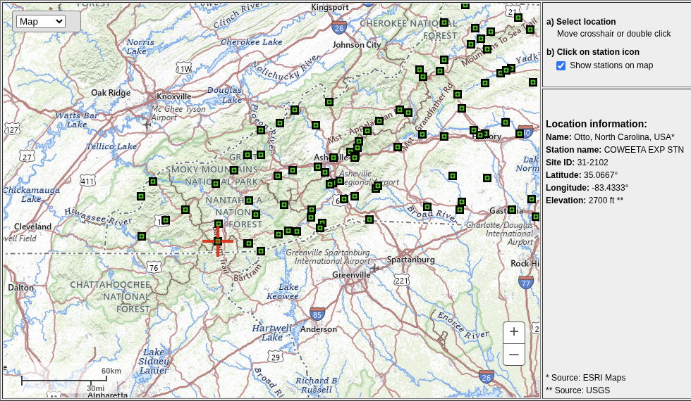
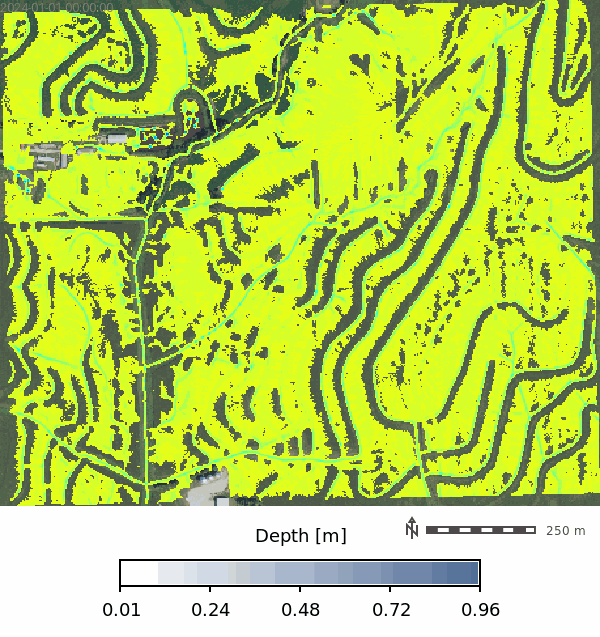
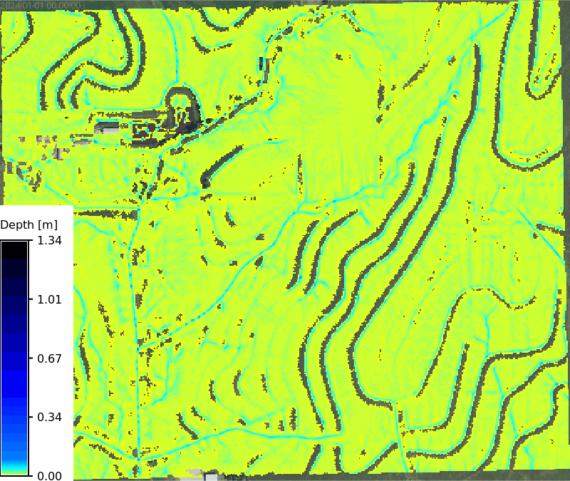

# [WIP] Clay Center, KS - Soil informed rainfall excess overland flow simulation

This notebook demonstrates how to import SSURGO soil data into GRASS using the [r.in.ssurgo](https://grass.osgeo.org/grass-devel/manuals/addons/r.in.ssurgo.html) extension. The `r.in.ssurgo` tool can import both local SSURGO data and data from the Soil Data Access (SDA) web service. The imported data includes *soil areas*, *hydrologic groups*, *ksat maps*, and *mukey maps*, which can be used for hydrological modeling and analysis in GRASS.

## Objectives

1. **Import SSURGO soil data** into GRASS using `r.in.ssurgo`.
2. **Visualize the imported soil maps**, including soil areas, hydrologic groups, ksat maps, and mukey maps.
3. **Calculate curve number** using the imported hydrologic group map and a land cover map.
4. **Calculate runoff depth and peak discharge** using the curve number map, flow direction, and time of concentration.
5. **Run a basic SIMWE simulation** using the imported soil data and visualize the results.

```{python}
# | label: imports
# | echo: false

import os
import subprocess
import sys

# import numpy as np
import matplotlib.pyplot as plt
import pandas as pd
import numpy as np
import seaborn as sns
from pprint import pprint
from PIL import Image
import sqlite3
from IPython.display import IFrame

# Ask GRASS GIS where its Python packages are.
sys.path.append(
    subprocess.check_output(["grass", "--config", "python_path"], text=True).strip()
)

# Import the GRASS GIS packages we need.
import grass.script as gs

# Import GRASS Jupyter
import grass.jupyter as gj
from grass.tools import Tools
```

We will examine the Clay Center, KS (39.4003765, -97.0630433) site for this demonstration, which has a mapset called `ssurgo_demo` that we will use to import the SSURGO data and run the SIMWE model.

```{python}
# | label: init_session
# | echo: false
# | output: false
gisdb = os.path.join(os.getenv("HOME"), "grassdata")
site = "clay-center"
mapset = "ssurgo_demo"
session = gj.init(gisdb, site, "PERMANENT")
tools = Tools(session=session)
try:
    tools.g_mapset(mapset=mapset, flags="c")
except Exception as e:
    print(f"{e}")
finally:
    session.switch_mapset(mapset)
```

---

Set the computational region to the elevation raster and create a relief raster for hillshading.

```{python}
# | label: set_region
region_text = tools.g_region(raster="elevation", flags="pac").text
print(region_text)
```

Let's also create a relief raster for hillshading or soil maps.

```{python}
tools.r_relief(input="elevation", output="relief")
```

Import SSURGO data using `r.in.ssurgo`. Note that this will import the soil areas map, hydrologic group map, and ksat maps for low, regular, and high values. The `mukey` column is also imported as a raster with a categorical color scheme applied. The hydrologic group map also has a categorical color scheme applied.

## SDA Import

```{python}
# | label: import_ssurgo_sda
# | eval: false
tools.r_in_ssurgo(
    soils="soil_areas_sda",
    hydgrp="hydgrp_sda",
    ksat_l="ksat_l_sda",
    ksat_r="ksat_r_sda",
    ksat_h="ksat_h_sda",
    mukey="mukey_sda",
    hzdept_r=0,
    hzdepb_r=100,
    desgnmaster="A",
    nprocs=30
)
```

## Visualize Imported Data

The tool imports the soil polygons as a vector map (`soil_areas_sda`), which contains the soil polygons with attributes from the SSURGO database.

```{python}
# | label: SDA soil attributes
# | echo: false

json_data = tools.v_db_select(map="soil_areas_sda", format="json").json
df = pd.DataFrame(json_data["records"])
display(df.head())
```


### MUKEY Map

```{python}
# | label: mukey
# | echo: false

m = gj.Map(use_region=True)
m.d_shade(shade="relief", color="mukey_sda")
m.d_vect(map="soil_areas_sda", color="black", fillcolor="none", width=0.5)
# m.d_legend(raster="mukey", title="MUKEY", flags="b")
m.show()
```

### Ksat Maps

```{python}
# | label: ksat
# | layout-ncol: 3
# | echo: false
# | fig-cap: "Ksat maps for low, regular, and high values"
# | fig-subcap:
# |     - Low
# |     - Regular
# |     - High


def ksat_color_scheme() -> None:
    """Apply ksat color scheme to elevation map."""
    gs.verbose(_("Applying ksat color scheme..."))
    ksat_color_palette = [
        # Very low Ksat (clays, compacted soils)
        ("0%", "#3B1F0E"),  # very slow infiltration
        ("10%", "#5A2D1A"),
        ("20%", "#7A3F1D"),
        # Low–moderate Ksat
        ("30%", "#9C5A2A"),
        ("40%", "#B97C3F"),
        # Transitional (loams)
        ("50%", "#D6A95C"),
        # Moderate–high Ksat
        ("60%", "#BFD38A"),
        ("70%", "#8FCB9B"),
        # High Ksat (sands)
        ("80%", "#5FB7B2"),
        ("90%", "#3A8FB7"),
        # Very high Ksat (gravel / macroporous)
        ("100%", "#1E5E8C"),
    ]
    # Convert palette list to rules string for r_colors
    ksat_color_scheme = (
        "\n".join(f"{pos} {color}" for pos, color in ksat_color_palette) + "\n"
    )
    return ksat_color_scheme

from io import StringIO

with gs.RegionManager(raster="ksat_l_sda", s="s-275", flags="a"):
    tools.r_colors(
        map=["ksat_l_sda", "ksat_r_sda", "ksat_h_sda"], rules=StringIO(ksat_color_scheme())
    )
    m = gj.Map(use_region=True, width=600)
    m.d_shade(shade="relief", color="ksat_l_sda", brighten=30)
    m.d_legend(
        raster="ksat_l_sda",
        title="Ksat (mm/hr)",
        at="8, 12, 20, 80",
    )
    m.show()

    m = gj.Map(use_region=True, width=600)
    m.d_shade(shade="relief", color="ksat_r_sda", brighten=30)
    m.d_legend(
        raster="ksat_r_sda",
        title="Ksat (mm/hr)",
        at="8, 12, 20, 80",
    )
    m.show()

    m = gj.Map(use_region=True, width=600)
    m.d_shade(shade="relief", color="ksat_h_sda", brighten=30)
    m.d_legend(
        raster="ksat_h_sda",
        title="Ksat (mm/hr)",
        at="8, 12, 20, 80",
    )
    m.show()
```

### Hydrologic Group

We can visualize the hydrologic group maps to compare the local and SDA imports. The hydrologic group map is a categorical raster with values of A, B, C, D, and A/D. The color scheme is applied using `r.colors` with the `hydgrp` color table.

```{python}
# | label: hydrologic_group_map
# | layout-ncol: 1
# | echo: false
# | fig-cap: "Hydrologic groups"

with gs.RegionManager(raster="hydgrp_sda", s="s-50000", flags="a"):
    m = gj.Map(use_region=False)
    m.d_shade(shade="relief", color="hydgrp_sda")
    m.d_legend(raster="hydgrp_sda", flags="bn", at="10, 30, 50, 80")
    m.show()
```

## Calculate Curve Number

Install the `r.curvenumber` extension if it is not already installed. This extension is available in the GRASS Addons repository and can be installed using `g.extension`.


To calculate the curve number, we need both a land cover map and a hydrologic soil group map. The land cover map is from the National Land Cover Database (NLCD) 2024 dataset, which was imported as a COG raster. The `landcover_source` parameter specifies that the land cover map is from the NLCD dataset, which allows the tool to use the appropriate lookup table for curve number values.

```{python}
# | label: import_landcover
# | eval: false
tools.r_import(
    output="nlcd_2024",
    input="/home/coreywhite/Downloads/Annual_NLCD_LndCov_2024_CU_C1V1.cog.tif",
    extent="region",
    resolution="region",
)
```

NLCD 2024 land cover map:

```{python}
# | label: landcover_map
with gs.RegionManager(raster="nlcd_2024", w="w-1600", flags="a"):
    m = gj.Map(use_region=True)
    m.d_shade(shade="relief", color="nlcd_2024")
    m.d_legend(
        raster="nlcd_2024",
        title="NLCD 2024",
        flags="",
        at="5,80,2,45",
        fontsize=12,
    )
    m.show()
```

Calculate the hydrolic curve number using the [r.curvenumber](https://grass.osgeo.org/grass-devel/manuals/addons/r.curvenumber.html) extension, which requires both a land cover map and a hydrologic soil group map. The land cover map is from the National Land Cover Database (NLCD) 2024 dataset, which was imported as a COG raster. The `landcover_source` parameter specifies that the land cover map is from the NLCD dataset, which allows the tool to use the appropriate lookup table for curve number values.

```{python}
# | label: curvenumber_calc
tools.r_curvenumber(
    landcover="nlcd_2024",
    soil="hydgrp_sda",
    landcover_source="nlcd",
    output="curvenumber",
)
```

```{python}
#| label: curvenumber_map

with gs.RegionManager(raster="curvenumber", w="w-1600", flags="a"):
    m = gj.Map(use_region=True)
    m.d_shade(shade="relief", color="curvenumber")
    m.d_legend(raster="curvenumber", title="Curve Number", flags="s", at="5, 30, 2, 10", fontsize=12)
    m.show()
```

## Calculate Runoff and time of concentration

Let's also run [r.runoff](https://grass.osgeo.org/grass-devel/manuals/addons/r.runoff.html) to calculate runoff depth using the curve number method. This tool requires a precipitation raster, which we can create using `r.mapcalc` with a constant value for precipitation.

We need the flow direction and stream maps to run `r.runoff` with time of concentration, which can be calculated using the `r.watershed` tool.

```{python}
#| label: watershed
tools.r_watershed(
    elevation="elevation",
    drainage="flow_direction",
    accumulation="accumulation",
    stream="stream",
    basin="basins",
    threshold=10,
)
```

```{python}
# | label: watershed_map

with gs.RegionManager(raster="accumulation", w="w-1600", flags="a"):
    m = gj.Map(use_region=True)
    m.d_shade(shade="relief", color="accumulation")
    m.d_legend(
        raster="accumulation",
        title="Accumulation",
        flags="s",
        at="5, 30, 2, 10",
        fontsize=12,
    )
    m.show()

    m2 = gj.Map(use_region=True)
    m2.d_shade(shade="relief", color="basins")
    m2.d_legend(
        raster="basins",
        title="Basins 50K threshold",
        flags="s",
        at="5, 30, 2, 10",
        fontsize=12,
    )
    m2.show()
```

Let calculate the time of concentration using the `r.timeofconcentration` tool, which requires an elevation raster, flow direction raster, and stream raster as inputs. The output is a raster of time of concentration values in hours.

```{python}
# | label: time_of_concentration
tools.r_timeofconcentration(
    elevation="elevation",
    direction="flow_direction",
    stream="stream",
    length_min=1,  # minimum length of flow path
    tc="time_concentration",
)
```

```{python}
# | label: time_of_concentration_map

with gs.RegionManager(raster="elevation", s="s-200", flags="a"):
    tools.r_colors(map="time_concentration", color="byg", flags="e")
    m = gj.Map(use_region=True)
    m.d_shade(shade="relief", color="time_concentration")

    m.d_legend(
        raster="time_concentration",
        at="8, 12, 20, 80",
        title="Time of Concentration (hours)",
        font="Fira Sans Condensed Light",
        fontsize=14,
        flags="s",
    )
    m.d_barscale(
        at=(20, 28),
        font="Fira Sans Condensed Light",
        fontsize=10,
        length=3,
        width_scale=1,
        units="kilometers",
        bgcolor="none",
        style="both_ticks",
        color="#f7f7f7",
        flags="n",
    )
    m.show()
```

Let's check the univarite statistics for the time of concentration raster to see the range of values.

```{python}
# | label: time_of_concentration_stats
# | echo: false

tc_json = tools.r_univar(map="time_concentration", flags="e", format="json").json
df_tc = pd.DataFrame(tc_json)
tc_table = (
    pd.DataFrame(tc_json, index=[0])
    .T.reset_index()
    .rename(columns={"index": "Statistic", 0: "Value"})
)

percentiles_row = tc_table.loc[tc_table["Statistic"] == "percentiles", "Value"]
tc_table = tc_table.loc[tc_table["Statistic"] != "percentiles"].copy()

if not percentiles_row.empty:
    p = percentiles_row.iloc[0]
    if isinstance(p, dict):
        pct_df = pd.DataFrame(
            [{"Statistic": f"percentile_{k}", "Value": v} for k, v in p.items()]
        )
        tc_table = pd.concat([tc_table, pct_df], ignore_index=True)

display(
    tc_table.style.hide(axis="index")
    .set_caption("Time of Concentration — Summary Statistics")
    .format(
        {
            "Value": lambda v: f"{v:,.3f}"
            if isinstance(v, (int, float, np.number))
            else v
        }
    )
)
```


## NOAA Atlas Precipitation Frequency

```{python}
# | label: noaa-import-func
# | echo: false
from __future__ import annotations

import csv
import io
import re
from typing import Any, Literal


class PFDSParseError(Exception):
    """Raised when a PFDS response cannot be parsed."""


BoundType = Literal["expected", "upper", "lower", "all"]
OutputType = Literal["json", "csv"]


def fetch_pfds_table(
    lat: float,
    lon: float,
    data: Literal["depth", "intensity"] = "intensity",
    units: Literal["metric", "english"] = "metric",
    series: Literal["pds", "ams"] = "pds",
    timeout: int = 30,
    session: Any | None = None,
) -> tuple[str, dict[str, Any]]:
    import requests

    valid_data = {"depth", "intensity"}
    valid_units = {"metric", "english"}
    valid_series = {"pds", "ams"}

    if data not in valid_data:
        raise ValueError(f"data must be one of {sorted(valid_data)}")
    if units not in valid_units:
        raise ValueError(f"units must be one of {sorted(valid_units)}")
    if series not in valid_series:
        raise ValueError(f"series must be one of {sorted(valid_series)}")

    url = "https://hdsc.nws.noaa.gov/cgi-bin/new/fe_text.csv"
    params = {
        "lat": lat,
        "lon": lon,
        "data": data,
        "units": units,
        "series": series,
    }

    http = session or requests
    resp = http.get(url, params=params, timeout=timeout)
    resp.raise_for_status()

    request_info = {
        "lat": lat,
        "lon": lon,
        "data": data,
        "units": units,
        "series": series,
        "url": resp.url,
    }
    return resp.text, request_info


def parse_pfds_table(
    text: str,
    request: dict[str, Any] | None = None,
) -> dict[str, Any]:
    """
    Parse PFDS response into structured sections:
      - expected
      - upper
      - lower
    """
    lines = [line.strip() for line in text.splitlines() if line.strip()]
    if not lines:
        raise PFDSParseError("Empty PFDS response.")

    result: dict[str, Any] = {
        "request": request or {},
        "metadata": {},
        "tables": {
            "expected": {"return_periods_years": [], "rows": []},
            "upper": {"return_periods_years": [], "rows": []},
            "lower": {"return_periods_years": [], "rows": []},
        },
    }

    current_section = "expected"
    current_return_periods: list[int | float | str] | None = None

    for line in lines:
        low = line.lower()

        # Section switches
        if "upper bound of 90% confidence interval" in low:
            current_section = "upper"
            current_return_periods = None
            continue

        if "lower bound of 90% confidence interval" in low:
            current_section = "lower"
            current_return_periods = None
            continue

        # Skip footer/runtime lines
        if low.startswith("date/time"):
            continue
        if low.startswith("pyruntime"):
            continue

        # Capture metadata before data table starts
        if current_section == "expected" and current_return_periods is None:
            m = re.match(r"^\s*([^=,:]+?)\s*[:=]\s*(.+?)\s*$", line)
            if m and not low.startswith("by duration for ari"):
                key = re.sub(r"\s+", "_", m.group(1).strip().lower())
                result["metadata"][key] = m.group(2).strip()

        # Header row like: by duration for ARI (years):,1,2,5,...
        if low.startswith("by duration for ari"):
            row = next(csv.reader([line]))
            if len(row) < 2:
                raise PFDSParseError(f"Malformed ARI header row: {line}")

            current_return_periods = [_parse_numeric_label(cell) for cell in row[1:]]
            result["tables"][current_section]["return_periods_years"] = current_return_periods
            continue

        # Data rows only valid after a header row
        if current_return_periods is None:
            continue

        row = next(csv.reader([line]))
        if len(row) < 2:
            continue

        duration = row[0].strip()
        if not duration:
            continue

        # Clean duration labels like "5-min:" -> "5-min"
        duration = duration.rstrip(":").strip()

        # Ignore repeated narrative/header junk if it leaks through
        if duration.lower().startswith("precipitation frequency estimates"):
            continue
        if duration.lower().startswith("by duration for ari"):
            continue

        values: dict[str, float | str | None] = {}
        numeric_count = 0

        for rp, cell in zip(current_return_periods, row[1:]):
            key = str(rp)
            cell = cell.strip()

            if cell in {"", "-", "--", "---"}:
                values[key] = None
                continue

            try:
                values[key] = float(cell)
                numeric_count += 1
            except ValueError:
                values[key] = cell

        # Only keep actual duration rows
        if numeric_count == 0:
            continue

        result["tables"][current_section]["rows"].append(
            {
                "duration": duration,
                "values": values,
            }
        )

    # Sanity check
    if not result["tables"]["expected"]["rows"]:
        raise PFDSParseError("No expected-value PFDS rows were parsed.")

    return result


def pfds_json_to_csv_text(
    pfds_json: dict[str, Any],
    bound: BoundType = "expected",
    float_format: str = "g",
) -> str:
    """
    Convert one PFDS bound section to compact CSV text.
    """
    if bound == "all":
        parts = []
        for name in ("expected", "upper", "lower"):
            parts.append(f"# {name}")
            parts.append(pfds_json_to_csv_text(pfds_json, bound=name, float_format=float_format).rstrip())
            parts.append("")
        return "\n".join(parts).rstrip() + "\n"

    table = pfds_json.get("tables", {}).get(bound)
    if not table:
        raise ValueError(f"Bound '{bound}' not found in parsed PFDS JSON.")

    return_periods = table.get("return_periods_years", [])
    rows = table.get("rows", [])

    if not return_periods or not rows:
        raise ValueError(f"PFDS JSON for bound '{bound}' is missing table data.")

    out = io.StringIO()
    writer = csv.writer(out, lineterminator="\n")

    header = ["duration"] + [_format_return_period_label(rp) for rp in return_periods]
    writer.writerow(header)

    for row in rows:
        out_row = [row["duration"]]
        for rp in return_periods:
            val = row["values"].get(str(rp))
            if val is None:
                out_row.append("")
            elif isinstance(val, float):
                out_row.append(format(val, float_format))
            else:
                out_row.append(str(val))
        writer.writerow(out_row)

    return out.getvalue()


def get_pfds_table(
    lat: float,
    lon: float,
    data: Literal["depth", "intensity"] = "intensity",
    units: Literal["metric", "english"] = "metric",
    series: Literal["pds", "ams"] = "pds",
    output: OutputType = "json",
    bound: BoundType = "expected",
    timeout: int = 30,
    session: Any | None = None,
    float_format: str = "g",
) -> dict[str, Any] | str:
    """
    High-level wrapper.

    bound:
      - expected : central estimate only
      - upper    : upper 90% bound only
      - lower    : lower 90% bound only
      - all      : all three
    """
    text, request = fetch_pfds_table(
        lat=lat,
        lon=lon,
        data=data,
        units=units,
        series=series,
        timeout=timeout,
        session=session,
    )

    parsed = parse_pfds_table(text=text, request=request)

    if output == "json":
        if bound == "all":
            return parsed
        return {
            "request": parsed["request"],
            "metadata": parsed["metadata"],
            "table": parsed["tables"][bound],
            "bound": bound,
        }

    if output == "csv":
        return pfds_json_to_csv_text(parsed, bound=bound, float_format=float_format)

    raise ValueError("output must be 'json' or 'csv'")


def _parse_numeric_label(value: str) -> int | float | str:
    value = value.strip()
    try:
        n = float(value)
        return int(n) if n.is_integer() else n
    except ValueError:
        return value


def _format_return_period_label(value: int | float | str) -> str:
    if isinstance(value, int):
        return str(value)
    if isinstance(value, float):
        return str(int(value)) if value.is_integer() else format(value, "g")
    return str(value)
```

```{python}
# | label: noaa-percip-freq
# | echo: false

pfds_json = get_pfds_table(
        lat=39.4003765,
        lon=-97.0630433,
        data="intensity",
        units="english",
        series="pds",
        output="json",
)
print(pfds_json)

# CSV-style output
pfds_csv = get_pfds_table(
    lat=39.4003765,
    lon=-97.0630433,
    data="intensity",
    units="english",
    series="pds",
    output="csv",
    bound="expected",   # <- this is the key fix
    float_format=".3g",
)
print(pfds_csv)
```


We can use the the `time_concentration` raster as an input to the `r.runoff` tool, which calculates runoff depth and peak discharge using the curve number method. The `r.runoff` tool also requires a precipitation raster, which we can create using `r.mapcalc` with a constant value for precipitation ($50$ mm) over a 24 hour period.

```{python}
# | label: tc_and_rfi

df_tc_min = df_tc[["min", "mean", "max"]].apply(
    lambda x: round(x * 60, 2)
)  # convert to minutes
max_tc = df_tc_min["max"].max()
print(max_tc)

df_rf_intensity = pd.read_csv(io.StringIO(pfds_csv))
display(
    df_rf_intensity.style.hide(axis="index")
    .set_caption("Rainfall Intensity — NOAA Atlas 14, Coweeta, NC")
    .format(
        {
            "Value": lambda v: f"{v:,.3f}"
            if isinstance(v, (int, float, np.number))
            else v
        }
    )
)

# | label: rainfall_intensity_figure
# | echo: false
# | fig-cap: "NOAA Atlas 14 rainfall intensity by storm duration for Coweeta, NC, with the maximum time of concentration marked."

rf = df_rf_intensity.copy()

duration_col = next(
    (c for c in rf.columns if "duration" in c.lower()),
    rf.columns[0],
)

def _duration_to_minutes(value):
    text = str(value).strip().lower()
    match = re.search(r"(\d+(?:\.\d+)?)", text)
    if not match:
        return np.nan
    number = float(match.group(1))
    if "day" in text:
        return number * 24 * 60
    if "hr" in text or "hour" in text:
        return number * 60
    return number

import re

rf["duration_min"] = rf[duration_col].apply(_duration_to_minutes)

value_cols = [c for c in rf.columns if c not in {duration_col, "duration_min"}]
rf_long = rf.melt(
    id_vars=["duration_min"],
    value_vars=value_cols,
    var_name="return_period",
    value_name="intensity_mm_hr",
)
rf_long["intensity_mm_hr"] = pd.to_numeric(rf_long["intensity_mm_hr"], errors="coerce")
rf_long = rf_long.dropna(subset=["duration_min", "intensity_mm_hr"]).sort_values(
    ["return_period", "duration_min"]
)

sns.set_theme(style="whitegrid", context="talk")
fig, ax = plt.subplots(figsize=(10, 6))

sns.lineplot(
    data=rf_long,
    x="duration_min",
    y="intensity_mm_hr",
    hue="return_period",
    marker="o",
    linewidth=2.5,
    ax=ax,
)

ax.axvline(
    max_tc,
    color="black",
    linestyle="--",
    linewidth=1.5,
    label=f"Max Tc = {max_tc:.1f} min",
)

ax.annotate(
    f"Max Tc\n{max_tc:.1f} min",
    xy=(max_tc, rf_long["intensity_mm_hr"].max()),
    xytext=(8, -10),
    textcoords="offset points",
    ha="left",
    va="top",
    fontsize=11,
    bbox=dict(boxstyle="round,pad=0.25", fc="white", ec="0.6", alpha=0.9),
)

ax.set_xscale("log")
ax.set_xlabel("Storm duration (minutes)")
ax.set_ylabel("Rainfall intensity (mm/hr)")
ax.set_title("Rainfall intensity–duration curves")
ax.legend(title="Return period", frameon=True, ncol=2)
sns.despine()
plt.tight_layout()
plt.show()


return_periods = rf_long["return_period"].dropna().unique()
rp_100 = next(
    (
        rp
        for rp in return_periods
        if re.search(r"100", str(rp)) and re.search(r"(yr|year)", str(rp).lower())
    ),
    next((rp for rp in return_periods if re.search(r"100", str(rp))), None),
)

if rp_100 is None:
    raise ValueError("Could not identify the 100-year storm column in rainfall intensity data.")

rf_100 = (
    rf_long.loc[rf_long["return_period"] == rp_100, ["duration_min", "intensity_mm_hr"]]
    .dropna()
    .sort_values("duration_min")
)

storm_intensity_100yr = float(
    np.interp(
        np.log10(max_tc),
        np.log10(rf_100["duration_min"].to_numpy()),
        rf_100["intensity_mm_hr"].to_numpy(),
    )
)

rain_inches_per_hour = storm_intensity_100yr

display(
    pd.DataFrame(
        {
            "return_period": [rp_100],
            "max_tc_min": [round(max_tc, 2)],
            "intensity_in_hr": [round(storm_intensity_100yr, 2)],
        }
    ).style.hide(axis="index").set_caption(
        "Interpolated rainfall intensity at maximum time of concentration"
    )
)

print(f"100-year storm intensity at max Tc ({max_tc:.2f} min): {storm_intensity_100yr:.2f} in/hr")
```

```{python}
# | label: precipitation_mm

duration_min = round(max_tc, 2)
intensity_in_hr =rain_inches_per_hour
intensity_mm_hr = intensity_in_hr * 25.4

duration_hr = duration_min / 60.0
rain_mm = intensity_mm_hr * duration_hr

print(f"Storm duration: {duration_min:.4f} min")
print(f"Storm duration: {duration_hr:.4f} hr")
print(f"Rainfall intensity: {intensity_in_hr:.3f} in/hr")
print(f"Rainfall intensity: {intensity_mm_hr:.3f} mm/hr")
print(f"Rain depth: {rain_mm:.3f} mm")
tools.r_mapcalc(
    expression=f"rain = {rain_mm}",  # mm of precipitation
)
```

```{python}
# | label: runoff_calculation
# tools.g_extension(extension="r.runoff", url="../../../cwhite911/grass-addons/src/raster/r.runoff")
# Make sure you have the following GRASS addons installed
# - r.accumulate
# - r.runoff

tools.r_runoff(
    rainfall="rain",
    direction="flow_direction",
    duration=duration_hr,  # hours
    curvenumber="curvenumber",
    time_concentration="time_concentration",
    runoff_depth="runoff_depth",
    runoff_volume="runoff_volume",
    upstream_area="upstream_area",
    upstream_runoff_depth="upstream_runoff_depth",
    upstream_runoff_volume="upstream_runoff_volume",
    time_to_peak="time_to_peak",
    peak_discharge="peak_discharge",
)
```

Let's visualize the runoff depth

```{python}
# | label: runoff_map
with gs.RegionManager(raster="runoff_depth", s="s-200", flags="a"):
    tools.r_colors(map="runoff_depth", color="water")
    m = gj.Map(use_region=True)
    m.d_shade(shade="relief", color="runoff_depth")
    m.d_legend(
        raster="runoff_depth", at="5, 30, 2, 10", title="Runoff Depth (mm)", flags="b"
    )
    m.show()

```

Peak discharge and time to peak discharge maps

```{python}
# | label: peak_discharge_map
# | echo: false
# | layout-ncol: 2
# | fig-cap: Discharge
# | fig-subcap:
# |     - Peak Discharge (m³/s)
# |     - Time to Peak (hours)


with gs.RegionManager(raster="peak_discharge", s="s-200", flags="a"):
    tools.r_colors(map="peak_discharge", color="haxby", flags="gn")
    m = gj.Map(use_region=True)
    m.d_shade(shade="relief", color="peak_discharge")

    m.d_legend(
        raster="peak_discharge",
        at="8, 12, 20, 80",
        # title="Peak Discharge (m³/s)",
        flags="l",
    )
    m.show()

    tools.r_colors(map="time_to_peak", color="haxby", flags="gn")
    m1 = gj.Map(use_region=True)
    m1.d_shade(shade="relief", color="time_to_peak")

    m1.d_legend(
        raster="time_to_peak",
        at="8, 12, 20, 80",
        # title="Time to Peak (hours)",
        flags="l",
    )
    m1.show()
```

## Manning's n Map

We will calculate the Manning's n map using the `r.manning` extension, which uses the National Land Cover Dataset (2024) map to assign Manning's n values based on the lookup table from Kalyanapu et al. (2009). The output is a raster of Manning's n values that can be used as an input to the SIMWE model.

Now we can calculate the roughness map using the `r.manning` tool.

```{python}
# | label: r_manning_map
tools.r_manning(
    input="nlcd_2024",
    output="mannings_n",
    landcover="nlcd",
    source="kalyanapu",
    seed=42,
)


with gs.RegionManager(raster="mannings_n", s="s-200", flags="a"):
    tools.r_colors(map="mannings_n", color="plasma", flags="")
    m = gj.Map(use_region=True)
    m.d_shade(shade="relief", color="mannings_n")

    m.d_legend(
        raster="mannings_n",
        at="8, 12, 20, 80",
        title="Manning's n",
        font="Fira Sans Condensed Light",
        fontsize=14,
        flags="",
    )
    m.d_barscale(
        at=(20, 28),
        font="Fira Sans Condensed Light",
        fontsize=10,
        length=3,
        width_scale=1,
        units="kilometers",
        bgcolor="none",
        style="both_ticks",
        color="#f7f7f7",
        flags="n",
    )
    m.show()
```

## Run SIMWE model

Calcuate the slope and aspect from the elevation raster, which are required inputs for the `r.sim.water` tool.

### Precipitation and Rainfall Excess

We will use a constant rainfall value for the simulation, which is based on an 100 year storm from NOAA Atlas 14 for Clay Center, KS. The rainfall excess is calculated as the runoff depth (mm), dervied using the SCS-CN method, divided by the 24 hours to get a rainfall excess in mm/hr.

| **Location Information** | **Value** |
|---|---|
| Name | Clay Center, Kansas, USA* |
| Station name |  |
| Site ID |  |
| Latitude | 39.4003765° |
| Longitude | -97.0630433° |
| Elevation | ft** |
<!--  -->

Rainfall excess map

```{python}
# | label: rainfall_excess_map

# Convert runoff_depth (mm) to rainfall excess. during a 54 min 100 year storm. So the runoff depth (m) is divided by 0.9 hours (54 min) to get the rainfall excess in mm/hr. The 0.9 hours is derived from the duration of the storm, which is 54 minutes, converted to hours (54/60 = 0.9). This gives us the average rainfall excess rate in mm/hr over the duration of the storm.
# Runoff depth per cell [mm] is calculated by the SCS-CN method.


tools.r_mapcalc(
    expression=f"rainfall_excess = runoff_depth / 0.9",
)


with gs.RegionManager(raster="rainfall_excess", s="s-200", flags="a"):
    tools.r_colors(map="rainfall_excess", color="blue", flags="e")
    m = gj.Map(use_region=True)
    m.d_shade(shade="relief", color="rainfall_excess")

    m.d_legend(
        raster="rainfall_excess",
        title="Rainfall Excess (mm/hr)",
        at="8, 12, 20, 80",
        font="Fira Sans Condensed Light",
        fontsize=14,
        flags="",
    )
    m.d_barscale(
        at=(20, 28),
        font="Fira Sans Condensed Light",
        fontsize=10,
        length=3,
        width_scale=1,
        units="kilometers",
        bgcolor="none",
        style="both_ticks",
        color="#f7f7f7",
        flags="n",
    )
    m.show()
```

Calcuate the overland flow for a 47 min 100 year storm using the `r.sim.water` tool, which simulates overland flow using a particle-based approach. The tool requires the elevation raster, rainfall excess raster, and Manning's n raster as inputs, along with the number of walkers to simulate and the number of iterations to run. The output is a series of depth and discharge rasters that can be visualized as maps or animations.

```{python}
# | label: r_sim_water
# | eval: false

# 100yr storm running for 54.05 min with soil informed
# Rainfall excess
duration_min = 54.05
tools.r_slope_aspect(elevation="elevation", dx="dx", dy="dy")
tools.r_sim_water(
    elevation="elevation",
    depth="rx_100yr_depth",
    discharge="rx_100yr_discharge",
    walkers_output="rx_100yr_walkers",
    rain="rainfall_excess",  # Infiltration / Veg Intercept
    man="mannings_n",  # Mixed forest Kalyanapu et al. (2009)
    nwalkers=1000000,
    # infil="ksat_r_sda", # Infiltration of flowing water
    # niterations=1440 / 2,
    duration=duration_min, # Duration of the simulated water flow [minutes]
    output_step=2, # Time interval for creating output maps [minutes]
    nprocs=30,
    flags="t",
)

# Register the output maps into a space time dataset
gs.run_command(
    "t.create",
    output="rx_100yr_depth_sum",
    type="strds",
    temporaltype="absolute",
    title="Runoff Depth",
    description="Runoff Depth in [m]",
    overwrite=True,
)

# Get the list of depth maps
depth_list = gs.read_command(
    "g.list", type="raster", pattern="rx_100yr_depth.*", separator="comma"
).strip()

# Register the maps
gs.run_command(
    "t.register",
    input="rx_100yr_depth_sum",
    type="raster",
    start="2024-01-01",
    increment="2 minutes",
    maps=depth_list,
    flags="i",
    overwrite=True,
)

```

```{python}
# | label: rx_depth_sum_info

tools.t_info(input="rx_100yr_depth_sum")
```

```{python}
# | label: rx_100yr_depth_map
# | eval: true

depth_list = gs.read_command(
    "g.list", type="raster", pattern="rx_100yr_depth.*", separator="comma"
).strip()

max_depth = depth_list.split(",")[-1]
stats = tools.r_info(map=max_depth, format="json").json
with gs.RegionManager(raster="accumulation", s="s-200", flags="a"):
    m = gj.Map(use_region=True)
    m.d_shade(shade="relief", color="naip_2021_rgb@naip")
    m.d_rast(map=max_depth, values=f"0.005-{stats['max']}")
    m.d_legend(
        raster=max_depth,
        title="Deqpth [m]",
        at="8, 12, 15, 85",
        font="Fira Sans Condensed Light",
        range=[0.005, stats["max"]],
        fontsize=14,
        flags="",
    )
    m.d_barscale(
        at=(20, 28),
        font="Fira Sans Condensed Light",
        fontsize=10,
        length=3,
        width_scale=1,
        units="kilometers",
        bgcolor="none",
        style="both_ticks",
        color="#f7f7f7",
        flags="n",
    )
    m.show()
```

Animation of depth maps

```{python}
# | label: tc_100_depth_map
# | eval: false

max_depth = depth_list.split(",")[-1]
stats = tools.r_info(map=max_depth, format="json").json
m = gj.TimeSeriesMap(use_region=True, width=800)
m.d_rast(map="naip_2021_rgb@naip")
m.add_raster_series("rx_100yr_depth_sum", values=f"0.005-{stats['max']}")
m.d_legend(
    raster=max_depth,
    title="Depth [m]",
    flags="bt",
    border_color="none",
    range=[0.005, stats["max"]],
    at=(1, 50, 0, 5),
)

m.save("output/clay_center_rx_100yr_simwe_depth_animation.gif")
m.show()
```



No soils

```{python}
# | label: r_sim_water_no_soil
# | eval: false

intensity_mm_hr = 101.937
tools.r_sim_water(
    elevation="elevation",
    depth="basic_depth",
    discharge="basic_disch",
    walkers_output="basic_particles",
    rain_value=intensity_mm_hr,  # Rainfall intensity: 95.584 mm/hr
    man="mannings_n",  # Mixed forest Kalyanapu et al. (2009)
    nwalkers=1000000,
    # infil="ksat_r_sda", # Infiltration of flowing water
    niterations=duration_min,
    output_step=2,
    nprocs=30,
    flags="t",
)

gs.run_command(
    "t.create",
    output="basic_depth_sum",
    type="strds",
    temporaltype="absolute",
    title="Runoff Depth",
    description="Runoff Depth in [m]",
    overwrite=True,
)

# Get the list of depth maps
depth_list = gs.read_command(
    "g.list", type="raster", pattern="basic_depth.*", separator="comma"
).strip()

# Register the maps
gs.run_command(
    "t.register",
    input="basic_depth_sum",
    type="raster",
    start="2024-01-01",
    increment="2 minutes",
    maps=depth_list,
    flags="i",
    overwrite=True,
)
```

```{python}
# | label: basic_depth_sum_info

tools.t_info(input="basic_depth_sum")
```

```{python}

depth_list = gs.read_command(
    "g.list", type="raster", pattern="basic_depth.*", separator="comma"
).strip()

basic_max_depth = depth_list.split(",")[-1]
stats = tools.r_info(map=basic_max_depth, format="json").json
with gs.RegionManager(raster="accumulation", s="s-200", flags="a"):
    m = gj.Map(use_region=True)
    m.d_shade(shade="relief", color="naip_2021_rgb@naip")
    m.d_rast(map=basic_max_depth, values=f"0.005-{stats['max']}")
    m.d_legend(
        raster=basic_max_depth,
        title="Depth [m]",
        flags="btl",
        border_color="none",
        range=[0.005, stats["max"]],
        at=(5, 50, 2, 5),
    )
    m.show()
```

no soil animation

```{python}
# | label: basic_depth_map_animation
# | eval: false
basic_max_depth = depth_list.split(",")[-1]
stats = tools.r_info(map=basic_max_depth, format="json").json
m = gj.TimeSeriesMap(use_region=True, width=800)
m.d_rast(map="naip_2021_rgb@naip")
m.add_raster_series("basic_depth_sum", values=f"0.005-{stats['max']}")
m.d_legend(
    raster=basic_max_depth,
    title="Depth [m]",
    flags="bt",
    border_color="none",
    range=[0.005, stats["max"]],
    at=(1, 50, 0, 5),
)
m.save("output/clay_center_basic_depth_simwe_depth_animation.gif")
m.show()
```


