# SFREC

## Maps

### First order topographic data

> Possible tiling or interpolation artifacts are present in the DEM.

* 1m DEM
* Unit of measure: meters
* EPSG: 26910
* CRS: NAD83 / UTM zone 10N

| Elevation | Elevation Histogram
| --- | --- |
| 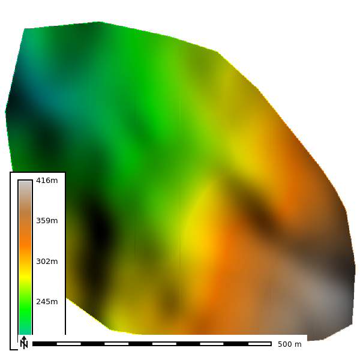 | 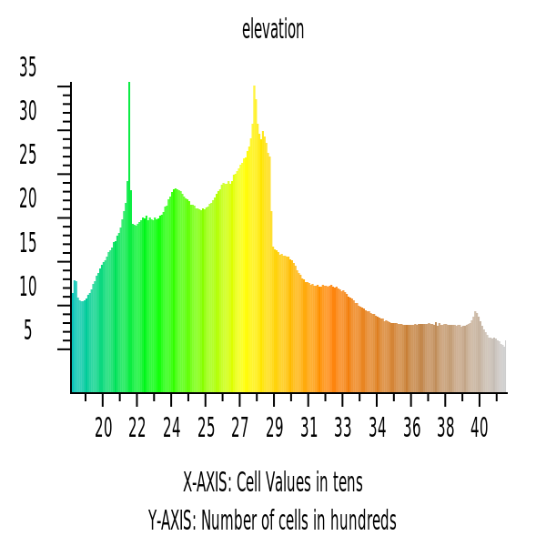 |

### NAIP Imagery and Derived Products

* NAIP: 2021

| NAIP | NDVI |
| --- | --- |
| 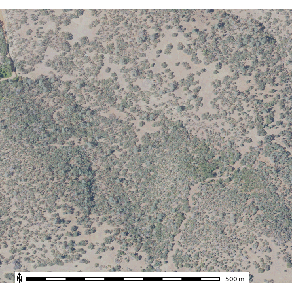 | 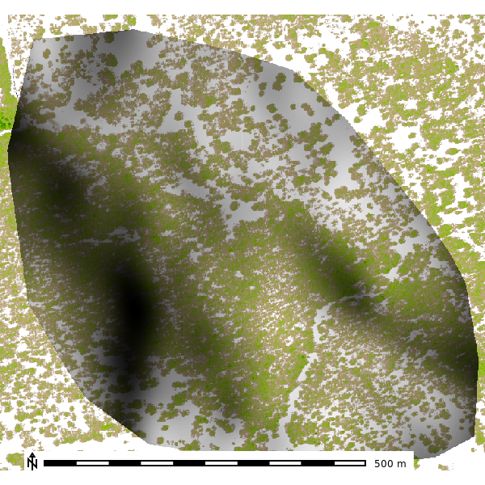 |

### Second order topographic derivatives

| Slope | Aspect | Geomorphon |
| --- | --- | --- |
| 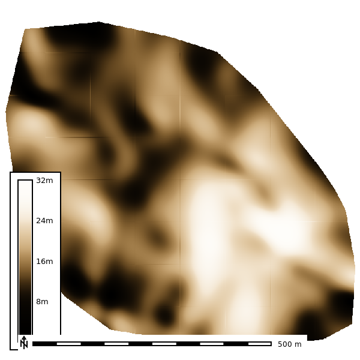 | 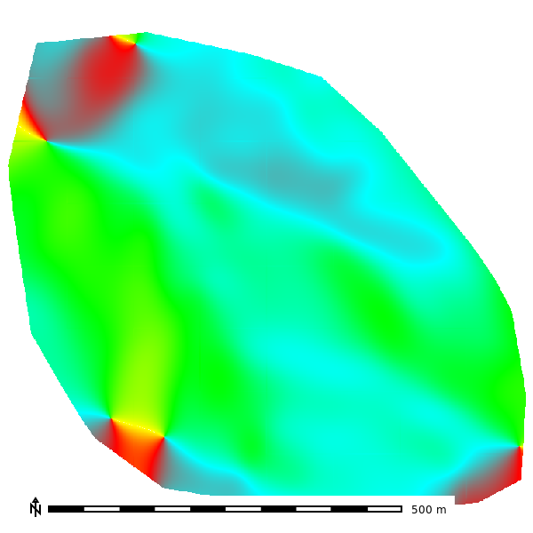 | 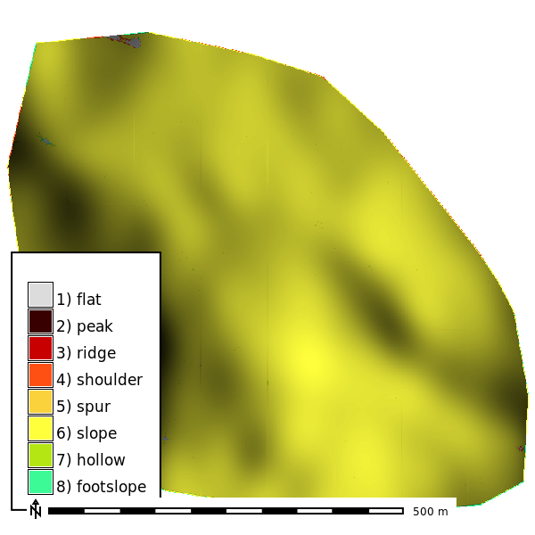 |

| Profile Curvature | Planform Curvature |
| --- | --- |
| 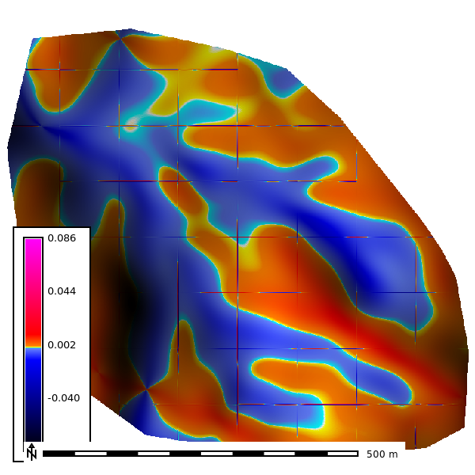 | 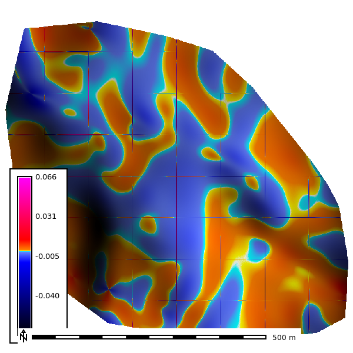 |

### Soils

| SSURGO MUKEY |
| --- |
| 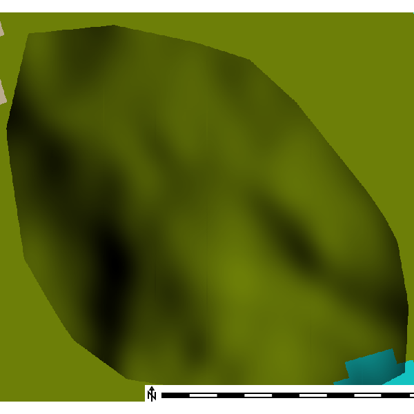 |

## Simulations

#### Base parameters

#### Depth

| 2 Min | 4 Min | 6 Min | 8 Min | 10 min |
| --- | --- | --- | --- | --- |
| 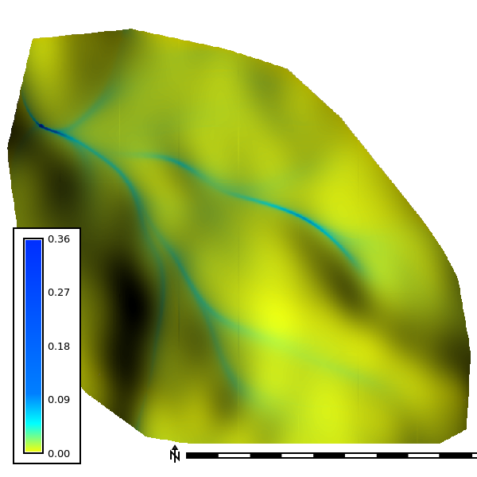 | 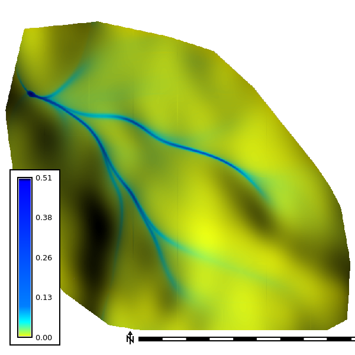 | 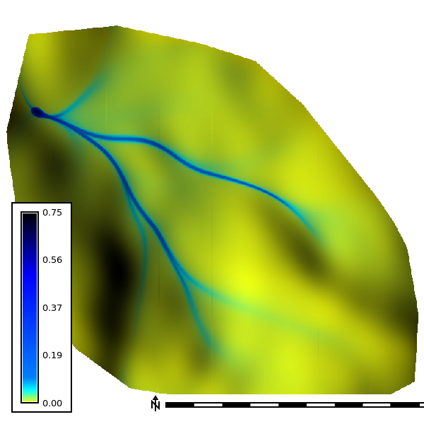 |  |  |

Simulation GIF: 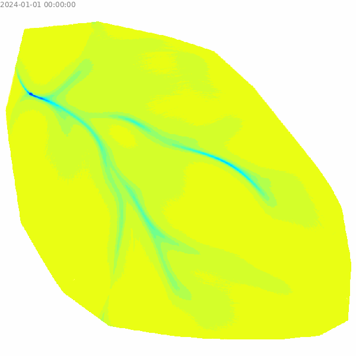

#### Discharge

| 2 Min | 4 Min | 6 Min | 8 Min | 10 Min |
| --- | --- | --- | --- | --- |
| 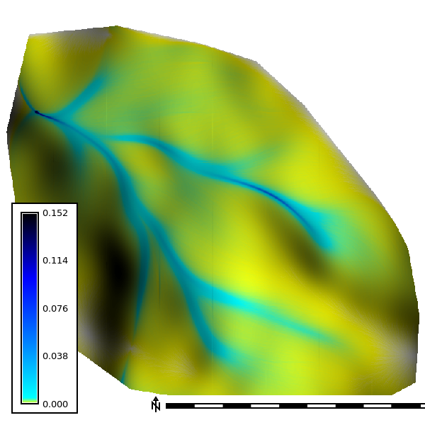 | 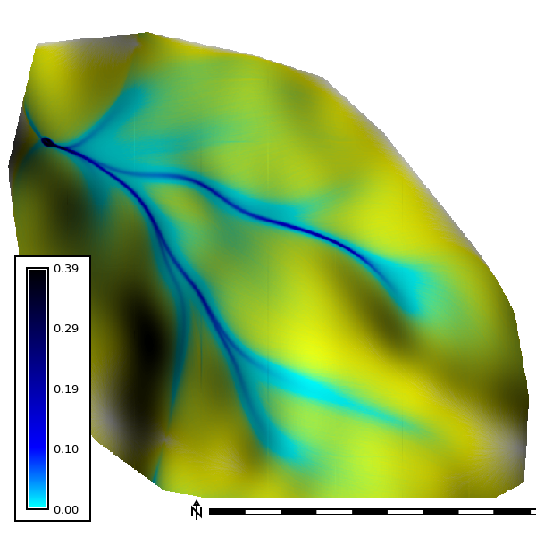 | 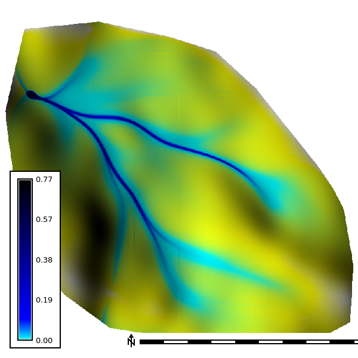 | 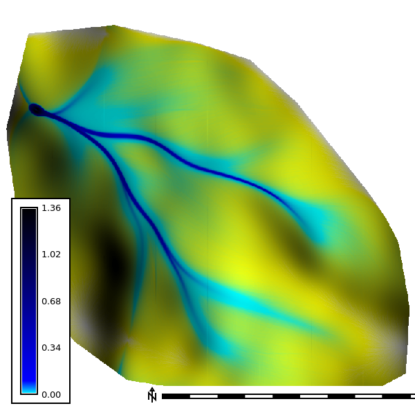 |  |
