```{python}
# | echo: false
# | tags: [parameters]

project_name = "SFREC"
project_description = "Sierra Foothill Research & Extension Center"
project_location = "California"
project_url = "https://ucanr.edu/research-and-extension-center/sierra-foothill-research-and-extension-center"
naip_year = 2022
dem_resolution = "1 m"
unit_of_measure = "meters"
epsg = "26910"
crs = "NAD83 / UTM zone 10N"
area_km2 = "0.38"
cell_count = "380,014"
elev_range = "188.61 - 415.64"
elev_mean = "282.1"
ars = "0.37"
```

## Overview

The Sierra Foothill Research and Extension Center (SFREC) is a University of California rangeland research station in the lower Sierra Nevada foothills east of Marysville. The 0.38 km^2^ study area drops 227 m from oak-woodland ridges to annual grassland slopes, giving it the second-highest roughness in the ensemble (ARS 0.37) despite its small extent. At 1 m resolution the DEM resolves individual swales and cattle paths, so this site tests how SIMWE behaves when microtopography, rather than broad terrain structure, steers the flow.

What this site demonstrates:

- Fine-scale flow routing on grazed rangeland at 1 m resolution.
- A hillslope-to-swale setting intermediate between the flat cropland sites and Coweeta's mountain catchments.
- Ground water seepage behavior in a small, steep drainage during rainfall.



## Ground Water

This run replaces the uniform rainfall input with stream-fed sources derived from flow accumulation, using 500,000 walkers and a 4-minute output step (`scripts/groundwater.py`). Only the combined scenario, groundwater seepage in streams during a 10 mm/hr rainfall, was simulated at SFREC; the seepage-only and springs scenarios were not run here. Depth is in meters, discharge in m^3^/s.

### Depth - Groundwater seepage in streams during rainfall

| 4 Min | 8 Min | 12 Min | 16 Min | 20 Min
| --- | --- | --- | --- | ---
| 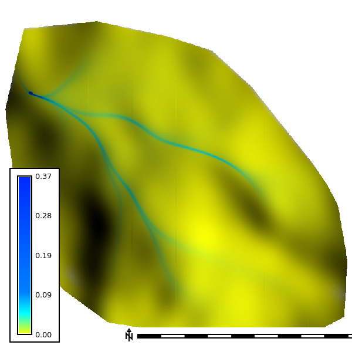 | 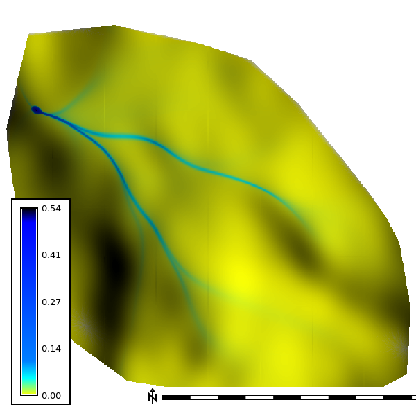 | 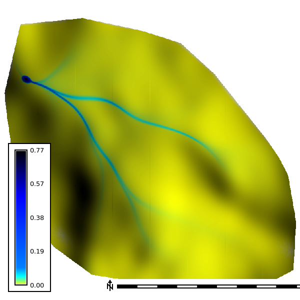 | 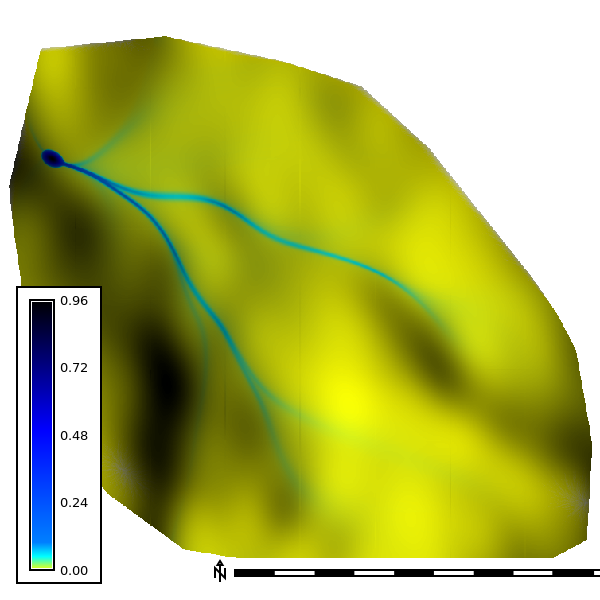 | 

### Discharge - Groundwater seepage in streams during rainfall

| 4 Min | 8 Min | 12 Min | 16 Min | 20 Min
| --- | --- | --- | --- | ---
| 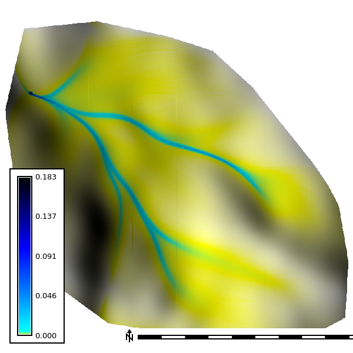 | 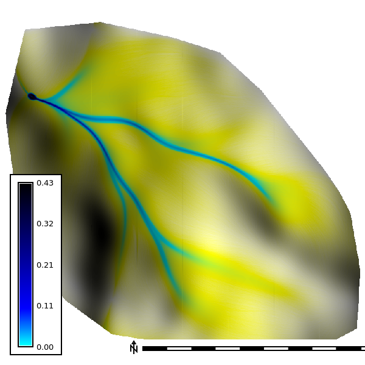 |  |  | 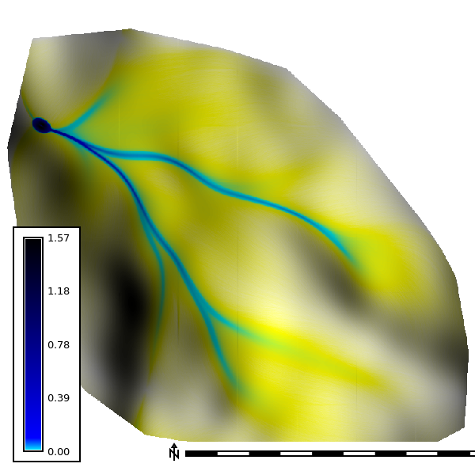

## Sensitivity Analysis

The sensitivity analysis re-runs the simulation across DEM resolutions of 1, 3, 10, and 30 m and walker densities of 0.25 to 2 walkers per cell, with 10 random seeds per combination and 120 one-minute iterations (`scripts/sensitivity.py`). The watershed extent is delineated at each resolution with a 30,000-cell accumulation threshold.

### Basin extent by resolution

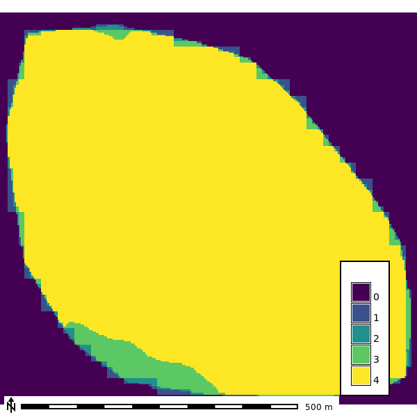

### Seed-averaged depth by resolution

Mean water depth across the 10 seeds at the final output step of each run (walker density 2). The 30 m run drains this small basin quickly and ends at step 49; the finer resolutions run to step 120.

| 1 m | 3 m | 10 m | 30 m
| --- | --- | ---  | ---
| 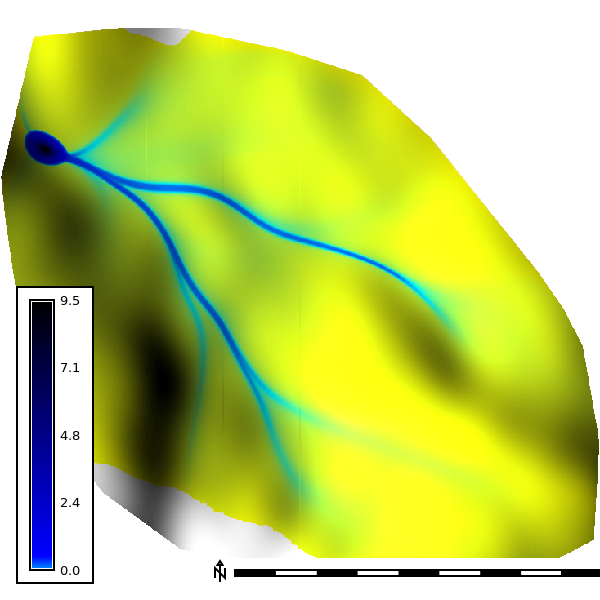 | 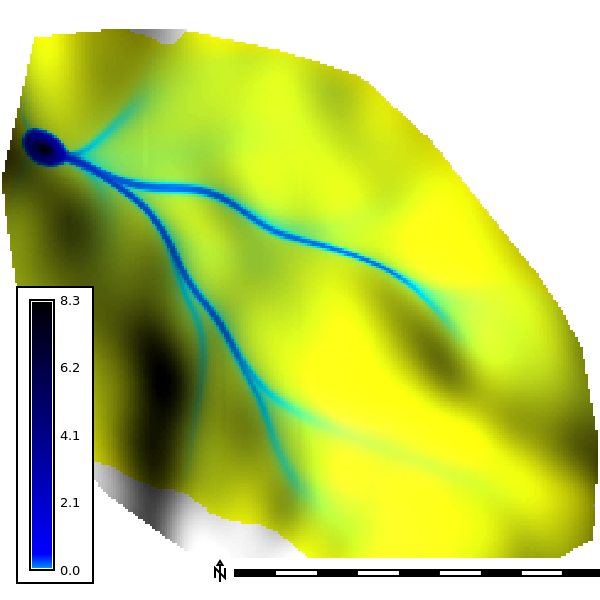 | 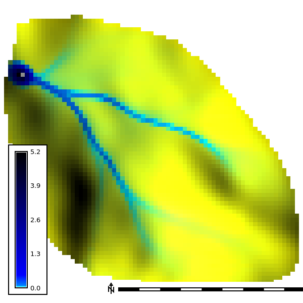 | 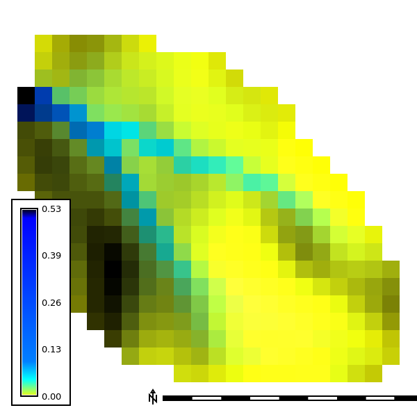 |
