```{python}
# | echo: false
# | tags: [parameters]

project_name = "SJER"
project_description = "San Joaquin Experimental Range"
project_location = "California"
project_url = (
    "https://research.fs.usda.gov/psw/rnas/locations/san-joaquin-experimental-range"
)
naip_year = 2022
dem_resolution = "1 m"
unit_of_measure = "meters"
epsg = "26911"
crs = "NAD83 / UTM zone 11N"
area_km2 = "0.3"
cell_count = "295,126"
elev_range = "333.12 - 371.12"
elev_mean = "349.67"
ars = "0.14"
```

## Overview

The San Joaquin Experimental Range (SJER) is a USDA Forest Service experimental range in the granitic foothills of the southern Sierra Nevada, northeast of Fresno. The 0.3 km^2^ study area is oak savanna and annual grassland over shallow, weathered-granite soils, with just 38 m of relief and an ARS of 0.14, gentle terrain, but at 1 m resolution the DEM still captures the low-order swales that organize runoff between scattered oaks and granite outcrops. Together with SFREC it brackets the California rangeland conditions in the ensemble: SJER the gentle, open savanna and SFREC the steeper foothill woodland.

What this site demonstrates:

- Flow organization on near-flat rangeland where small swales, not hillslopes, do the routing.
- A direct comparison case for SFREC at identical resolution (1 m) with a third of the relief.
- The full ground water scenario suite on a small foothill drainage.



## Ground Water

These runs replace the uniform rainfall input with stream-fed sources derived from flow accumulation, using 500,000 walkers and a 4-minute output step (`scripts/groundwater.py`). Three scenarios are simulated: groundwater seepage in streams during a 10 mm/hr rainfall, seepage with no rainfall, and springs at first-order streams only. The seepage-only and springs runs reached steady state early and end at 12 minutes; the rainfall scenario runs the full 20. Depth is in meters, discharge in m^3^/s.

### Depth - Groundwater seepage in streams during rainfall

| 4 Min | 8 Min | 12 Min | 16 Min | 20 Min
| --- | --- | --- | --- | ---
| 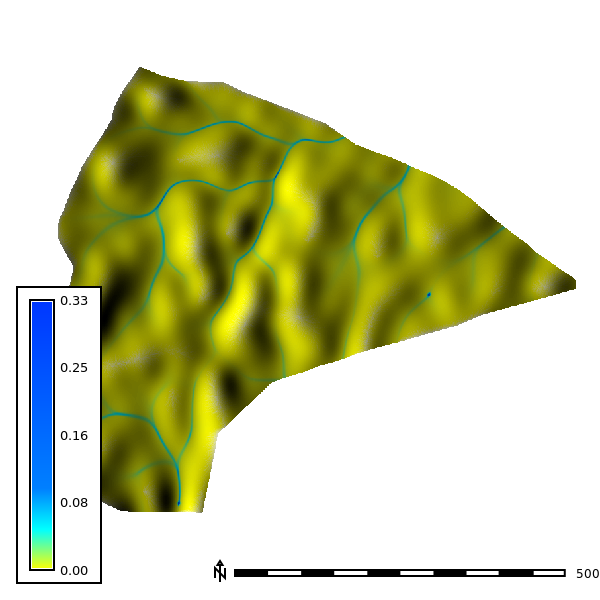 |  | 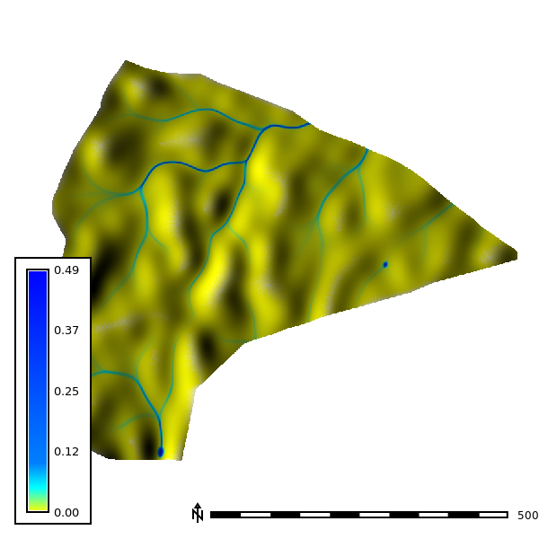 | 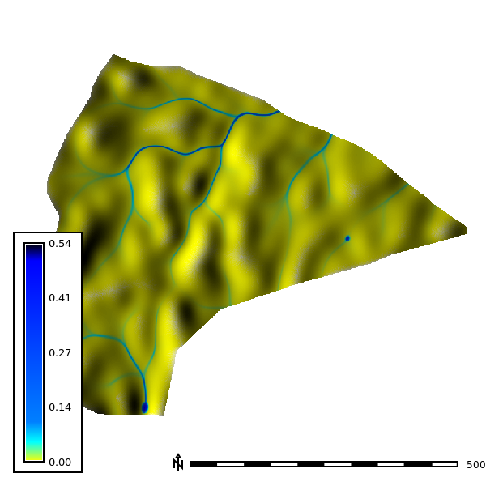 | 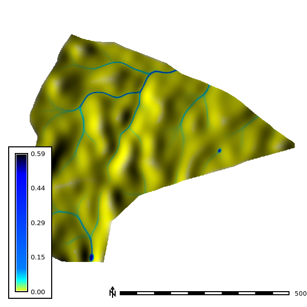

### Discharge - Groundwater seepage in streams during rainfall

| 4 Min | 8 Min | 12 Min | 16 Min | 20 Min
| --- | --- | --- | --- | ---
|  | 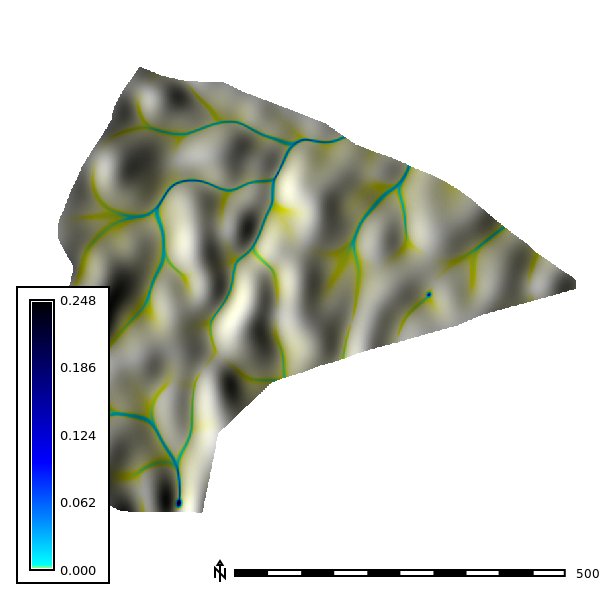 |  | 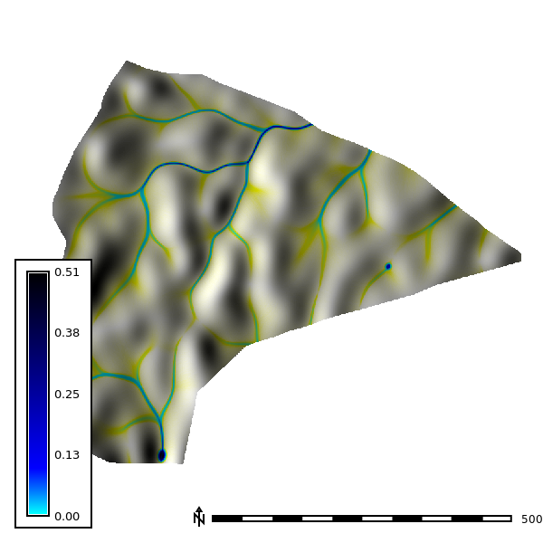 | 

### Depth - Groundwater seepage in streams, no rainfall

| 4 Min | 8 Min | 12 Min
| --- | --- | ---
| 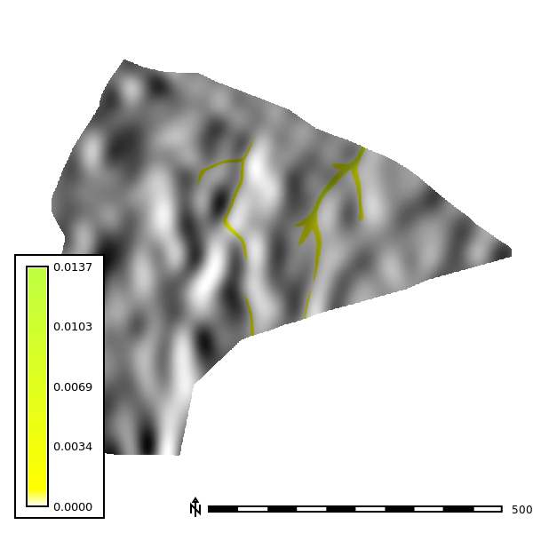 | 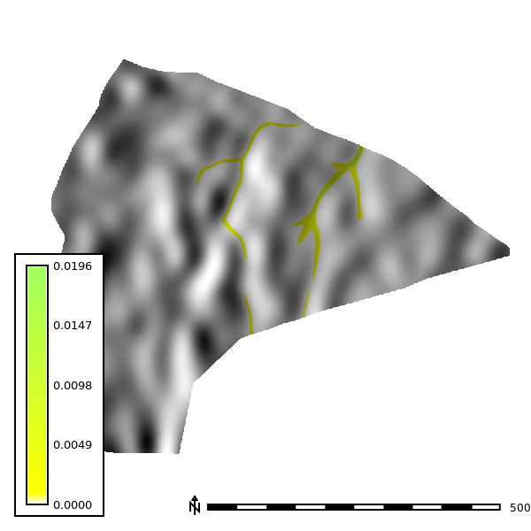 | 

### Discharge - Groundwater seepage in streams, no rainfall

| 4 Min | 8 Min | 12 Min
| --- | --- | ---
| 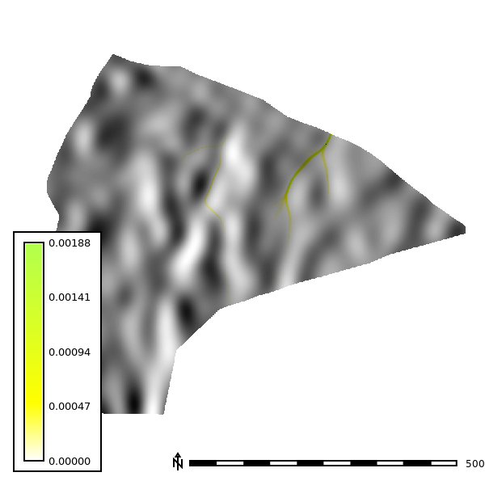 | 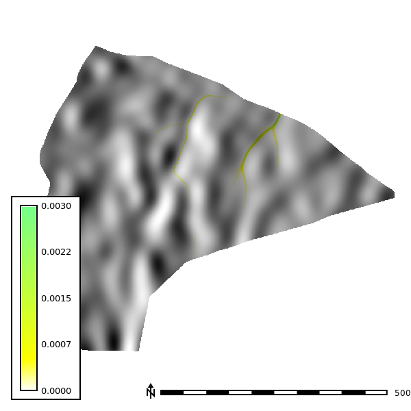 | 

### Depth - Springs

| 4 Min | 8 Min | 12 Min
| --- | --- | ---
| 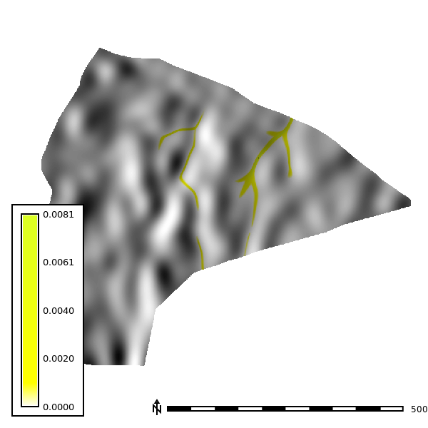 | 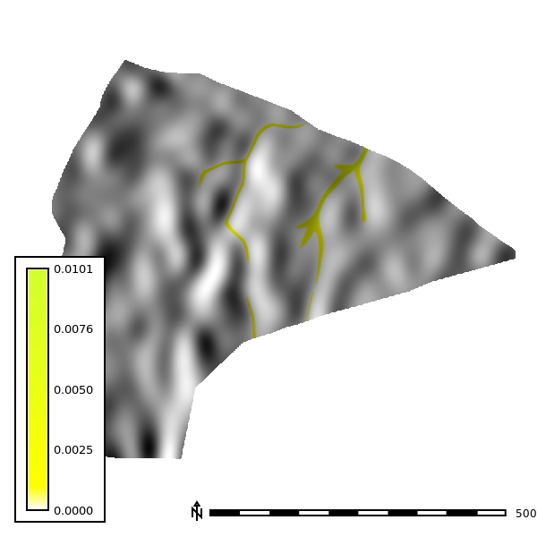 | 

### Discharge - Springs

| 4 Min | 8 Min | 12 Min
| --- | --- | ---
| 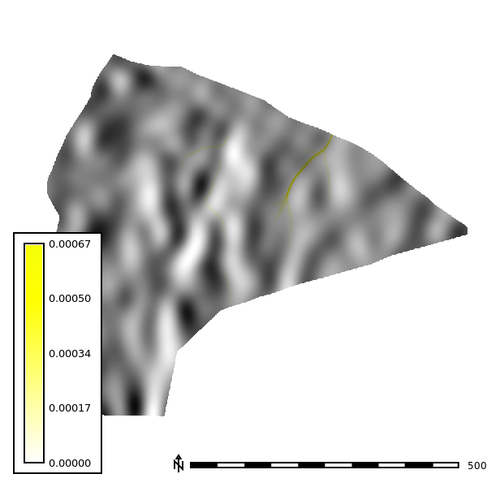 | 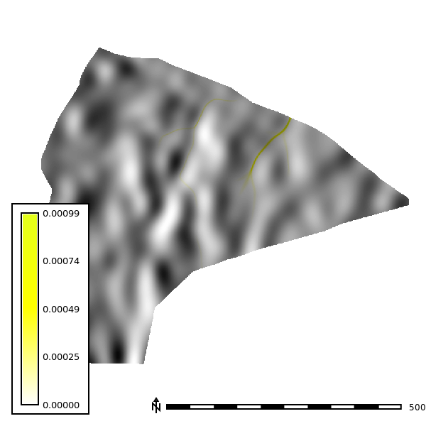 | 

## Sensitivity Analysis

The sensitivity analysis re-runs the simulation across DEM resolutions of 1, 3, 10, and 30 m and walker densities of 0.25 to 2 walkers per cell, with 10 random seeds per combination and 120 one-minute iterations (`scripts/sensitivity.py`). The watershed extent is delineated at each resolution with a 30,000-cell accumulation threshold.

### Basin extent by resolution

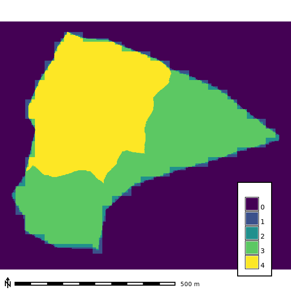

### Seed-averaged depth by resolution

Mean water depth across the 10 seeds at the final output step of each run (walker density 2). This small basin drains fast, so the runs end at different steps: 30 at 1 m, 120 at 3 m, 70 at 10 m, and 20 at 30 m.

| 1 m | 3 m | 10 m | 30 m
| --- | --- | ---  | ---
| 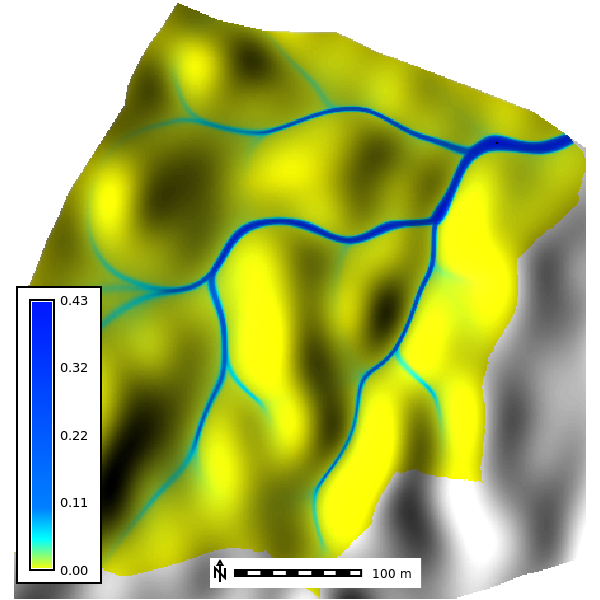 | 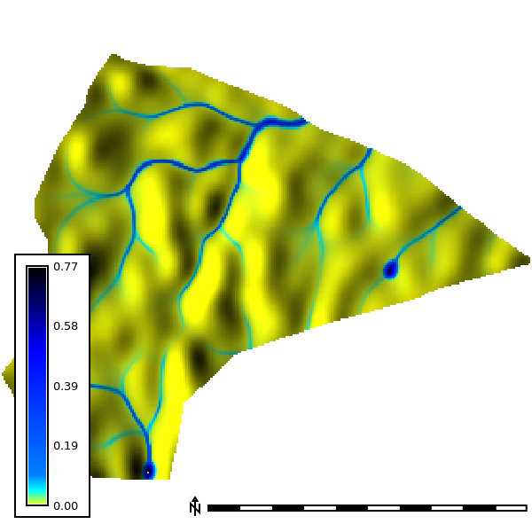 | 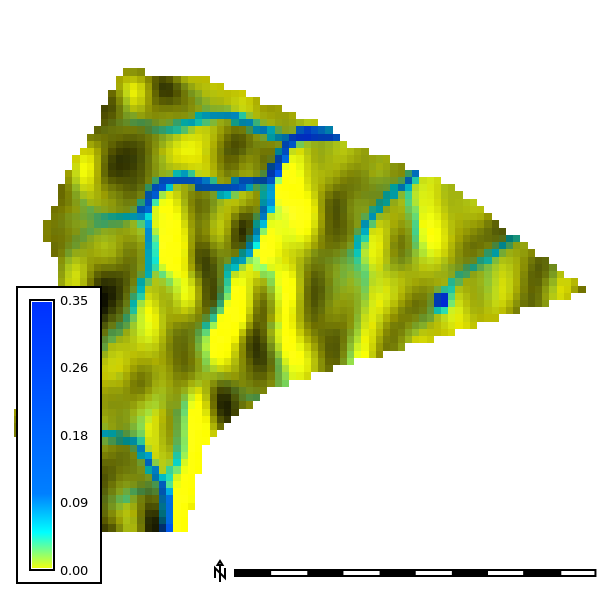 | 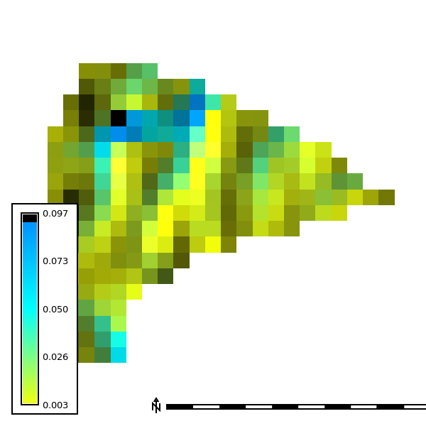
