# Clay Center

## Maps

### Elevation

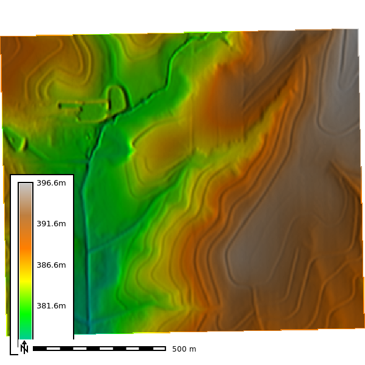

### Aspect

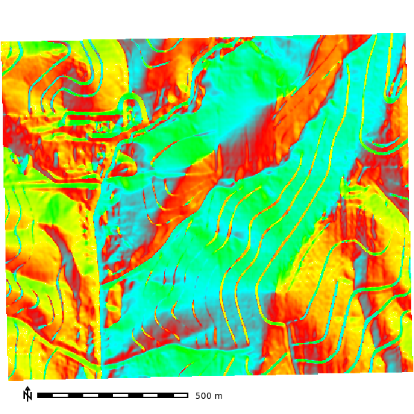

### Elevation Histogram

### Slope

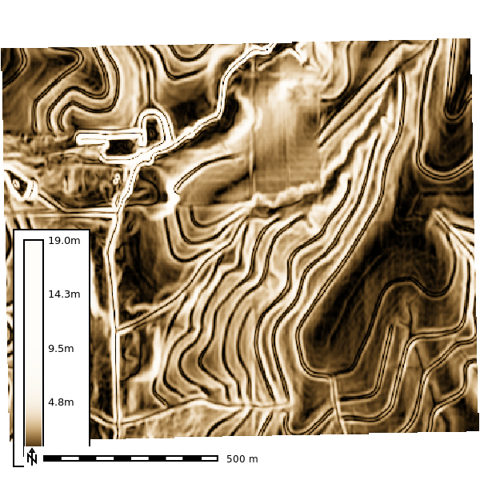

### Aspect: 

### Geomorphon

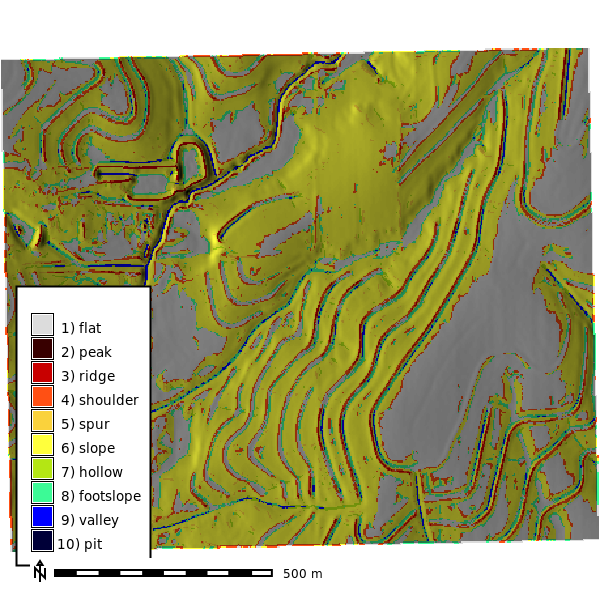

### SSURGO MUKEY

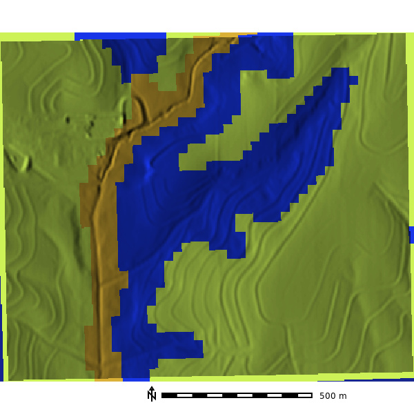

### NAIP

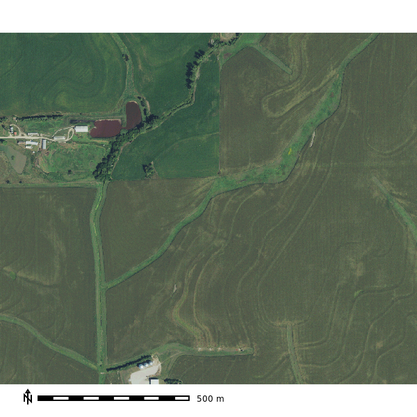

### NDVI

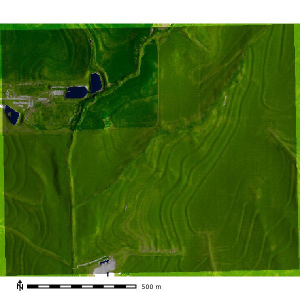

## Profile curvature

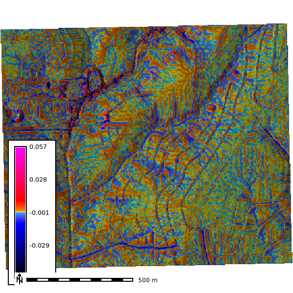

## Planform curvature

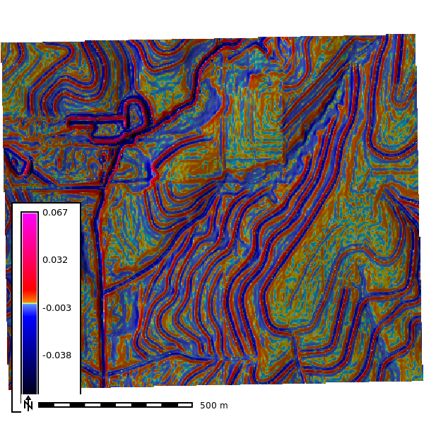

## Simulation

- 2 Min: 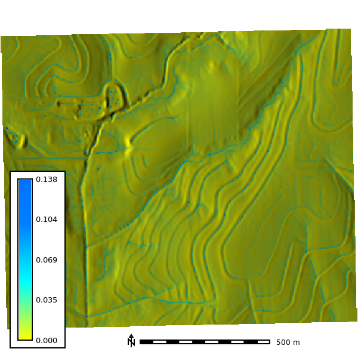
- 4 Min: 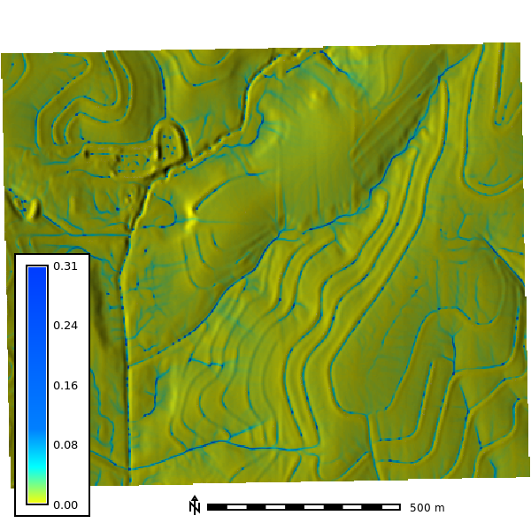
- 6 Min: 
- 7 Min: 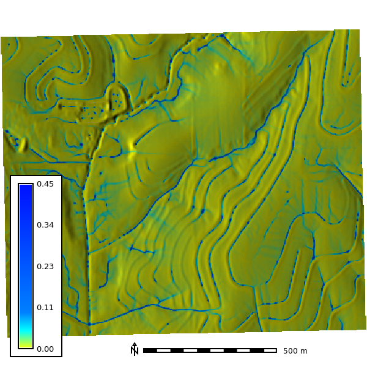
- 8 Min: 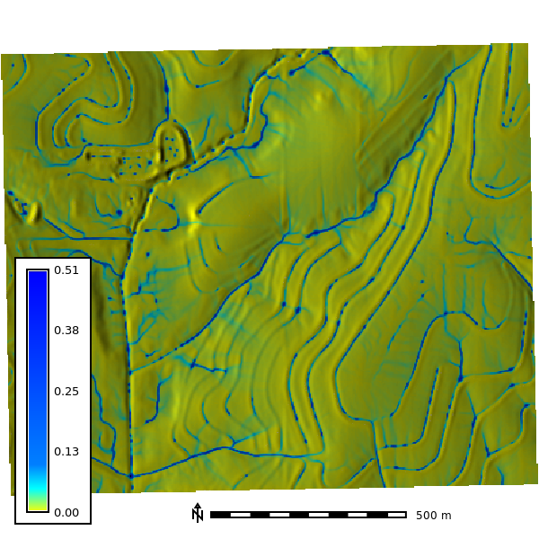

Simulation GIF: 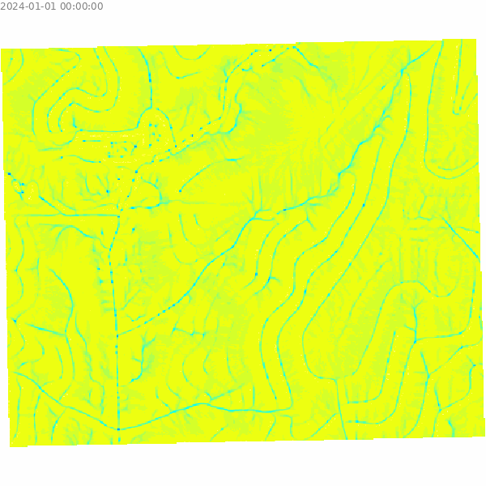
