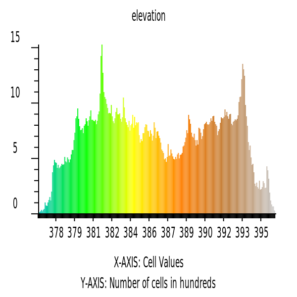

# Clay Center

## Maps

### Elevation

### Aspect

### Elevation Histogram

### Slope

### Aspect: 

### Geomorphon

### SSURGO MUKEY

### NAIP

### NDVI

## Profile curvature

## Planform curvature

## Simulation

- 2 Min: 
- 4 Min: 
- 6 Min: 
- 7 Min: 
- 8 Min: 

Simulation GIF: 
