```{python}
# | echo: false
# | tags: [parameters]

project_name = "Clay Center"
project_description = "Clay Center"
project_location = "Kansas"
project_url = (
    "https://github.com/ncss-tech/SIMWE-coordination/tree/main/sites/clay-center"
)
naip_year = 2021
dem_resolution = "3 m"
unit_of_measure = "meters"
epsg = "32614"
crs = "WGS 84 / UTM zone 14N"
area_km2 = "1.53"
cell_count = "170,244"
elev_range = "376.69 - 396.57"
elev_mean = "386.71"
ars = "0.13"
```

## Overview

The Clay Center site covers 1.53 km^2^ of cultivated cropland in the Republican River basin of north-central Kansas. Relief is gentle (a 19.9 m elevation range at 3 m resolution), so runoff patterns here are controlled less by terrain and more by soil properties: the deep loess soils span hydrologic soil groups B through D, producing a patchwork of infiltration capacities across otherwise uniform fields. That makes Clay Center the benchmark site for the soil-informed workflow (i.e., SSURGO hydrologic groups to curve number to rainfall excess) developed in the [Clay Center notebook](../../notebooks/ssurgo_clay_center.qmd).

What this site demonstrates:

- Soil variability, not topography, drives where runoff concentrates on low-relief agricultural land.
- The SSURGO-to-curve-number workflow produces spatially varying rainfall excess that a uniform-rainfall simulation misses.
- A ground water scenario suite (seepage during rainfall, seepage only, and springs) on pre-saturated terrain.



## Ground Water

These runs replace the uniform rainfall input with stream-fed sources derived from flow accumulation, using 500,000 walkers and a 4-minute output step (`scripts/groundwater.py`). Three scenarios are simulated: groundwater seepage in streams during a 10 mm/hr rainfall, seepage with no rainfall, and springs at first-order streams only. Depth is in meters, discharge in m^3^/s.

### Depth - Groundwater seepage in streams during rainfall

| 4 Min | 8 Min | 12 Min | 16 Min | 20 Min
| --- | --- | --- | --- | ---
| 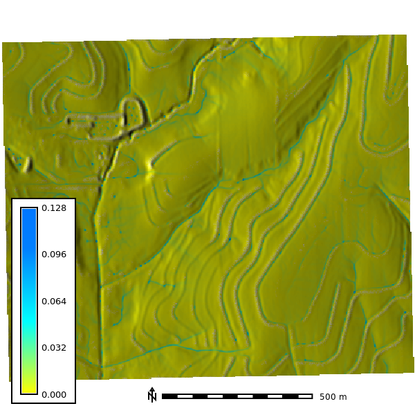 |  |  |  | 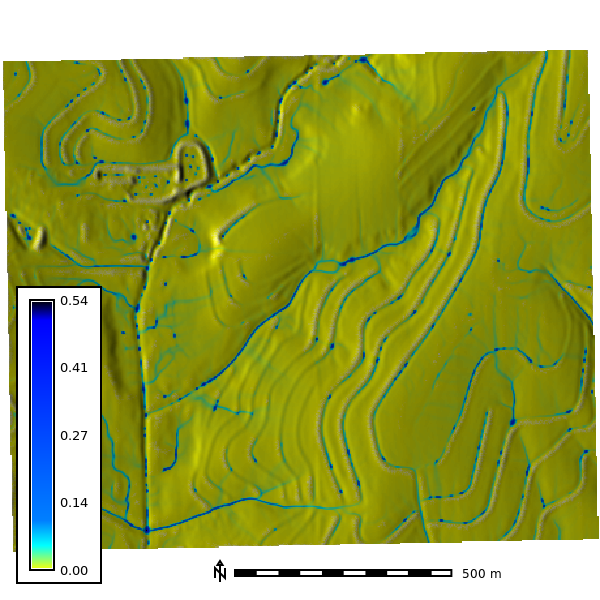

### Discharge - Groundwater seepage in streams during rainfall

| 4 Min | 8 Min | 12 Min | 16 Min | 20 Min
| --- | --- | --- | --- | ---
| 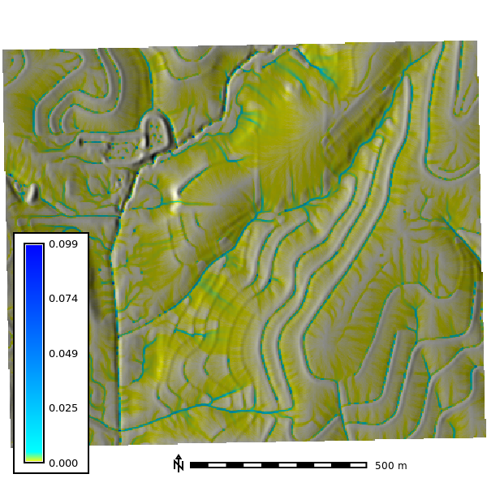 | 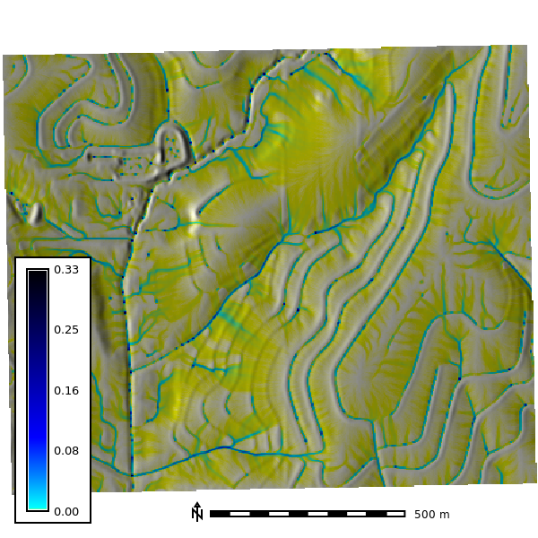 |  |  | 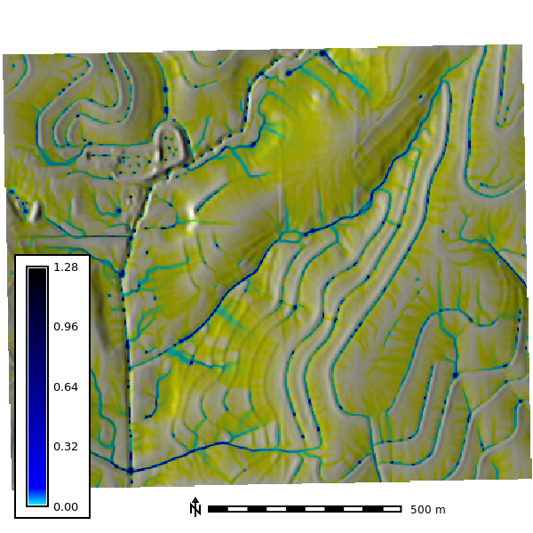

### Depth - Groundwater seepage in streams, no rainfall

| 4 Min | 8 Min | 12 Min | 16 Min | 20 Min
| --- | --- | --- | --- | ---
| 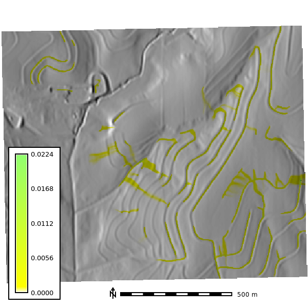 | 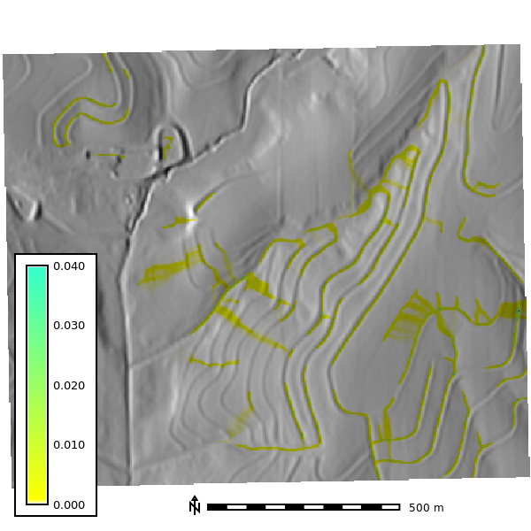 | 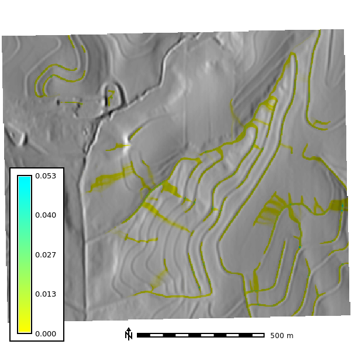 | 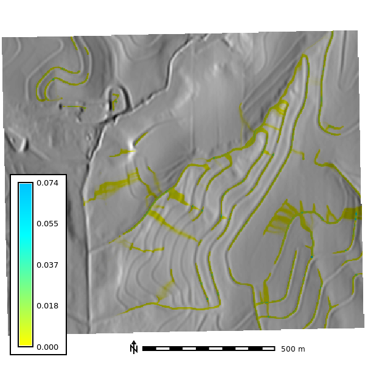 | 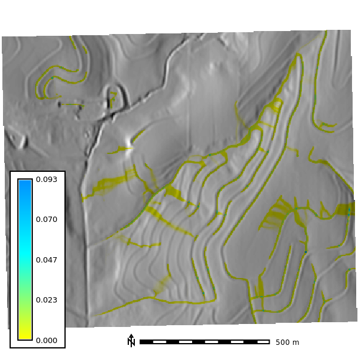

### Discharge - Groundwater seepage in streams, no rainfall

| 4 Min | 8 Min | 12 Min | 16 Min | 20 Min
| --- | --- | --- | --- | ---
| 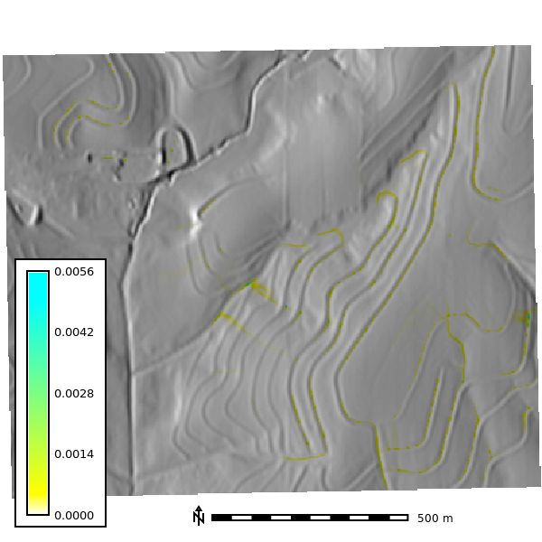 | 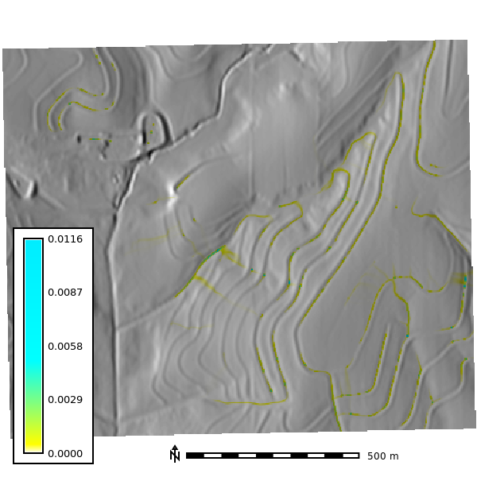 | 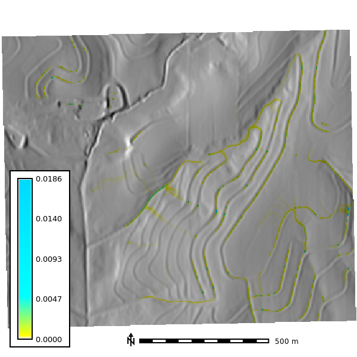 | 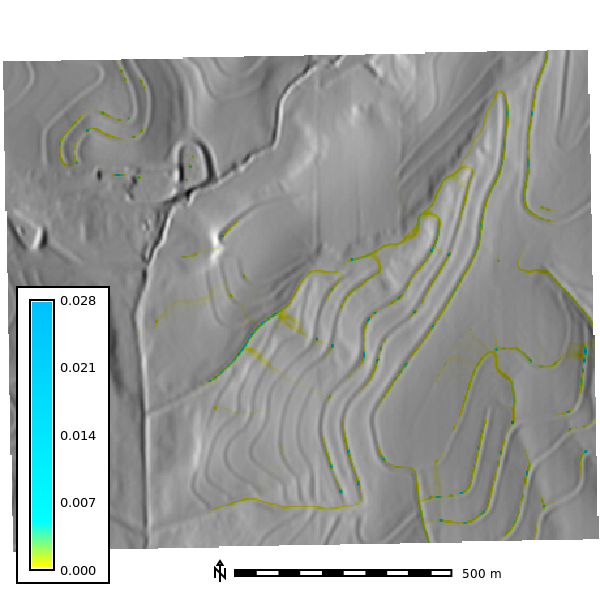 | 

### Depth - Springs

| 4 Min | 8 Min | 12 Min | 16 Min | 20 Min
| --- | --- | --- | --- | ---
| 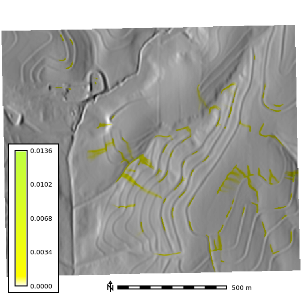 | 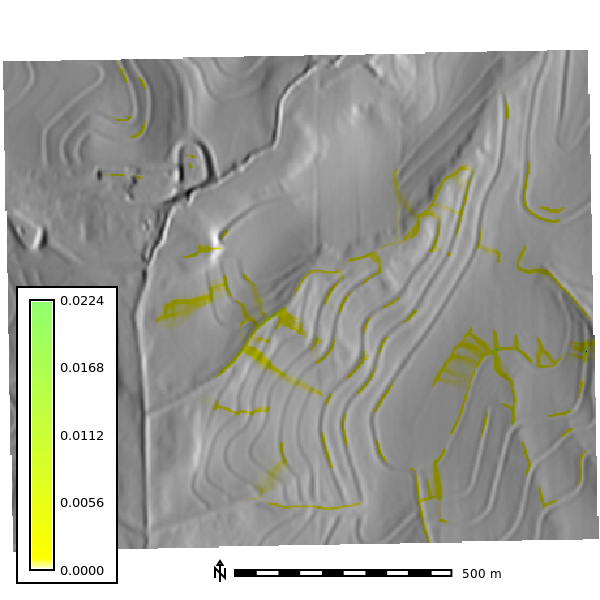 | 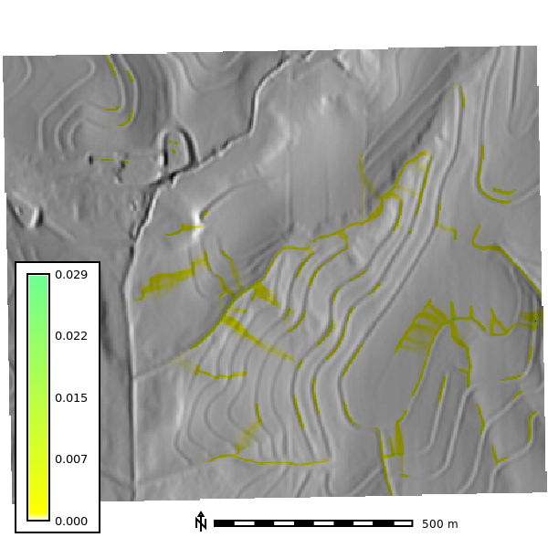 |  | 

### Discharge - Springs

| 4 Min | 8 Min | 12 Min | 16 Min | 20 Min
| --- | --- | --- | --- | ---
| 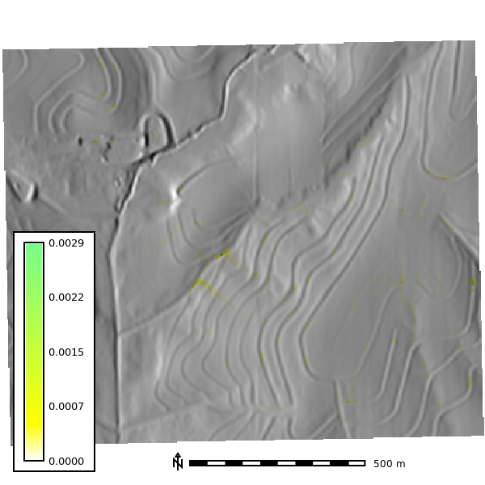 | 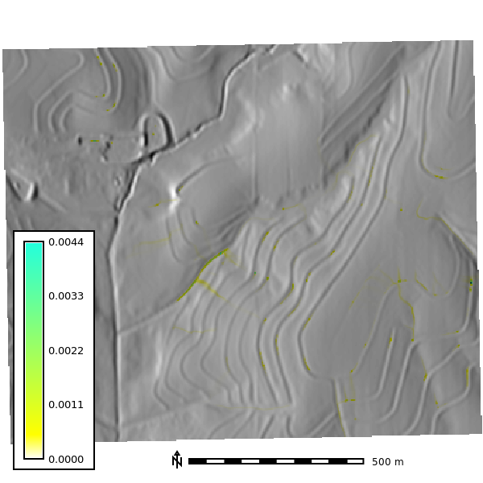 |  | 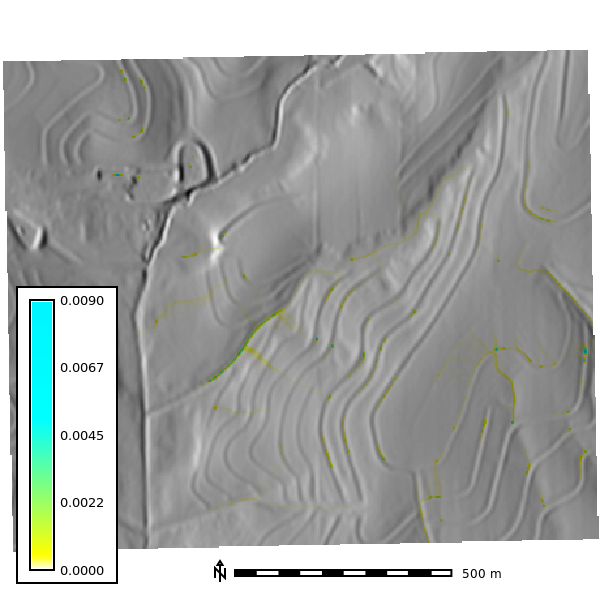 | 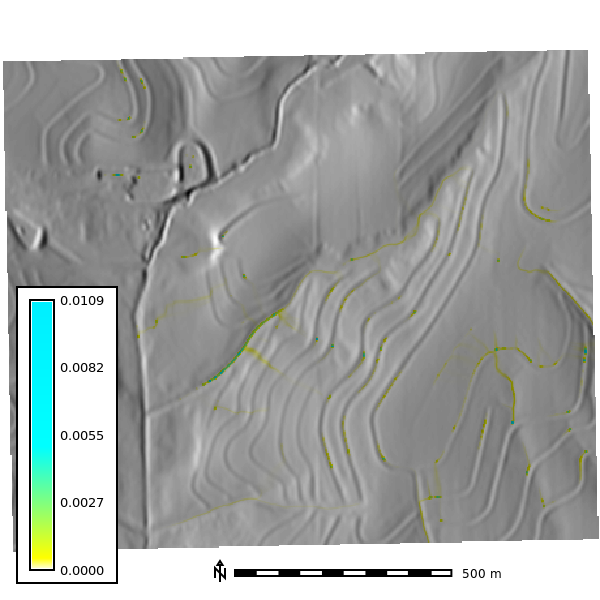

## Sensitivity Analysis

The sensitivity analysis re-runs the simulation across DEM resolutions of 1, 3, 10, and 30 m and walker densities of 0.25 to 2 walkers per cell, with 10 random seeds per combination and 120 one-minute iterations (`scripts/sensitivity.py`). The watershed extent is delineated at each resolution with a 30,000-cell accumulation threshold.

### Basin extent by resolution

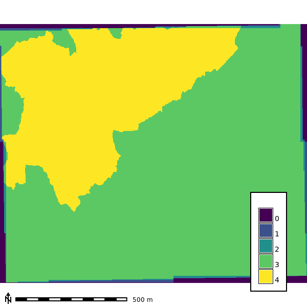

### Seed-averaged depth by resolution

Mean water depth across the 10 seeds at the final output step of each run (walker density 2). Coarser grids finish at slightly different steps, so the 10 m map shows step 119.

| 1 m | 3 m | 10 m | 30 m
| --- | --- | ---  | ---
| 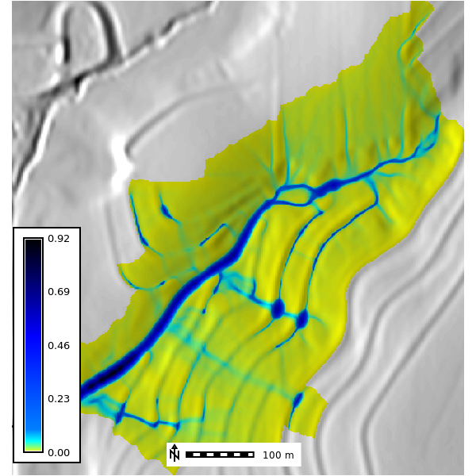 | 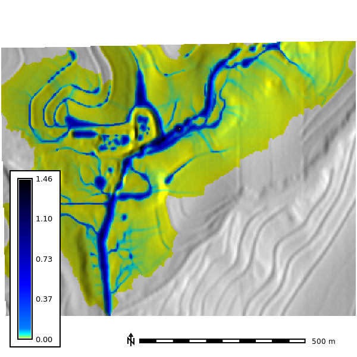 | 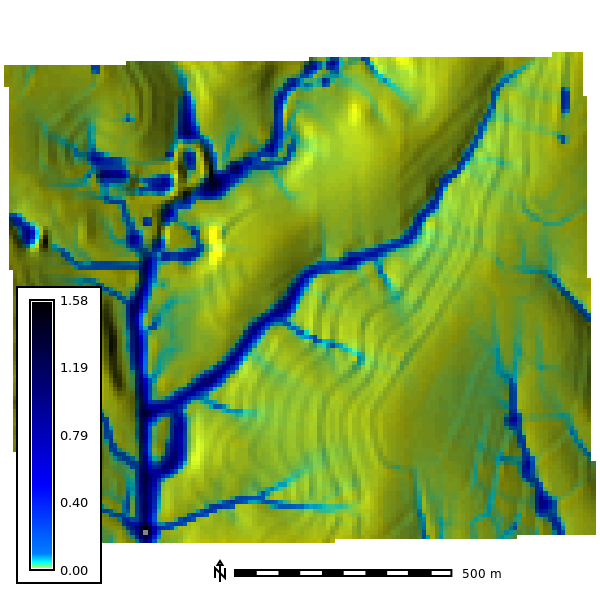 | 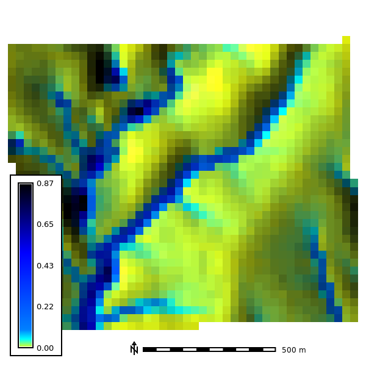 |
