```{python}
# | echo: false
# | tags: [parameters]

project_name = "Coweeta"
project_description = "Coweeta Hydrologic Laboratory"
project_location = "North Carolina"
project_url = "https://research.fs.usda.gov/srs/forestsandranges/locations/coweeta"
naip_year = 2022
dem_resolution = "10 m"
unit_of_measure = "meters"
epsg = "26917"
crs = "NAD83 / UTM zone 17N"
area_km2 = "57.17"
cell_count = "572,246"
elev_range = "652.8 - 1597.6"
elev_mean = "1043.83"
ars = "5.5"
```

## Overview

The Coweeta Hydrologic Laboratory sits in the southern Blue Ridge Mountains of western North Carolina, where steep slopes, dense mixed-hardwood canopy, and deep well-drained loams route most rainfall through subsurface pathways long before it reaches a channel. It is by far the most rugged site in the study: 944.8 m of relief over 57.17 km^2^, with an average roughness (ARS) of 5.5, more than an order of magnitude above the next-roughest site (SFREC at 0.37). Hydrologic soil groups are dominated by B, with pockets of C and D on thinner ridge soils.

That combination makes Coweeta a demanding test for overland flow simulation. Terrain routing is strong, but the soils absorb so much of the rainfall that a uniform-rainfall run badly overpredicts surface runoff. The [Coweeta notebook](../../notebooks/ssurgo.qmd) develops the full soil-informed workflow here (i.e., SSURGO to curve number to rainfall excess to SIMWE) and compares it against the naive simulation shown below.

What this site demonstrates:

- The upper bound of terrain complexity: steep, dissected headwater catchments where flow converges quickly into a dense channel network.
- Why soil-informed rainfall excess matters most on forested, well-drained landscapes.
- Model behavior at 10 m resolution over the largest cell count in the ensemble apart from the Texas playas.



## Ground Water

These runs replace the uniform rainfall input with stream-fed sources derived from flow accumulation, using 500,000 walkers and a 4-minute output step (`scripts/groundwater.py`). Three scenarios are simulated: groundwater seepage in streams during a 10 mm/hr rainfall, seepage with no rainfall, and springs at first-order streams only. Depth is in meters, discharge in m^3^/s.

### Depth - Groundwater seepage in streams during rainfall

| 4 Min | 8 Min | 12 Min | 16 Min | 20 Min
| --- | --- | --- | --- | ---
| 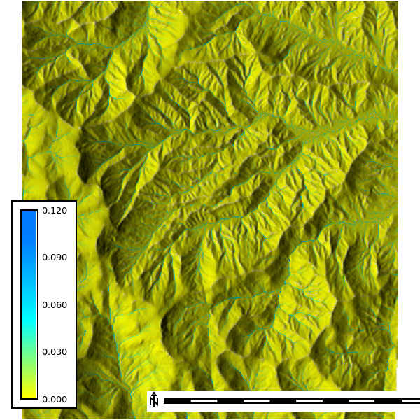 | 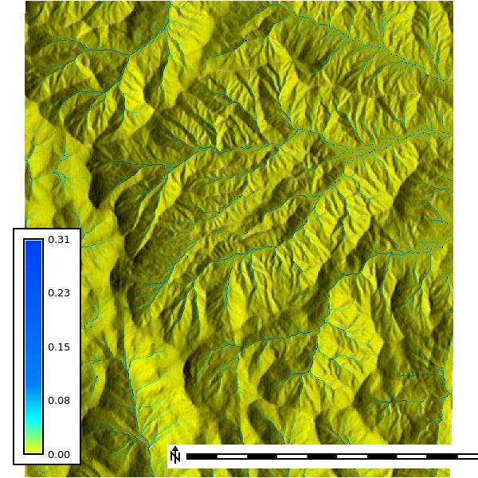 | 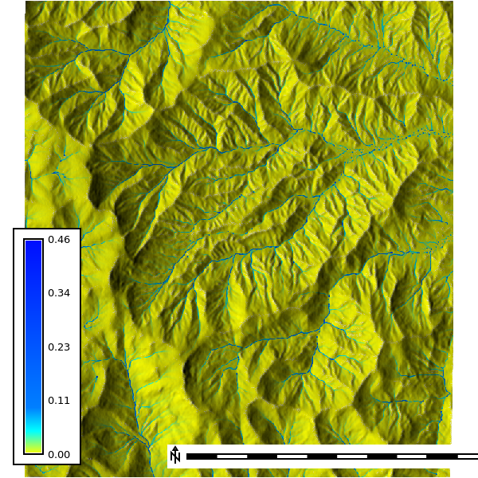 |  | 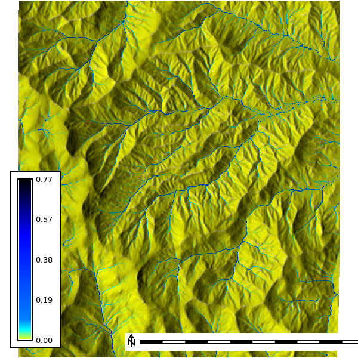

### Discharge - Groundwater seepage in streams during rainfall

| 4 Min | 8 Min | 12 Min | 16 Min | 20 Min
| --- | --- | --- | --- | ---
| 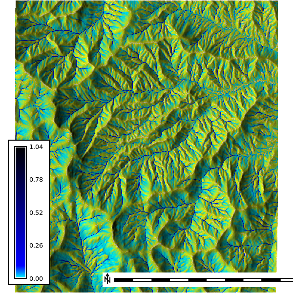 |  |  | 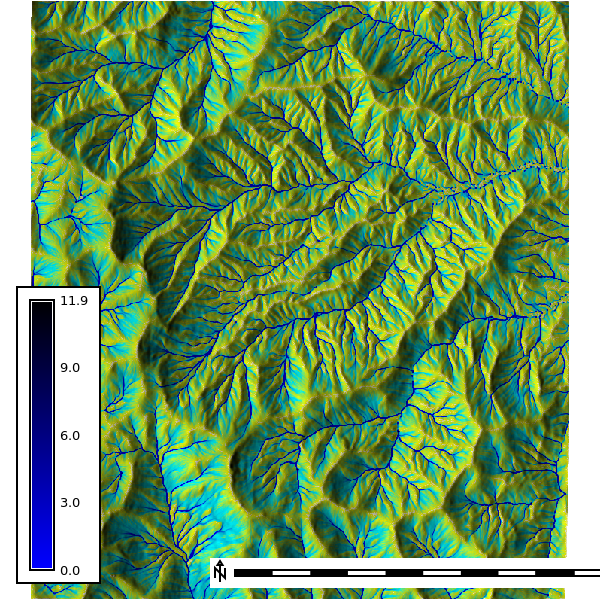 | 

### Depth - Groundwater seepage in streams, no rainfall

| 4 Min | 8 Min | 12 Min | 16 Min | 20 Min
| --- | --- | --- | --- | ---
| 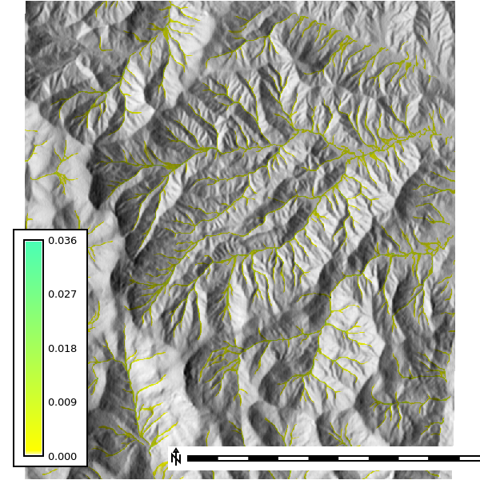 |  | 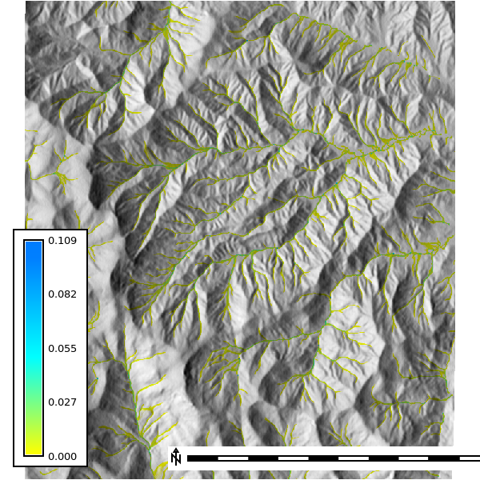 |  | 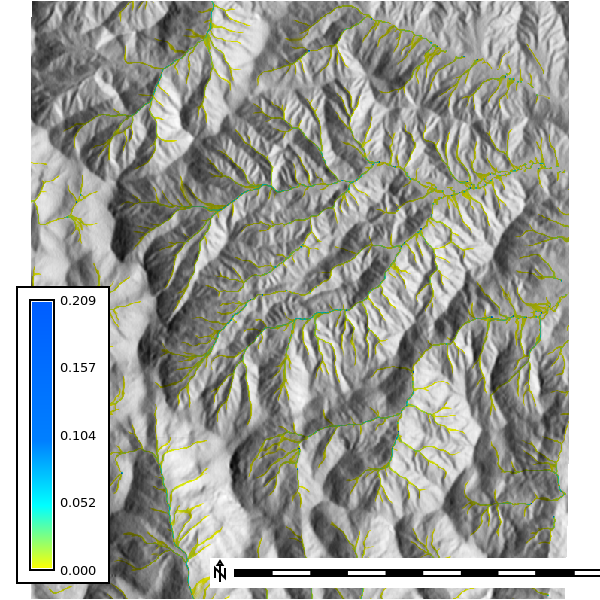

### Discharge - Groundwater seepage in streams, no rainfall

| 4 Min | 8 Min | 12 Min | 16 Min | 20 Min
| --- | --- | --- | --- | ---
| 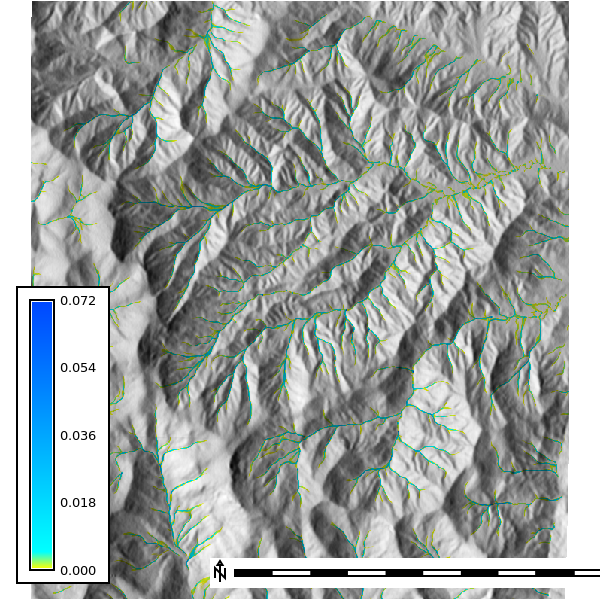 | 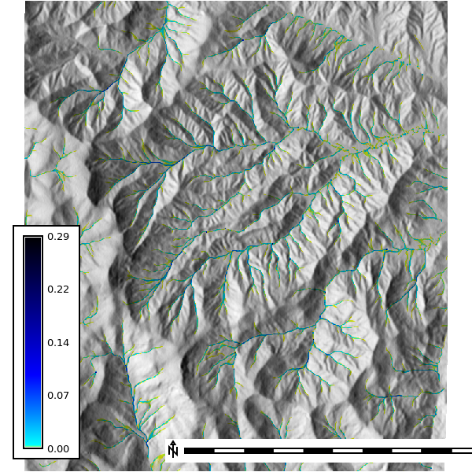 | 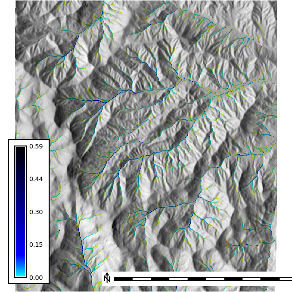 | 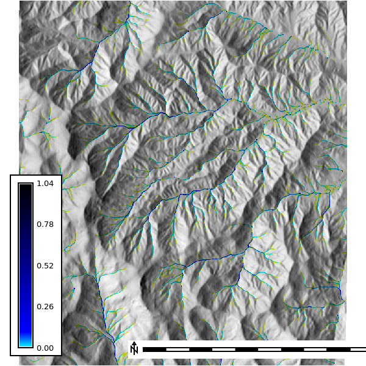 | 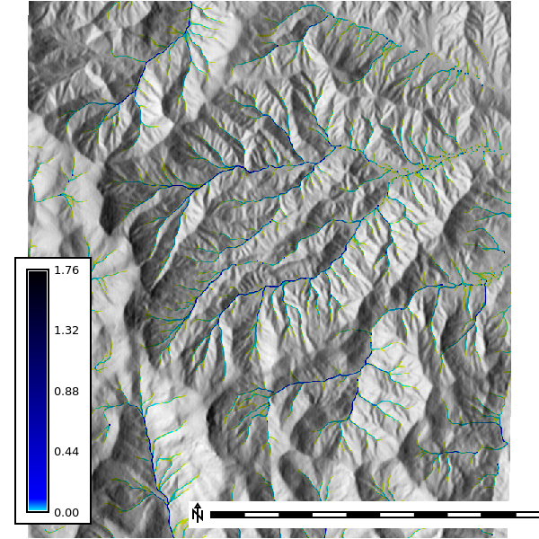

### Depth - Springs

| 4 Min | 8 Min | 12 Min | 16 Min | 20 Min
| --- | --- | --- | --- | ---
| 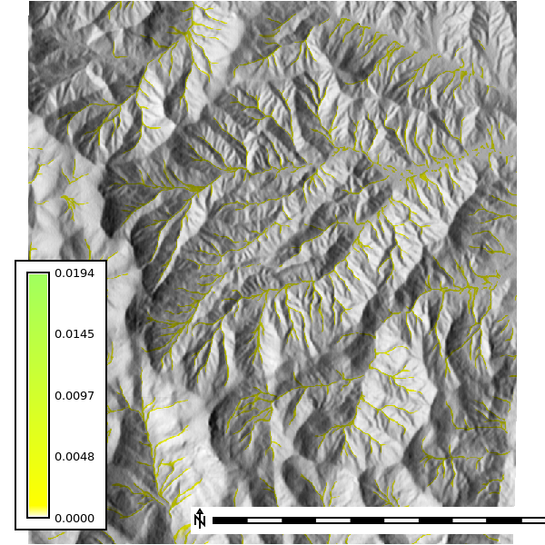 | 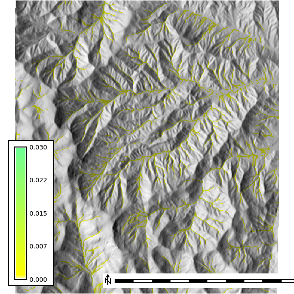 | 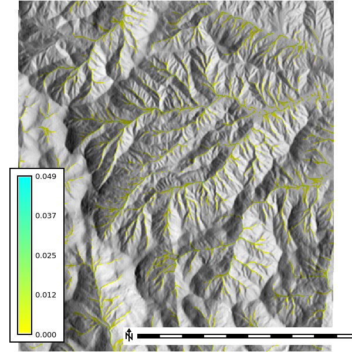 | 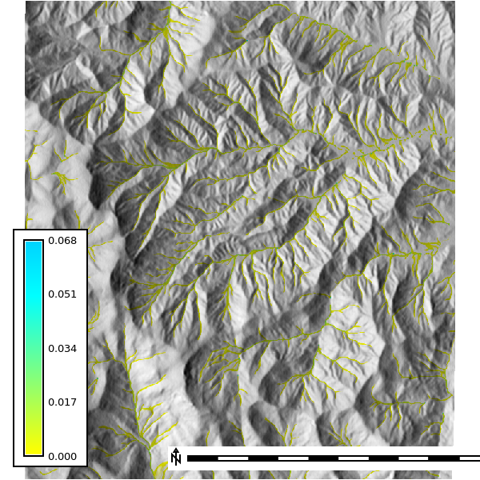 | 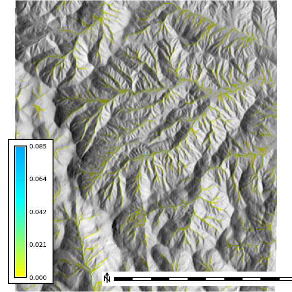

### Discharge - Springs

| 4 Min | 8 Min | 12 Min | 16 Min | 20 Min
| --- | --- | --- | --- | ---
| 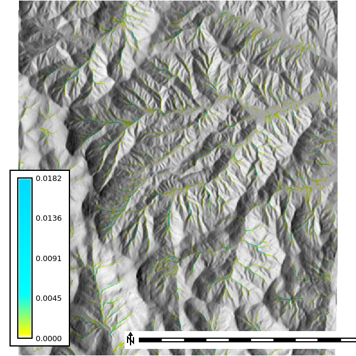 |  | 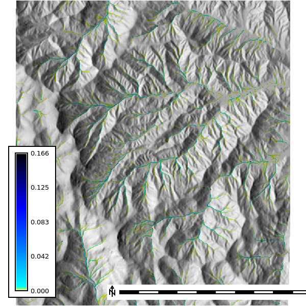 | 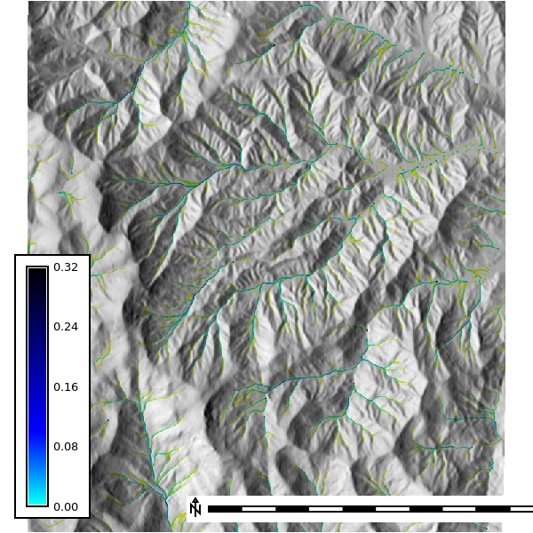 | 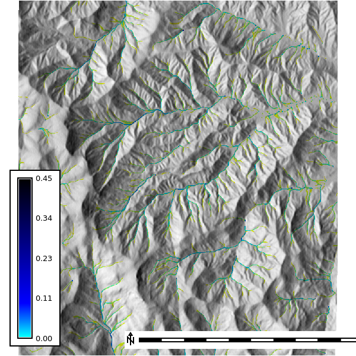

## Sensitivity Analysis

The sensitivity analysis re-runs the simulation across DEM resolutions of 1, 3, 10, and 30 m and walker densities of 0.25 to 2 walkers per cell, with 10 random seeds per combination and 120 one-minute iterations (`scripts/sensitivity.py`). The watershed extent is delineated at each resolution with a 30,000-cell accumulation threshold.

### Basin extent by resolution

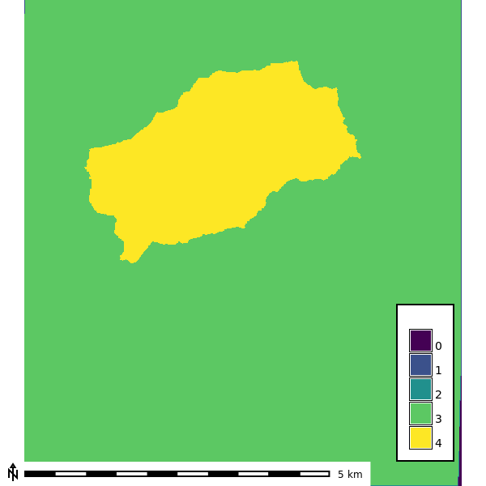

### Seed-averaged depth by resolution

Mean water depth across the 10 seeds at the final output step of each run (walker density 2).

| 1 m | 3 m | 10 m | 30 m
| --- | --- | ---  | ---
| 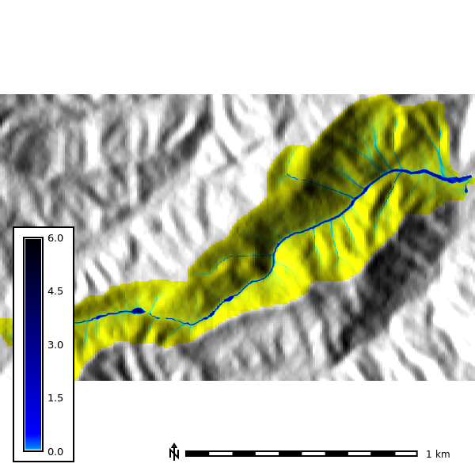 | 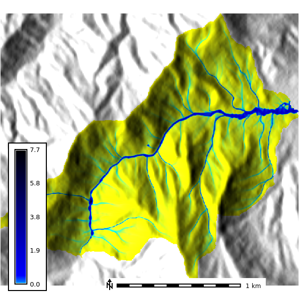 | 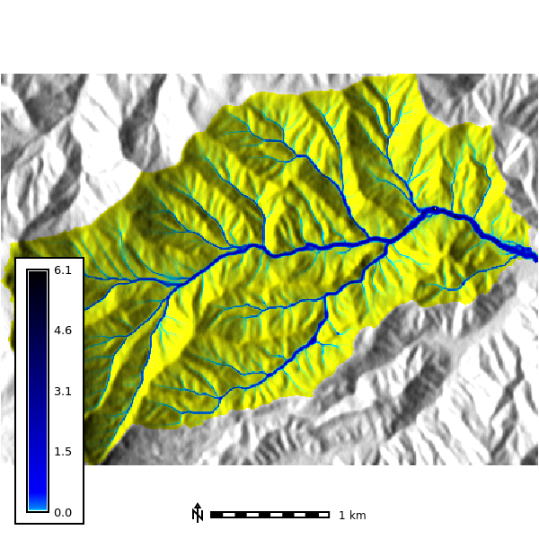 | 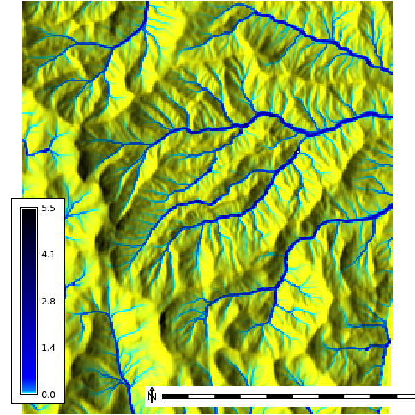 |
