```{python}
# | echo: false
# | tags: [parameters]

project_name = "TX069-PLAYAS"
project_description = "Texas High Plains playas (soil survey area TX069)"
project_location = "Texas"
project_url = (
    "https://github.com/ncss-tech/SIMWE-coordination/tree/main/sites/tx069-playas"
)
naip_year = 2022
dem_resolution = "8 m"
unit_of_measure = "meters"
epsg = "32613"
crs = "WGS 84 / UTM zone 13N"
area_km2 = "324.74"
cell_count = "5,378,306"
elev_range = "1104.0 - 1165.3"
elev_mean = "1134.9"
ars = "0.07"
```

## Overview

The TX069 playas site covers 324.74 km^2^ of the Texas High Plains, a landscape defined by what it lacks: integrated drainage. Runoff collects in thousands of shallow, internally drained playa depressions rather than flowing to streams. With 61.3 m of total relief spread across the largest study area in the ensemble (5.4 million cells at 8 m resolution) and an ARS of 0.07, this is the flattest site by a wide margin, the opposite end of the roughness ranking from Coweeta (5.5).

Playas are a hard case for overland flow models. Flow directions are weak, ponding dominates routing, and small elevation errors can reroute water between adjacent basins. However, they matter: playas are the primary recharge points for the Ogallala Aquifer, so getting their contributing areas right has direct consequences for water management on the High Plains.

What this site demonstrates:

- SIMWE behavior in depressional, internally drained terrain where ponding replaces channelized flow.
- Scalability: the largest cell count in the study by an order of magnitude.
- How watershed delineation degrades with resolution when relief approaches the DEM error budget.



## Ground Water

These runs replace the uniform rainfall input with stream-fed sources derived from flow accumulation, using 500,000 walkers and a 4-minute output step (`scripts/groundwater.py`). Three scenarios are simulated: groundwater seepage in streams during a 10 mm/hr rainfall, seepage with no rainfall, and springs at first-order streams only. These runs end at 19 minutes. Depth is in meters, discharge in m^3^/s.

### Depth - Groundwater seepage in streams during rainfall

| 4 Min | 8 Min | 12 Min | 16 Min | 19 Min
| --- | --- | --- | --- | ---
| 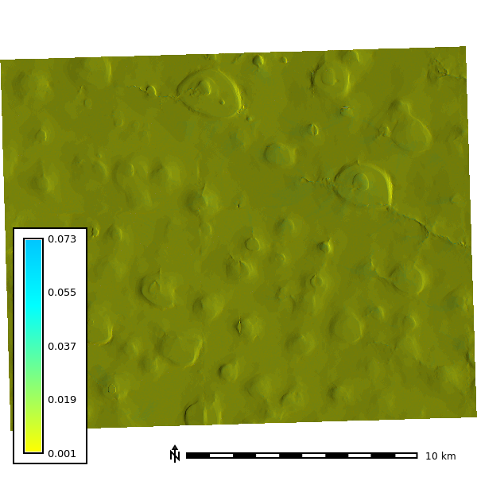 | 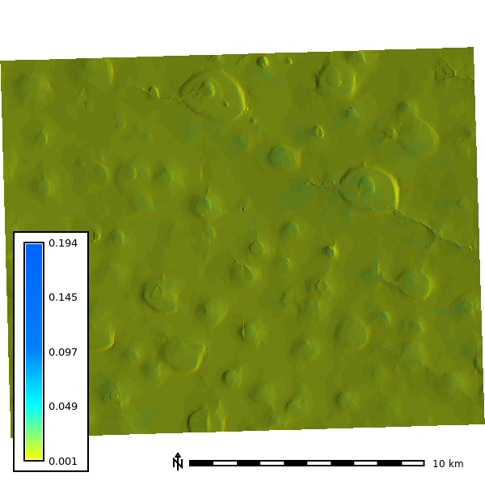 | 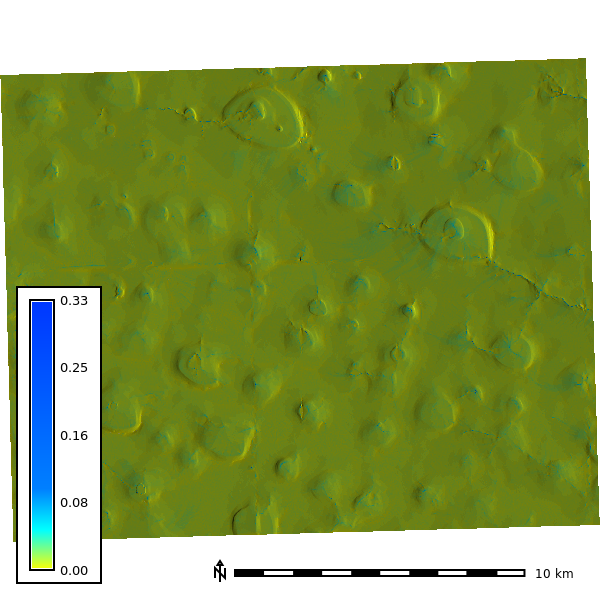 |  | 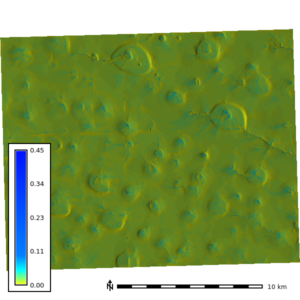

### Discharge - Groundwater seepage in streams during rainfall

| 4 Min | 8 Min | 12 Min | 16 Min | 19 Min
| --- | --- | --- | --- | ---
|  | 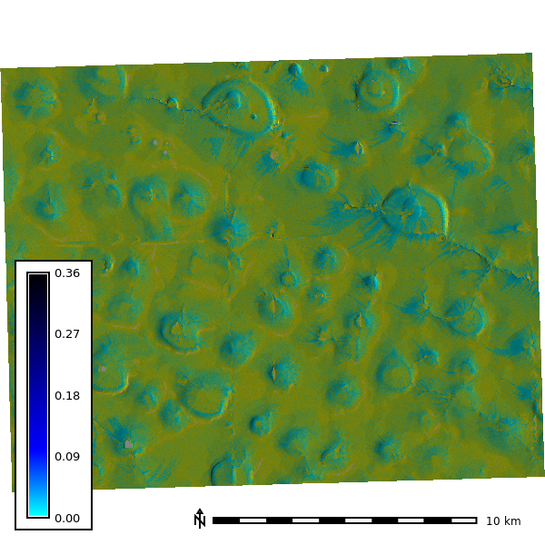 | 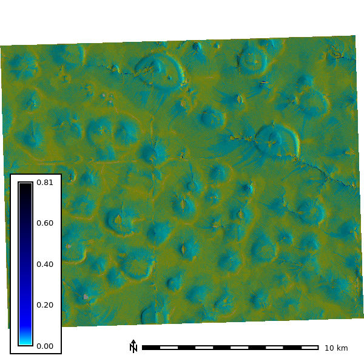 | 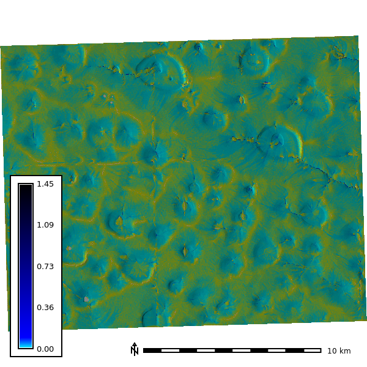 | 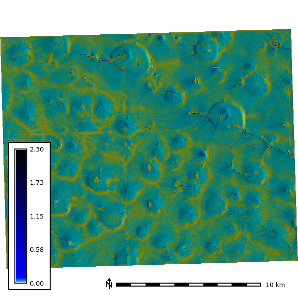

### Depth - Groundwater seepage in streams, no rainfall

| 4 Min | 8 Min | 12 Min | 16 Min | 19 Min
| --- | --- | --- | --- | ---
| 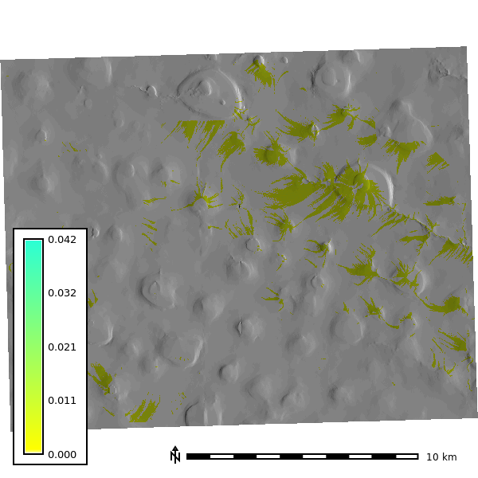 | 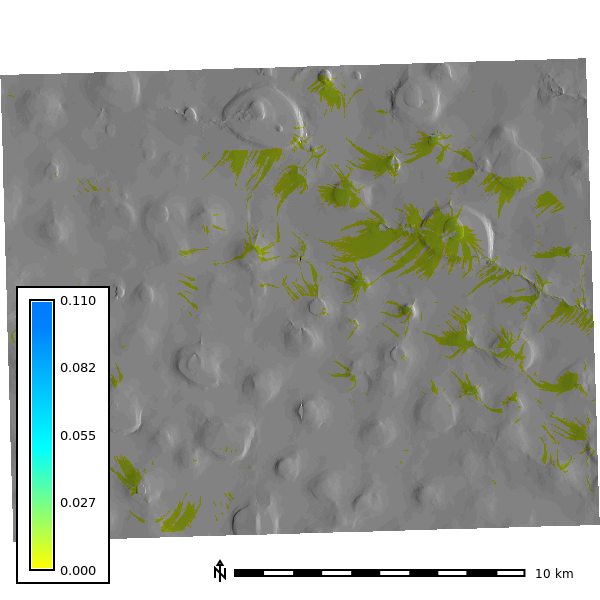 |  | 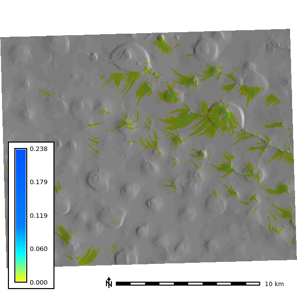 | 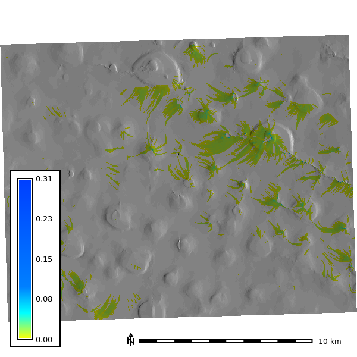

### Discharge - Groundwater seepage in streams, no rainfall

| 4 Min | 8 Min | 12 Min | 16 Min | 19 Min
| --- | --- | --- | --- | ---
| 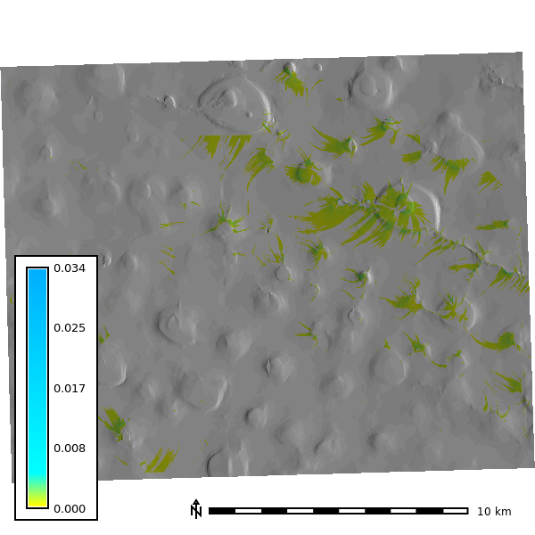 | 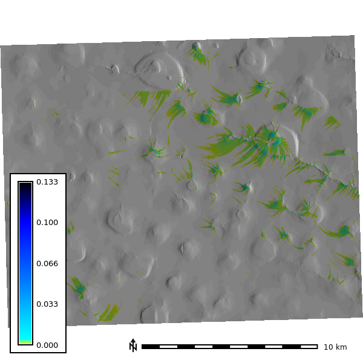 | 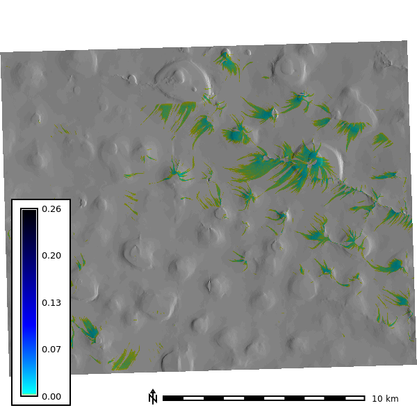 | 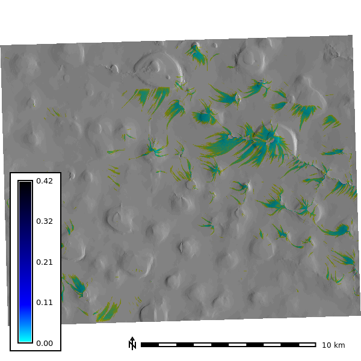 | 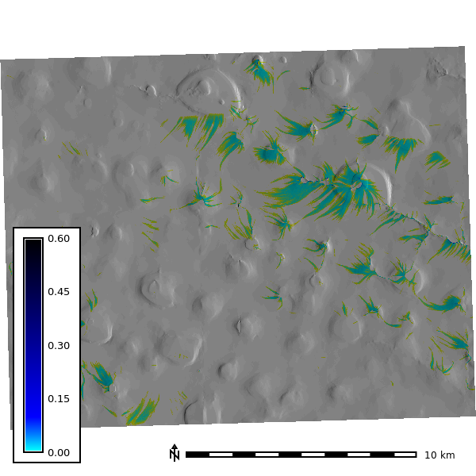

### Depth - Springs

| 4 Min | 8 Min | 12 Min | 16 Min | 19 Min
| --- | --- | --- | --- | ---
| 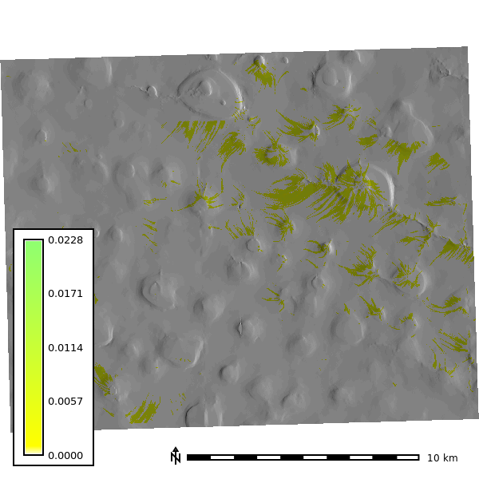 | 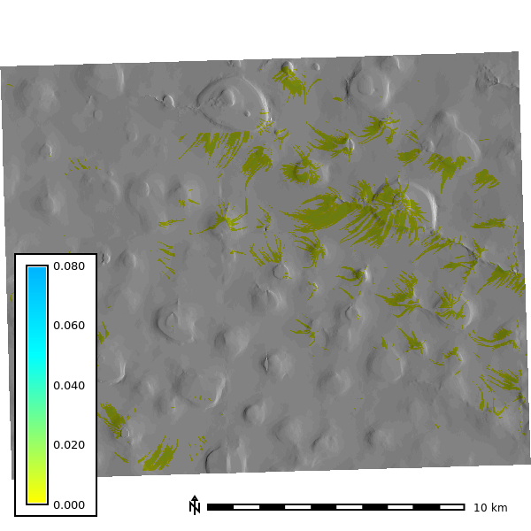 | 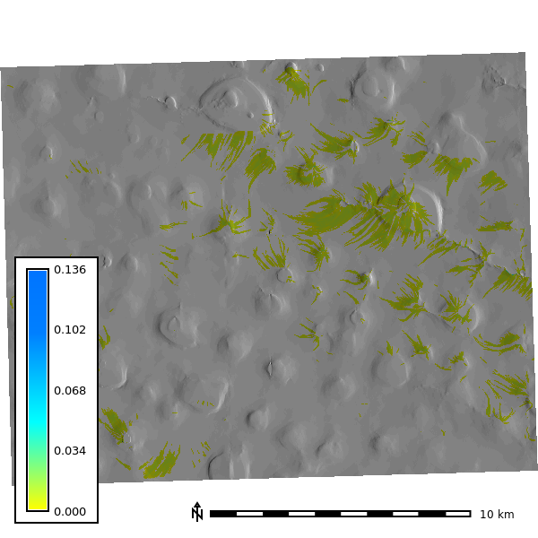 |  | 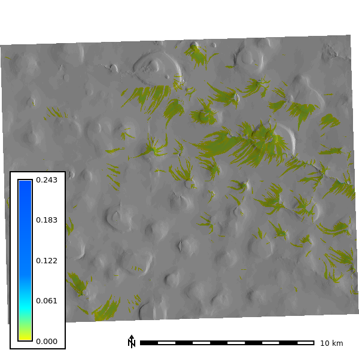

### Discharge - Springs

| 4 Min | 8 Min | 12 Min | 16 Min | 19 Min
| --- | --- | --- | --- | ---
| 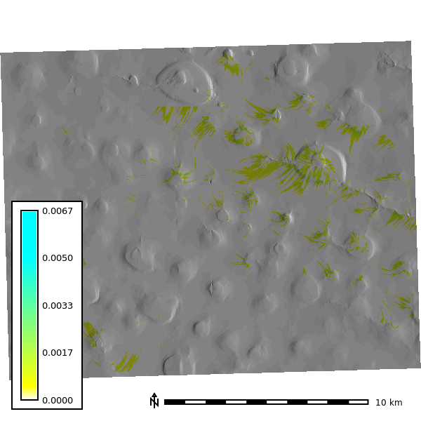 | 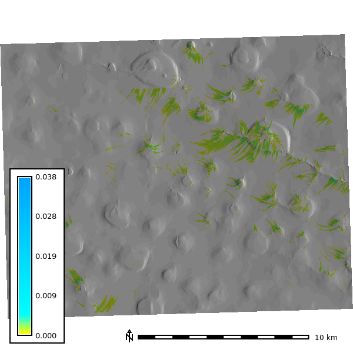 |  |  | 

## Sensitivity Analysis

The sensitivity analysis re-runs the simulation across DEM resolutions of 1, 3, 10, and 30 m and walker densities of 0.25 to 2 walkers per cell, with 10 random seeds per combination and 120 one-minute iterations (`scripts/sensitivity.py`). The watershed extent is delineated at each resolution with a 30,000-cell accumulation threshold.

### Basin extent by resolution

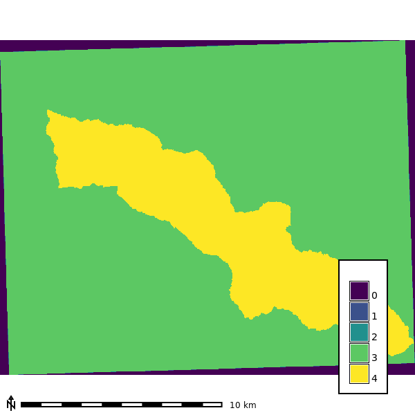

### Seed-averaged depth by resolution

Mean water depth across the 10 seeds at the final output step of each run (walker density 2). The coarser grids end a few steps early: 117 at 10 m and 118 at 30 m.

| 1 m | 3 m | 10 m | 30 m
| --- | --- | ---  | ---
| 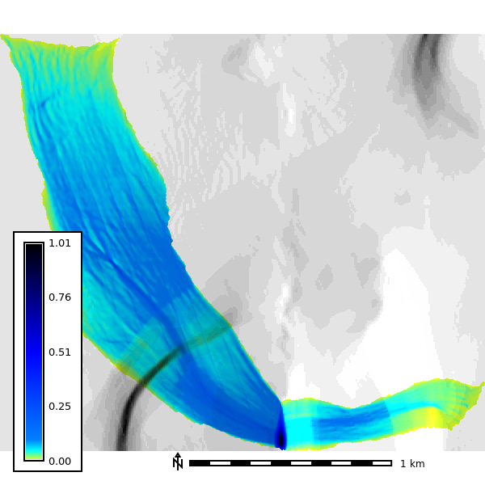 | 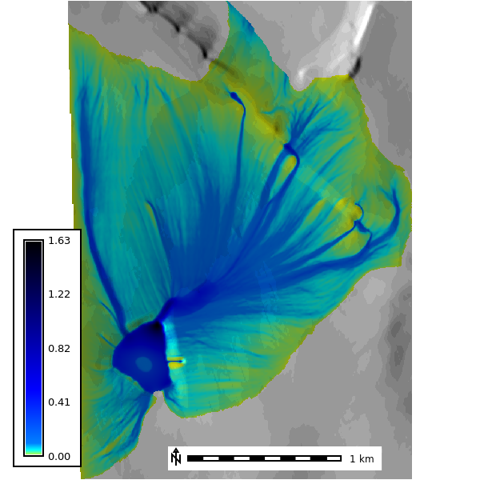 | 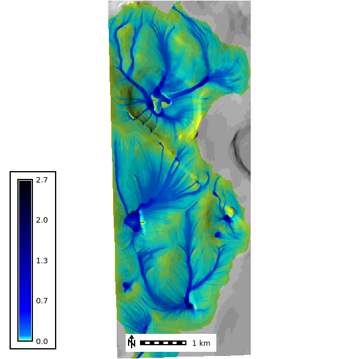 | 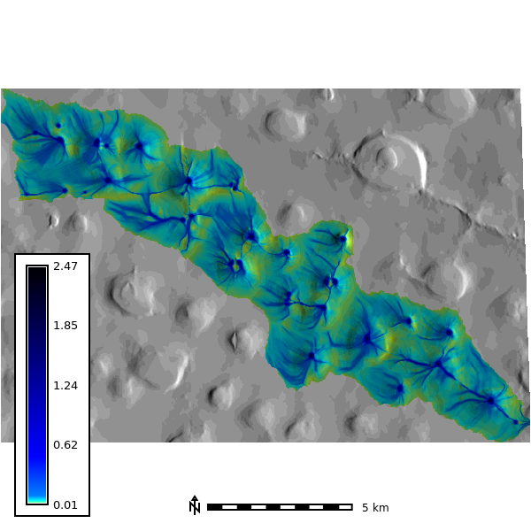
